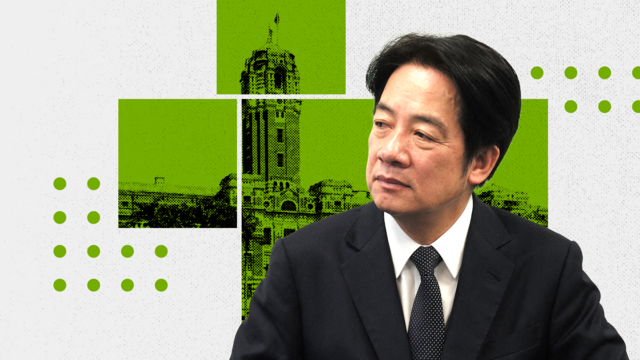
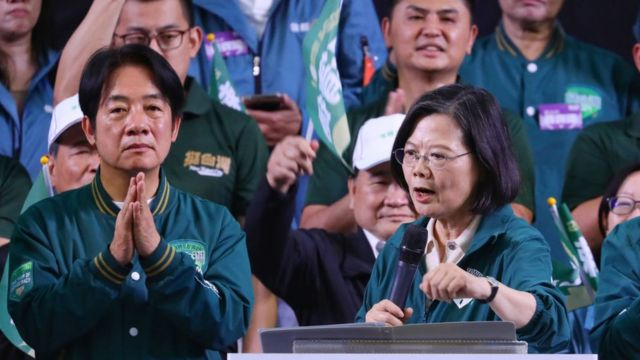
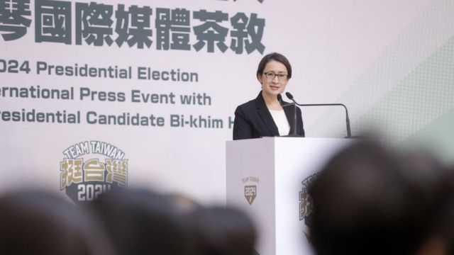
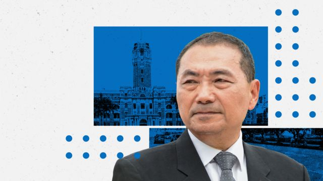
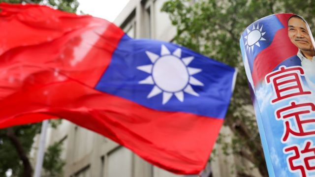
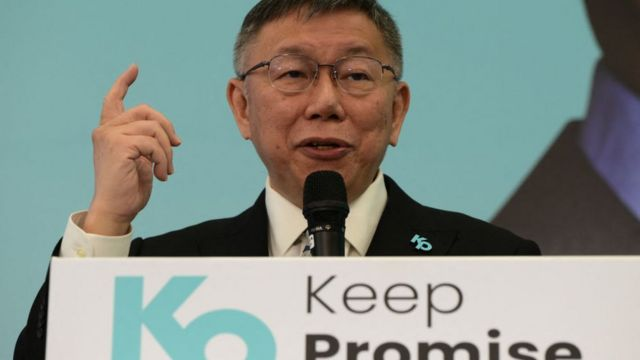

# [Chinese] 台湾总统大选2024观察: “两强争霸”笼罩下的“三雄演义”

#  台湾总统大选2024观察: “两强争霸”笼罩下的“三雄演义”

  * 吕嘉鸿 
  * BBC中文 

> 图像来源，  Getty Images
>
> 图像加注文字，台湾金门沙滩上的防御阵地。对面近在咫尺的就是中国大陆的厦门市。

**距离台湾2024总统大选投票日越来越近，不同候选人无论倾向“九二共识”或者是持续走亲美路线，都代表背后美中两大力量的拉扯。选举结果必然会引起国际关注，甚至影响亚太区域地缘政治格局。**

柯文哲的“等距论”，侯友宜的民国版“九二共识”，赖清德的“维持现状”，都已在传递台湾三大候选人对于中美两国的微妙态度差异。这一方面会为他们争取态度不同的选民，同时也是在谋求两个主要伙伴的支持。

有分析称，2024选举的结果可能巩固台湾主权或者走进中国大陆属意的轨道。

换言之，未来台湾新任总统的施政，有分析称将直接影响到美中关系及印太区域（Indo- pacific）安全。譬如，若大选由民进党赖清德胜出，他该如何处理冰冻多年的两岸关系？北京会释出善意吗？或者，台湾再次政党轮替，侯友宜如何重新以“九二共识”与北京谈判？台湾民众能够接受？柯文哲提到的台湾与美中“保持等距”实务上能够顺利操作吗？

> 图像加注文字，赖清德数次表示，若当选会持续蔡英文的外交路线。

回应相关问题，前白宫国安会亚洲事务副资深主任简以荣（Ivan Kanapathy）接受BBC中文采访时认为，大选后中美关系估计不会有太大变化。

他分析称，若民进党获胜，北京预计将归咎于外国势力的“黑手”影响了选举，但若国民党获胜，“北京将归功于台湾同胞的智慧。”

更具体而言，简以荣告诉记者说，赖清德若胜出，作为回应，北京可能会在短期内再拿走台湾另一个友邦，或透过取消ECFA来提高关税，增加军事绕台动作等；若国民党获胜，在短暂的两岸蜜月期之后，国民党也将不得不做出一些让步，以避免同样的命运。

台湾政治大学助理教授南乐向BBC强调，就华府立场来看，维持台海现状（status quo）不会改变，这包含美国的“一个中国政策”（One China Policy）。

南乐分析，赖清德已经数次明确表示，若当选会持续蔡英文的外交路线，因此他若胜出，台湾的外交两岸政策因之改变幅度也不大：“北京对台北的全方位施压也应该会持续。但若国民党胜选，预计两岸关系会升温，可能会回到多年前马英九执政时期的景况，不过白宫应该会因此向北京再次确认维系台海现况的立场。”

> 图像来源，  Getty Images
>
> 图像加注文字，赖清德强调会持续蔡英文的外交路线，似乎意味着他的中美政策取向是严格保持现状。

> 图像来源，  Getty Images
>
> 图像加注文字，赖清德的竞选副手萧美琴此前一直担任台湾驻美代表。

##  大选背后：美中台如何角力？

民进党蔡英文总统执政8年，北京一直主张以过往作为国共两党谈判基础的“九二共识”论述为交流模式，不为台北接受。2019年元旦，习近平以“一国两制台湾方案”邀请台湾上谈判桌，随即遭到蔡英文拒绝。紧接着是两岸一连串的外交摩擦、角力及北京持续对台经济外交的全方面施压；2022年夏天，为报复时任美国众议院院长佩洛西（Nancy Pelosi 裴洛西）访台，北京立即发动史无前例的“围岛”军事演练，区域间军事紧张关系达到巅峰。

在此期间，白宫则持续声明支持台湾民主。总统拜登（Joe Biden）上台四年来，四度宣称美国会防卫台湾的说法引起国际高度关注，以及北京激烈的抗议。

在如此激烈的大国角力背景下，台湾总统大选一直是被认为探测美中关系及区域政治的温度计，因为任何一党获胜，都将影响两岸关系甚或美中各自的台湾政策，进而牵动其亚太战略。

不过，美国智库亚洲协会（Asia Society）学者高喜明（Simona Grano）最近发表的一份报告认为此次台湾大选，各党在两岸政策上其实有若干共通点，立场有部分其实是重叠的。譬如三位参选人都有主张维持台海现状，或加强台湾防卫能力，抵御外部军事入侵等。她强调，即便如此，美国对所有总统参选人都“有所保留”，原因在于所属政党的历史或参选人立场模糊不清。

> 图像加注文字，侯友宜接受访问时提到自己接受合乎《中华民国宪法》的“九二共识”，但反对“一国两制”下的“九二共识”。 他又说，自己主张维持现状，除了坚持民主自由之外，也要反对台独。

> 图像加注文字，柯文哲近日称自己外交是走蔡英文路线。有分析指，他强调台湾要与中国、美国维持"等距"，似乎不认为白宫在美中台三角关系中应具有主导地位。

高喜明先以赖清德为例说，有不少美方观察家认为，他有可能偏离现任总统蔡英文的温和路线。而国民党过去与美国的关系则是侯友宜的包袱。譬如，前总统马英九执政时，国民党都批评并试图阻挠美国肉品进口台湾、或与中国发展更紧密的关系，而马英九的人马在该党内仍具影响力。高喜明称，柯文哲强调台湾要与中国、美国维持“等距”，可见柯文哲似乎不认为白宫在美中台三角关系中应具有主导地位。

与高喜明相呼应的论点来自上周，美国外交重点期刊“外交事务”（Foreign Affairs）刊载了葛来仪（Bonnie Glaser）、白洁曦（Jessica Chen Weiss）和柯庆生（Thomas Christensen）三位知名中国研究学者合写一篇文章，在台湾大选前夕引发激烈辩论。

该文指出，美中台三方虽然都强调各自立场没有根本改变，也都致力于台海和平，但美中台三方都有责任，也该负责缓和三角紧张关系。作者强调，若赖清德当选“应该考虑冻结台独党纲”。文章说，蔡政府执政8年，台湾中学课堂上的台湾史与中国史分开，刺激了中国。作者表示，台北需要处理一些无效或过于刺激北京的动作，做出有效的保证（assurance）才能做出更有效的吓阻（deterrance），去抵御外部威胁。

台独党纲是1991年民进党通过一条修正后的党纲，增加透过台湾公民投票“建立主权独立自主的台湾共和国”的条文。但为争取更多中间选民支持，1999年5月民进党通过《台湾前途决议文》主张维持现状，被视为冻结了上述台独党纲。

葛来仪等人投书发生在台湾选举前夕，此文迅速在台政坛发酵。国民党阵营立即表示，投书证实了赖清德是位“引战者”，赖的“务实台独”路线无法处理两岸关系。不过，成立于美国的台美关系研究机构“美台观测站”则分析，该文章在选前只剩一个多月发布，“时机相当敏感……更可能成为新一波疑美论的素材。” 该机构还批评葛来仪文中对台独过度焦虑，忽略最新的民调显示台湾人支持维持现状的比例来到历年来的最高峰，超过了60%。

> 图像来源，  Getty Images

> 图像来源，  Getty Images

回顾大选期间的美中台三方角力，澳洲国立大学讲师宋文笛告诉BBC，民进党已明确表示，在美中关系的范围将“加倍押注美台关系”；而国民党将寻求重新调整中美之间的距离，以达到更平等的姿态。宋文笛因此认为，若侯友宜胜出，国民党政府应该会同北京谈判，重新启动两岸正式的政治对话，并加速台湾与中国的经济连结。“然而，这种密切的两岸关系是否会受到华盛顿的欢迎或忧虑，将成为国民党若执政后将面临的主要考验之一。”

华府智库战略暨国际研究中心（CSIS）研究员简以荣则告诉BBC称，说到底，“美国如何做都无法让北京放心。因为中共永远会认为美国在努力破坏其政权合法性，包括打台湾牌。因此，美国安抚中国的努力仅能是迁就（accommodation）而已。”

英国前驻台代表麦瑞礼（Michael Reilly）也向《日经亚洲》评论，在北京持续对台施压的情况下，未来无论新总统是谁，北京都将推动自己的”政治解决“。

中国与美国在台湾大选中的角色，直接凸显了台湾地缘政治复杂及重要性，全球两大强权在台湾问题的角力空前激烈。但美国在台协会（AIT）台北办事处处长、美驻香港前总领事杨甦棣（Stephen M. Young）向BBC强调，美国对台湾选举不持立场，并尊重选举过程，“但美国会密切观察以评估选举过程的公正性。”

