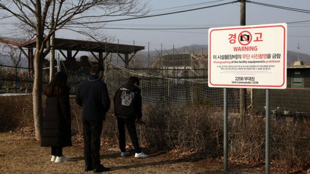

# [Chinese] 中国被指遣返逾600名北韩脱北者，大部分是女性

#  中国被指遣返逾600名北韩脱北者，大部分是女性

> 图像来源，  Getty Images
>
> 图像加注文字，一个脱北者家庭在两韩非军事区边界附近祭拜祖先。

**人权组织表示，多达 600 名朝鲜脱北者被中国遣返后杳无音信，据信他们大部分是女性。**

朝鲜今年8月结束新冠疫情的边境封锁，中国10月大规模遣返脱北者，人数为多年来最多。

人权组织当时曾表示，这会危及脱北者的性命安全。他们被平壤当局视为叛国者，回国后可能面临酷刑、性暴力和处决。

追踪脱北者的南韩人权组织“转型正义工作组”（Transitional Justice Working Group）上周四（12月7日）表示，他们相信多达600名朝鲜人在被强行遣返后“消失”。

该组织成员指出，在封闭政权下通信困难，他们无法与任何被遣返的脱北者取得联系。

一名被遣返脱北者在英国的亲人金赫（Kim Hyuk，音译）告诉记者，她担心自己姊妹金哲玉（Kim Cheol-ok，音译）的安危。

"我姊妹唯一的罪行就是出生在北韩...... 我只希望她能安全地生活，"金赫说。她是少数的已知脱北者。

大多数脱北者身份不明，但据信主要是女性。

今年10月，研究人员发现有中国营运的大巴和小货车，把脱北者从中国吉林省和辽宁省的拘留中心，运送到与朝鲜接壤的五个边境口岸。

“转型正义工作组”指出，这些脱北者据信被关押在沈阳监狱和长春铁北监狱，有300多人于10月9日在稳城口岸过境，同一时期180人在丹东口岸过境。

中国政府没有公开承认遣返事件。

中国当局向来不把脱北者说成是叛逃者，也不会给予他们庇护身份，而是把他们说成是非法经济移民。

自上世纪90年代朝鲜饥荒以来，当地成千上万人试图逃离极权政权。“转型正义工作组”表示，当中超过七成是女性。

近年，朝鲜领导人金正恩加强打击危及边境安全的行为，而在新冠疫情爆发后，当局自2020年1月起封锁边境。

直到数月前平壤才重新开放边境，主要是为了改善与中国的贸易。

