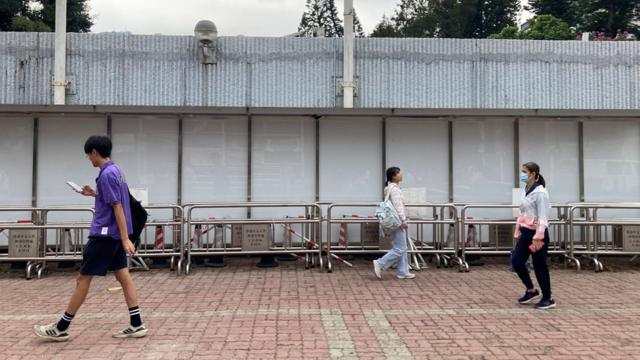
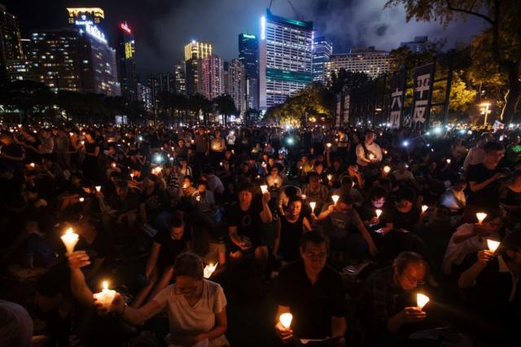

# [Chinese] 香港学术自由：大学如何在北京的控制下凋零

#  香港学术自由：大学如何在北京的控制下凋零

> 图像来源，  Getty Images
>
> 图像加注文字，2019年抗议活动高潮时的香港中文大学。抗议者以雨伞为标志。

**“在香港已经不再有‘红线’了。”一名30多岁的人文学科教授说道。**

“如果他们想对付你，一切都可以成为借口。”这名出于后果考虑而要求匿名的教授说道。

他说，他的噩梦是被北京支持的媒体点名攻击，这可能会让他丢掉工作，甚至失去自由。

这种恐惧席卷了香港的大学和学术界，它们曾一度吸引着顶尖人才。这座城市距离中国大陆很近，但以往又足够远，在学术自由之下可以容纳先进的教室、世界一流的图书馆和档案馆，即便是中国相关的研究。

但一些学者和学生告诉BBC，情况已今非昔比。他们中的许多人出于担忧而选择匿名。

在2021/22学年，超过360名学者离开了香港八所公立大学。根据官方数据，流失率达到7.4%，是1997年香港主权移交到中国统治以来的最高水平。自2019年以来，外国学生入学人数下降了13%。

“曾经存在的自由氛围已经一去不复返，人们忧心忡忡。”香港都会大学政治学学者史蒂芬·奥特曼（Stephan Ortmann）说。他称，许多同事已经离开，留下来的人也很警惕——他听说有些老师从课程中删除了所有与香港和中国相关的材料。

学者们表示，“自我审查”始于2020年香港《国安法》生效之后。这部范围宽泛的法律针对任何被视为是分裂主义或颠覆行为，使当局能够针对活动人士和普通公民采取行动。

> 图像来源，  Getty Images
>
> 图像加注文字，2019年大规模民主抗议席卷香港。

北京表示，在2019年大规模反政府抗议活动之后，北京推动通过的这项法律使香港“由乱到治”。但它也改变了这座曾充满活力的城市。过去，几乎每个周末香港都会有大大小小的抗议活动，但现在公开表达异议已变得难以想象。

公共图书馆里宣扬当局所称的“不良意识形态”的书籍已被清理，各种电影也以国家安全名义而受到审查。

亲民主活动人士被禁止参加上周末举行的仅限“爱国者”参选的区议会选举。最知名的一些民主人士——其中一些人亦是学者——不是身陷囹圄就是流亡海外。

##  “感觉很不一样”

在香港中文大学位于山坡上的庞大校园入口处，七名安保人员守卫着一个岗亭，进出的教师、学生和访客必须表明自己的身份。

这项安检措施于2021年推出。就在那一年，两家有影响力的民主派媒体《苹果日报》和《立场新闻》，以及数十个人权组织和工会被关闭。

“感觉很不一样。”当天前往中大校园的一名校友说道。

2019年的中大曾是一个战场。身穿的黑衣抗议者和防暴警察互掷汽油弹、砖头、催泪瓦斯和橡皮子弹。现在，这里已没有任何异议的痕迹。

曾贴满支持民主的海报和字句的民主墙现在已空空如也，并设置了围栏。

为纪念1989年北京天安门广场镇压中遇难的数千人而建立的民主女神像已不复存在。它于2021年平安夜当天被移走。

> 图像加注文字，人们不被允许在香港中文大学的民主墙上粘贴海报。

“我和朋友们肯定会有一种无力感。”一位不愿透露姓名的中大学生说。“我选择学习社会科学，部分原因就是社会运动……我想学到更多，做出更多贡献。但现在能做的事情越来越少了。”

他已开始避开潜在的敏感课程，如有关中国政治和历史的课程。尽管大学保证保护学生隐私，他还担心自己写的研究论文可能会被泄露。他的担忧并非没有根据，因为香港现在设有热线，人们可以举报他人违反国安法。

他不确定这座他称之为家的城市会给他带来怎样的未来。他认识一些朋友，他们在入学一年后就放弃了大学学业，并与其他14万香港人一起持英国国民（海外）护照签证移居英国，该签证允许他们在英生活和工作。他表示，还有一些人计划很快离开。

“香港曾处于成为西方以外的卓越学术中心的上升轨道上。”一名2020年后离开香港的中国问题专家说。“令人心碎的是，二十年的进步被（国安法）一手打破。”

2011年来港的奥特曼博士对香港失去中国问题学术研究中心地位也感到失望。他说：“它提供了无与伦比的获取大量资源的渠道。随着这些渠道消失，它肯定变得不那么重要了。”

> 图像来源，  Getty Images
>
> 图像加注文字，香港理工大学；2019年抗议期间警察和学生曾在此激烈冲突。

他说，即便是中国问题专家的身份也会成为被审视的目标。“我的一位同事是一名中国问题学者，从中国大陆抵港时，在边境被关了大约四个小时。”

“他们不喜欢我们已经有很长一段时间了，但在2019年后，他们对我们采取了行动。”两年前离开香港的一位人文学者说道。当时尽管有不同同行的推荐，他仍被拒取得终身教职，即学术界的永久工作。

一位社会科学老师说，来自海外的教授和学者的求职申请已经枯竭，甚至连聘请研究助理都变得困难。

现在，香港很少有人文或社会科学专业招收博士生，而攻读博士学位的学生完成学业的机会也越来越少。

##  “我能教什么？”

历史学家、八九学运参与者何晓清于2019年7月来香港执教，当时正值抗议活动爆发的最初几个月。她知道这可能有风险，但她还是抓住了机会。

对于这位中国广州出生长大的学者来说，香港是1989年天安门民运的灯塔。她是看着港剧长大的，并目睹香港记者如何报道1989年天安门广场内外发生的事情。

> 图像来源，  Rowena He
>
> 图像加注文字，何晓清在中大的办公室。

今年10月，她发现自己的香港签证续签申请在长达一年的等待后被拒。几天后，她被雇主香港中大解雇。

香港特首李家超表示，何教授的签证被拒是常规程序的一部分，该程序用于筛出那些可能“导致安全和犯罪风险”的人士。

“我只是为这座城市和人民感到悲伤。”她说。“这将产生严重、更广泛的影响……人们会问，‘我还能继续在香港从事学术工作吗？我能教什么？’”

她说，由于中国大陆禁止任何有关1989年学运和血腥镇压的公众讨论，即便是互联网也没有留下那个重大时刻的痕迹，她的过程相当“孤独”。

但这只会加深她与香港的联系：“我知道，无论如何，每年6月4日，都会有成千上万的人去维多利亚公园。他们一起举着这些蜡烛，告诉世界我们还在这里。我们依然关心，我们依然记得。”

香港一直以来都在举行规模最大的六四烛光晚会，但在2019年举行了最后一次后就被禁止了。

> 图像来源，  Getty Images
>
> 图像加注文字，2019年香港维园六四烛光晚会。

何教授表示，她在中大"尽可能低调"，但她没有审查自己的课堂。

“我拒绝用‘有争议’或‘敏感’来形容我正在做的事情。我的基本责任是传授历史真相和普世价值。”她每周都会与学生们共进晚餐，让他们谈论城市里发生的事情。

“即使我们生活在恐惧之中，我们也能够互相支持。”

在今年二月，在香港的中国国有报章《文汇报》称她为西方代理人。

作为一名政治流亡问题专家，她认为自己对这种经历足够了解。“我以为我非常理解它，但当我不得不只携带一个行李箱和所有衣服，从一间Airbnb（民宿）搬到另一间时，我开始觉得我实际上并不理解。”

不过，海内外香港人的温暖和支持让她感到慰藉。

“将会有一段黑暗的时期。但只有当自己的人民放弃时，公民社会才会消亡。我们不应该放弃香港。”

