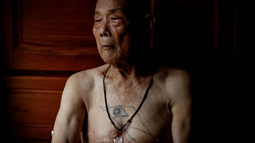

# [Chinese] 台湾大选揭开“中国议题”的世代裂痕

#  台湾大选揭开“中国议题”的世代裂痕

**台湾大选揭开“中国议题”的世代裂痕**

现年93岁的王治全曾是朝鲜战俘，后来来到台湾并最终在金门作战，他在13岁时就正式参军。他的胸前纹有中华民国国旗。

“我参军的时候是被押着走的。如果他们抓不到成年人，就会抓小孩。”他说。“直到今天，我都不想在电视上看到战争。战争是残酷无情的。”

2024年台湾大选即将在明年1月13日举行，“中国议题”不仅影响着选民手中的选票，同时也引起了世代之间的分歧。

近年来中国对台湾的主权宣示变得更具威胁性，不断增加对台军事和政治压力。随着两岸关系紧张升温，台湾选举已演变成对抗北京、展示台湾民主不屈服于威胁的选举，围绕“亲中”、“台湾主权”等议题展开持续讨论。

