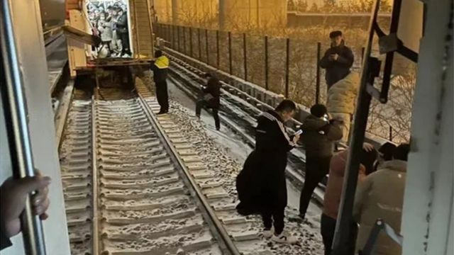
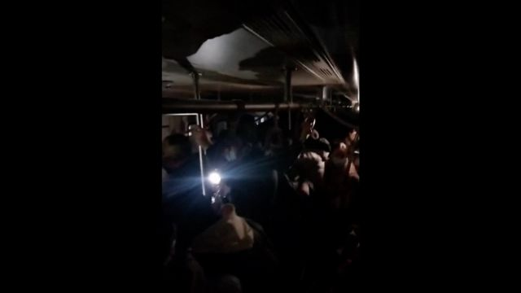
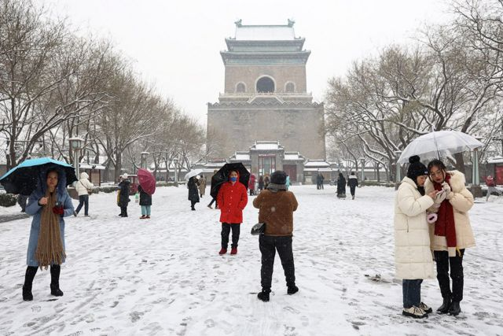

# [Chinese] 北京地铁发生追尾事故 导致102人骨折

#  北京地铁发生追尾事故 导致102人骨折

> 图像来源，  Weibo

**中国北京市当局表示，北京地铁周四（12月14日）晚高峰期间发生追尾事故，导致102人骨折。**

该事故发生在晚上七点左右。运营方最初表示，地铁昌平线一趟列车的最后两节车厢与前车在西二旗至生命科学园站之间“发生分离”。

在中国，此类事故并不常见。北京及该国北方多地最近几天遭到暴雪侵袭，交通出现延误。

事发地点位于北京北部，附近有众多互联网和初创公司，客流量很大。

北京市交通委员会周五（12月15日）称，经过初步调查，事故原因为“雪天轨滑导致前车信号降级，紧急制动停车”，但后车未能有效刹车从而发生追尾。

据中国媒体报道，事发时巨大的冲击力使一些乘客从车厢中被甩出去，摔到铁轨上。

> 图像来源，  Weibo
>
> 图像加注文字，社交媒体上的画面显示，事故发生后，地铁车厢陷入黑暗。

社交媒体上流传的影片显示，有乘客躺在地上，一些人称自己肋骨疼。

还有画面显示，一些乘客打破车厢窗户逃生，还有人穿过厚厚的积雪沿着铁轨离开。

北京市交通委员会在声明中称，截至当日晚11点，共有515人送医院检查，其中骨折102人。

据报道，截至周五上午，423人已出院，67人仍在住院治疗。事故没有造成人员死亡。

> 图像来源，  Reuters

北京地铁就此次事件致歉，并表示该公司将承担受伤人员的医疗费用。

北京地铁还表示，所有地面线及高架线路已采用人工驾驶模式，并且降速运行，因此发车间隔将会拉大。

由于大雪，北京本周已有700多架航班取消，高铁线路也出现晚点。

气象部门表示，此次强降雪过程已基本结束，但未来几日北京气温将持续维持在-12℃以下。

