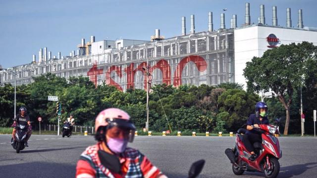
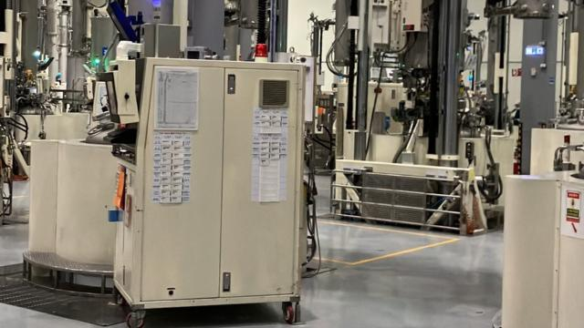
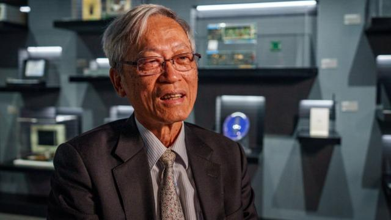
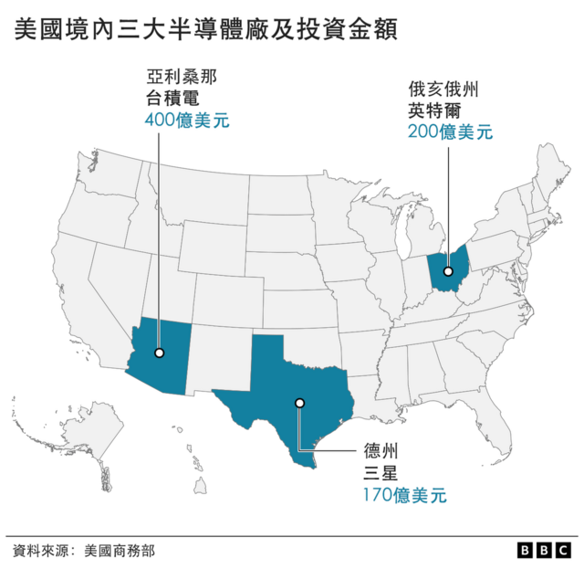
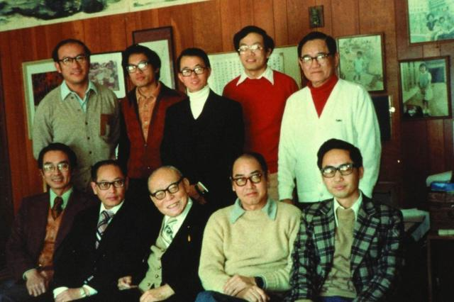
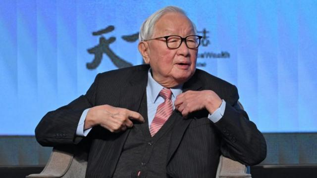

# [Chinese] 台湾成为全球半导体业超级巨星的半世纪历程与秘诀

#  台湾成为全球半导体业超级巨星的半世纪历程与秘诀

  * 傅东飞（Rupert Wingfield-Hayes） 
  * BBC记者 发自台北 

> 图像来源，  Getty Images

**1969年夏天，时年23岁的史钦泰搭上飞往美国的班机，他正飞向一个截然不同的世界。**

他在一个被甘蔗田环绕的渔村长大。后来在台湾首都台北上大学，当时的台北是一个尘土飞扬的城市，遍布灰暗的公寓大楼，拥有私家车的市民并不多。而现在，他要前往普林斯顿大学读书了。

彼时美国刚将人类送上月球，波音747已经开始翱翔天空。美国的经济比当时的苏联、日本、东西德和法国的经济总和还要大。

现在77岁的史钦泰博士回忆道：“当我降落美国时，我感到震惊。我心想：台湾如此贫困，我必须做些什么来帮助它变得更好。”

而他做到了。

史钦泰后来和一群年轻的有志之士，将一个出口蔗糖和T恤的岛屿转变成了一个电子产业霸主。

今日的台北富裕且时尚，时速350公里的高速铁路穿越岛屿的西岸。台北101大楼，曾短暂地被认定是全球最高的建筑物，矗立在城市上空，象征着城市的繁荣。这或许其中很大一部分归功于一个比指甲还小的微小装置：矽半导体 （silicon semiconductor），薄如纸张，现在是以其制成的晶片（芯片 chip）闻名。晶片是现在当代人类生活使用任何工具必需的核心技术，从iPhone到飞机。

台湾现在制造了超过一半用以推动当代人类生活的晶片。最大的晶片制造商台积电（TSMC）是世界第九大市值的公司。

这使得台湾几乎不可替代，但也让它变得脆弱。

因为，中国担心外界可能切断最先进晶片的供应链，所以正在花费数十亿美元窃取台湾的王冠。北京还可能并吞这个岛屿，正如它一再威胁要做的那样。

但事实上，台湾通往“晶片超级巨星”之路并不容易复制。因为，台湾拥有一种“秘密配方”，由其无数工程师透过数十年的辛勤工作所磨练而成。此外，这种半导体晶片制造还依赖于一个构建于经济联系之上的网络，而不断升级的美中竞争现在正在试图断开这些经济关联。

> 图像来源，  Globalwafers
>
> 图像加注文字，半导体是一个全球化的生态圈，亦即一个晶片产品的完成，从原料，设计，晶圆制造到代工晶片及封测等等，常常是全球不同公司的协作。但现在各国都希望有自己的生态圈。

##  从糖到矽

史钦泰抵达普林斯顿时，“美国正开始半导体革命。”

当时距离诺伊斯（Robert Noyce）制造出“单晶片电路”仅有十年，将电子元件集成到单片矽中，这是微晶片的早期版本，也推动了个人电脑革命。

在普林斯顿博士毕业后的两年时间里，史钦泰先在雷明顿兰德公司（Burroughs Corporation）设计记忆晶片，该公司当时规模仅次于IBM，是电脑制造业的领先者。同时，在石油危机导致其出口遭受重创之后，台湾正在寻找一个新的产业。矽似乎是一种可能性，史博士认为他可以帮上忙：“我认为是时候回家了。”

1970年代末，他加入了台湾最优秀的电子工程师组成的一个新研究实验基地，这个名字听起来很沉闷的“工业技术研究院”，之后却将在重塑这个岛屿的经济中发挥巨大作用。

工作始于新竹市，一个位于台北以南的小城。今天，该地成为全球电子产业枢纽，由台积电的巨大制造厂所主宰。这些晶片厂每一座都有好几个足球场那么大，是地球上最“清洁”的地方之一。

晶片制造的细节是被严格保护的机密，不允许外部摄影机进入。最新的工厂“fab 18”位于台湾南部，是一座投资近200亿美元的半导体大厂，将很快开始生产下一代iPhone产品使用的三奈米晶片。

这些成果远远超过史钦泰和同事们在1970年代开办实验性的工厂时的想像。他们当时乐观的原因是他们当时拥有一家美国大型电子公司授权的技术，但令所有人惊讶的是，他们这家台湾工厂的表现青出于蓝而胜于蓝。

> 图像加注文字，史钦泰博士是1970年代台湾进军半导体产业的领军人物之一。

其中原因很难解释，台湾成功的精确方程式也难以捉摸。

史博士的回忆则相对平淡。他告诉我说，“产量比原来的美国无线电公司（RCA）的工厂更好，成本更低。因此，这让政府相信，也许我们真的能做些什么。”

台湾政府提供了最初的资金，首先是给了联华电子，然后在1987年，注资给了后来成为世界最大晶片代工厂的台积电。后来政府聘请了张忠谋，一位美籍华裔工程师，曾是美国电子巨头德州仪器公司的高阶主管。

这是一次幸运或绝妙的抉择——今天，93岁的张忠谋被誉为台湾半导体产业之父。

当时，张忠谋迅速意识到，在已有的游戏中与美国和日本巨头竞争会失败。因此，台积电只为他人制造晶片，而不是设计自己的晶片。

这种在1987年还很少听说的“晶圆代工模式”之后改变了整个产业格局，为台湾成为半导体龙头铺平了道路。

而且当时时机再好不过。

矽谷的新一代初创公司，包括苹果、超微、高通、英伟达当时都没有资金建造自己的工厂。他们很难找到无法自行生产的晶片的制造商。

史钦泰表示：“他们当时将不得不去领先的半导体公司，询问他们是否有多余的生产能力可供使用。但后来台积电出现了。”

现在，加州的“无厂公司”能与台湾的晶片制造商合作，而且后者对窃取设计或与前者竞争不感兴趣。

##  “秘密配方”

世界每年生产超过一兆（万亿）个晶片。一辆现代汽车上装配的晶片数量在1500到3000个之间。据报导，iPhone12上有大约1400个半导体晶片。由于疫情期间对电子产品需求飙升，2022年的晶片供应不足影响了洗衣机到宝马汽车的生产与销售。

台湾在该产业可以取得非凡的成功：在这一兆枚晶片中，台湾的出货量超过一半，而且几乎都是所有最先进的晶片。这种成功来自其巨大产能，换言之，台湾的制造极其高效。

因为，制造矽晶片昂贵且繁琐。它始于一个从单一晶体生长出来，超纯矽所构成的“矽晶棒”。而每个矽晶棒可能需要几天才能制成，重量可达100公斤。

当精密的切割机将薄薄的矽片切成细长的晶圆时，另一台机器还利用光，在每个晶圆上蚀刻出微小的电路。一个单一的晶圆可能包含数百个微处理器和数十亿条电路。

> 图像加注文字，包括台积电所在的凤凰城，几大晶片公司的选址都并不在繁华的美国中心城市。

最终的晶圆良率很重要，也就是能够被用于生产晶片的晶圆数量与总共开始加工的晶圆数量之间的比率。

在1970年代，美国公司的晶圆良率低至10％，最好也只有50％。到了1980年代，日本平均晶圆良率达到60％。而台积电据称以80％的晶圆良率超越了所有其他公司。随着时间推移，台湾制造商成功地将更多电路塞进狭小的空间中。使用最新的极紫外光微影机，台积电可以在单个微处理器上蚀刻出1000亿条电路，或者每平方毫米超过1亿条电路。

台湾公司为什么这么擅长于此呢？没有人知道确切原因。

但史博士则认为这问题很容易回答：“我们有崭新的机器，也有最先进的设备。我们还招聘了最优秀的工程师。即使是机械操作员也非常熟练。然后，我们不仅仅是引进新技术，还从我们的美国老师那里汲取教训，不断进行改进。”他告诉我说。

> 图像来源，  Courtesy: ITRI
>
> 图像加注文字，1977年，史钦泰（后排左二）回到台湾后不久和其他工程师在一起。

另一名曾在台湾一家大型电子公司工作多年的年轻人也同意。他称：“我认为台湾公司在技术上不擅长有大突破。但他们很擅长接受别人的想法并加以改进。这可以通过反覆试验，不断调整细节来实现。”

这很重要，因为在半导体制造厂中，机器需要不断校准。制造晶片是工程，但也不仅仅是工程。有些人将其比喻为烹饪——就像一顿美味的大餐。给两位厨师相同的食谱和成分，能力较强的厨师会做出更美味的菜。

换句话说，台湾拥有一种秘制的酱汁配方。

但这位不愿透露姓名的年轻人认为台湾公司还有另一个优势。“与美国的软体工程师相比，即使在这里最好的公司，工程师的薪水也相当差。”他表示。

“但与台湾其他行业相比，薪水还算不错。因此，如果在大型电子公司工作几年后，你将能够买房，买车。你还能结婚。因此，人们忍受了这一切。”他说。

这位先生还跟我描述了每周六天的工作，每天早上七点半开始开会，工作通常持续到傍晚七点钟。而且，如果厂内出现问题，他还会在星期天或节假日被叫去工作。

“如果人们不愿意做这份工作，公司就完了。正是因为人们愿意忍耐，这些公司才能成功。”他告诉记者。

> 图像来源，  Getty Images
>
> 图像加注文字，前台积电董事长张忠谋去年将在美国扩大晶片生产形容为昂贵、浪费的徒劳之举，因为在美国制造晶片将比在台湾昂贵50%。

##  “矽盾”

2022年12月，台积电在美国亚利桑那州动工兴建一座价值400亿美元的工厂。这被总统拜登誉为高科技制造业回归美国领土的大转变。但自那时以来，新闻标题开始变得有些不大正面。譬如一篇新闻文章标题是：“他们不听话：亚利桑那州晶片工厂内部困境”，另一篇则是“台积电面临工会反扑，同时难以招聘工人！”

晶片生产原定于明年开始。现在被推迟到2025年。

前台积电董事长张忠谋一开始就对此深感怀疑。去年，他将在美国扩大晶片生产形容为“昂贵、浪费的徒劳之举”，因为在美国制造晶片将比在台湾昂贵50%。但台湾的晶片制造实力让其成为美中科技战的中心。

华府希望阻止台湾向中国提供先进晶片，担心北京会利用这些晶片来加速其军武及人工智慧产业发展。

再者，俄罗斯入侵乌克兰造成欧洲天然气供应吃紧，美国政治人物对台湾处境感到不安。他们忧心，高端晶片生产主要集中于台湾，一旦发生中国入侵，美国经济将成为笼中鸟。

然而，台湾企业认为将生产转移出去缺乏经济利益。他们只是在政治压力下勉强地这么做。

因为自身的成功遭到指责，甚至应该减弱被视为“矽盾”的产业——这样的说法让台湾人感到愤慨。与此同时，世界各国对是否值得保护这个岛及其民主社会显得摇摆不定。

史钦泰表示，那些试图强制重组全球晶片生产的人误解了产业成功背后的核心：“如果你看半导体的历史，没有哪个国家主宰这个行业，台湾可能主宰了制造业，但供应链很长，它的每一部分的创新都有助于行业的增长。”

譬如，全球大部分的矽矿石来自中国，尽管其中大部分用于太阳能行业。德国和日本在处理晶圆所需的化学品方面处于领先地位。德国蔡司（Carl Zeiss）公司制造光学零件，提供给生产晶片光刻机、来自荷兰的艾司摩尔（ASML）公司。而这繁琐的制造遵从源自美国公司或总部位于英国剑桥的安谋控股公司（ARM Holdings）之设计。

史博士对于北京能否在中国内部重建这个供应链（从原材料到设计到高端生产）表示怀疑：“如果他们想创造一种不同的模式，我祝他们好运，” 他耸耸肩说。

他补充说，“因为如果你真的想要创新，你需要来自世界各地的所有人一起共事，这不是一家公司或一个国家能做到的。”

> 图像来源，  Ethan LIN
>
> 图像加注文字，台积电在凤凰城的厂房

但是对于像美国一样把中国排除在外，他同样表示怀疑。他说，“我认为那可能是一个重大的错误！”

“回顾过往，我很幸运能见证台湾经济的非凡成长和长时间的和平。现在我看到世界其他地方的冲突，我担心它可能波及亚洲。我希望人们能够珍惜我们所付出的宝贵努力，不要将其摧毁。”

