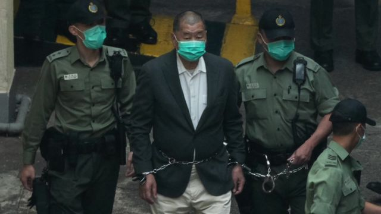
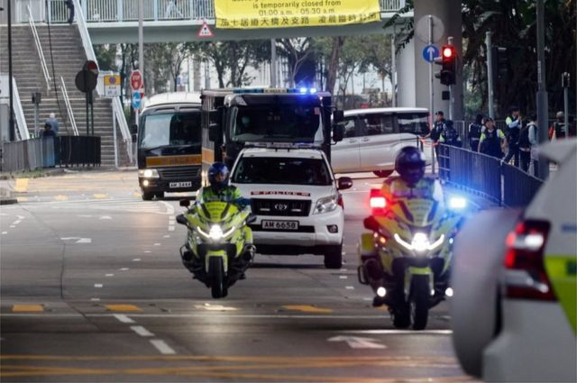
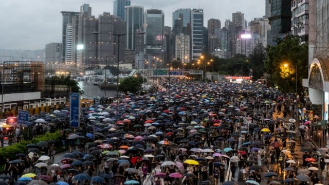
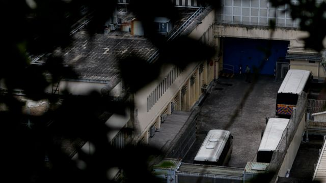
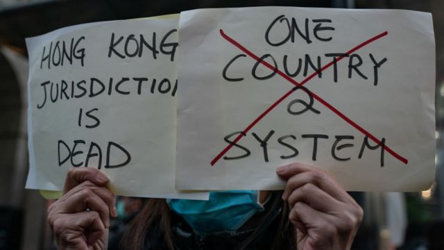
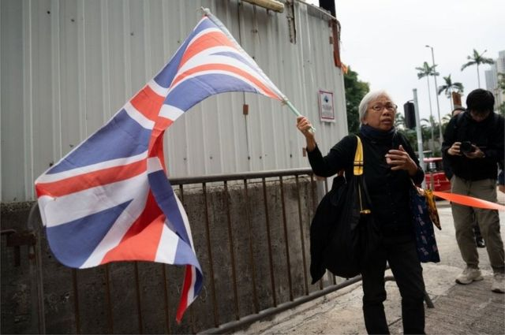

# [Chinese] 黎智英的审判具标志性意义， 是对香港法院的一次考验

#  黎智英的审判具标志性意义， 是对香港法院的一次考验

  * 毛远扬（Frances Mao） 
  * BBC记者 

> 图像来源，  Reuters
>
> 图像加注文字，2020年12月，香港法院推翻了黎智英的保释申请，他被还押至今。

在入狱三年半之后，黎智英终于被带进香港法庭，接受危害国家安全罪的审判。

周一（12月18日）他被从后门带入法庭，所以只有在法庭内的人才能亲眼看到这位被中国政府称为“臭名昭著的反华分子”的民主人士。

这位76岁的老人明显消瘦了许多，面容憔悴。他的对面是三名法官，后者将在未来几个月内决定其命运。

黎智英否认了所有指控，辩称自己只是在捍卫香港的自由，这里是他创造财富的地方。

黎智英在伦敦的律师告诉BBC，不指望他们的客户在今天的香港得到公正的审判——尽管当局会提出相反的论点。

“表面上看，机构还在，建筑还在，法官还在，律师也还在。但事实上，法治的基本原则受到了侵蚀。”黎智英国际法律团队的大律师乔纳森·普莱斯（Jonathan Price）表示。该团队无法在香港为黎智英辩护。

“每个人都知道只会有一个结果——这绝对是明摆着的。”

> 图像来源，  Reuters
>
> 图像加注文字，第一天庭审结束，警方车队将黎智英送回收押所。

自2020年以来，至少有250名香港人因涉嫌危害国家安全罪而被捕，黎智英仅是其中之一。

像许多被指控的人一样，他大都被剥夺了保释、陪审团以及选择律师为其在庭上辩护的权利。

香港坚称其仍以法治为基础，继承着来自英国的普通法法系。这也是这座城市成为国际金融中心的原因。香港坚持这一形象，并继续寻求外国投资。

但批评人士表示，在北京的威权统治下，这座城市已经发生了不可逆转的变化。北京在2019至2020年镇压了亲民主抗议活动，并实施了国家安全法，以惩罚异议人士。

如果罪名成立，黎智英将面临终生监禁。普莱斯表示，他的境遇代表了“香港所发生的一切”。

这位媒体大亨所创办的《苹果日报》曾猛烈批评北京。在国安法生效两个月后的2020年8月，他在一次警方的突击行动中被从自己的新闻编辑室押走。

他被控“串谋勾结外国势力”，并被控试图破坏香港稳定。

检方指其文章质疑香港未来，并呼吁国际社会对香港官员实施制裁。

他后来还被指领导了一次亲民主抗议活动，亦参加了一场被当局禁止的为纪念1989年北京天安门屠杀遇难者举行的晚会。

他因“未经批准集结”被判处14个月监禁，2022年因另一项与违反租契有关的欺诈罪被判刑5年。
 黎智英国安法案件开庭：前传媒大亨面临终身监禁，英国外相呼吁放人 
 香港壹传媒创始人黎智英身负的多起案件 一图看完全过程 

这是对这名直言不讳的香港商人的惊人打击。黎智英曾靠时尚业白手起家，通过Polo衫品牌佐丹奴赚取了数百万美元。后来他进军报业，而做出这一决定的原因是1989年的“六四”事件。

在2019年香港示威期间，黎智英会置身于被催泪弹袭击的人群，了解抗议者的声音，然后返回新闻编辑室指导报道。

这位媒体大亨被视为几乎不可撼动的人物，许多人认为他拥有的资源超出了当局的控制范围。

但法律学者表示，事实上他的案件表明，在香港，任何人在为民主发声时都多么脆弱。

不仅黎智英的保释请求一再被拒，就连这位英国公民选择的律师——英国御用大律师蒂莫西·欧文（Timothy Owen KC）——也被当局禁止参与此案。

尽管外国律师已在香港法院执业数十年，但香港当局去年决定，他们可能对国家安全构成威胁，需要获得许可才能处理国安案件。

此前，香港特首李家超对香港终审法院允许黎智英聘请欧文的裁决提出质疑，并要求北京方面“释法”。

> 图像来源，  Getty Images
>
> 图像加注文字，黎智英已因领导2019年一场吸引170万抗议者的亲民主游行而服刑 12个月。

黎智英已因领导2019年一场吸引170万抗议者的亲民主游行而服刑 12个月。

他也不会面对陪审团，尽管这在香港以往判处终身监禁的刑事法律案件中是常规做法。

根据国安法，政府有权拒绝陪审团，并任命一个由三名法官组成的小组。迄今为止，他们对每一名涉国安法的被告都是这样做的。

香港律政司表示，此举“旨在保障而非损害被告获得公平审判的权利。”但黎智英的律师提出上诉，辩称他的法官是由香港领导人亲自挑选的。

香港法律学者黎恩灏表示，国安法在一夜之间颠覆了长期存在的法律原则。“我们面对的是相当模糊和广泛的立法——许多程序保障被一扫而光，”他说。

黎恩灏表示，对那些依国安法被起诉的人来说，“现在的推定是不得准予保释。”

因此，被告必须自证他们为何应被释放，而不是由检方提出将他们关在监狱里的理由。

法律监督人士表示，近五分之四的人被拒绝保释。

当局表示，每一项国安法保释裁决都得到了“公平处理和公正评判。” 律政司告诉BBC：“保障国家安全的重要性……解释了为什么国安法对准予保释提出了更严格的条件。”

但已离港的，曾任大律师和讲师多年的张语轩表示：“政府策略的全部意义就在于尽可能长时间地让人们处于审前拘留状态，这是法律上的真空地带。”

> 图像来源，  Reuters
>
> 图像加注文字，荔枝角收押所，黎智英被羁押的监狱之一。

多名曾在国安法下被监禁的人此前告诉BBC，他们觉得这种策略的目的是让他们筋疲力尽、士气低落。

张语轩表示，这就是香港当局目前的运作方式：“在第一天审判他们，然后用第二件事起诉他们，然后一遍又一遍地重复这种做法。”

香港政府还表示，到目前为止，国安法的定罪率达到100%。法律专家认为，这是一个令人痛心的统计数据。

“任何正常运作的司法系统都不可能在100%定罪率的环境中运行，这是不可能的。这让人联想到独裁者声称拥有98%民众选票的虚假民主。”普莱斯说。

官方称国安法的打击目标是颠覆和分裂国家的行为，但其已被用来监禁流行歌星、律师和领导民主运动的政治人士。

一个突出的案例是“香港47人案”，涉案者为试图在2020年立法会选举前组织初选的活动人士和立法会议员。

但随着当局重新使用殖民时代的煽动罪，一些普通人也陷入困境。黎智英也面临这一指控。

> 图像来源，  Getty Images
>
> 图像加注文字，2020年12月，一名黎智英支持者在他的保释听证会外表达对香港自治受威胁的担忧。

去年11月，23岁的袁静婷因在日本留学期间于Instagram上发布“我是香港人；我主张香港独立”的字句，而被判入狱两个月。

她是根据国安法被捕的，但她后来被以煽动罪起诉。她是首个因在香港以外的言行被定罪的人。

今年6月，单亲母亲罗爱华因在Facebook上分享亲民主口号而被定罪。她被拒绝保释，她12岁的儿子在宣判时请求释放她，但仍被判囚四个月。

“这些人不是投掷炸弹的革命者，而只是想表达另一种观点。但现在这样做很危险。”今年离港的香港中文大学法学教授迈克尔·费希尔（Michael Fisher）说。

“五年前我们认为理所当然的事情：言论自由、示威自由——这些都被有效地侵蚀或摧毁了。”

1997年英国将香港移交中国时，条约明确规定香港的政治自由和权利将再保留50年不变。

香港政府表示，公民的权利，包括获得公平审判的权利，仍然受到香港《基本法》的保护。但政治和法律专家表示，它们已经被国安法所取代。

这导致了香港法律专业人员的流失。据估计，自2020年以来，已有10万人离开香港，其中包括律师和法官。

“一些被告决定在没有律师的情况下进行诉讼，因为他们对指派的律师缺乏信心。”法律学者陈文敏写道。他曾任香港大学法律学院院长，于2021年辞职并前往美国。

其他没有经济能力的人不得不接受检察官为他们安排的辩护人。

> 图像来源，  EPA
>
> 图像加注文字，香港曾因言论自由而闻名，但王婆婆（王凤瑶）是此次唯一在法庭外发声的抗议者。

香港大律师公会前主席已经离港，三名外籍法官——包括两名英国最高法院法官——已从香港终审法院辞职。

法官韦彦德勋爵（Lord Robert Reed）与贺知义勋爵（Lord Patrick Hodge）在2022年写道，香港法院“因其对法治的承诺而继续受到国际尊重”，但与英国政府观点一致，他们不能继续在香港任职，“否则会显得是在支持一个背离政治自由和言论自由价值观的政府。”

这一点在审判黎智英的西九龙法院外显而易见。

此前庭审时，人群经常聚集在一起，拿着标语和《苹果日报》排队等候，但在周一（12月18日），只有一名示威常客大声疾呼。

这名被称为“王婆婆”的活动人士挥舞着港英时代的米字旗喊道：“支持黎智英！支持真相！”

她很快被包围，并被警察带走。

