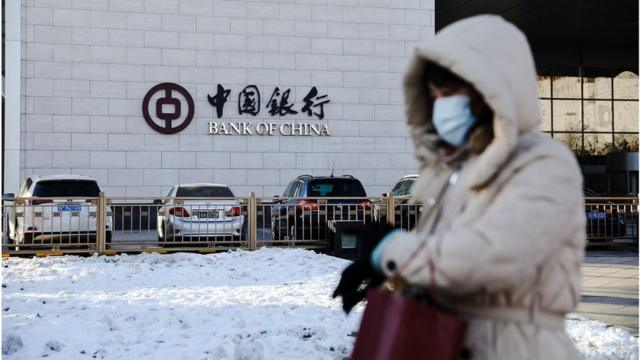
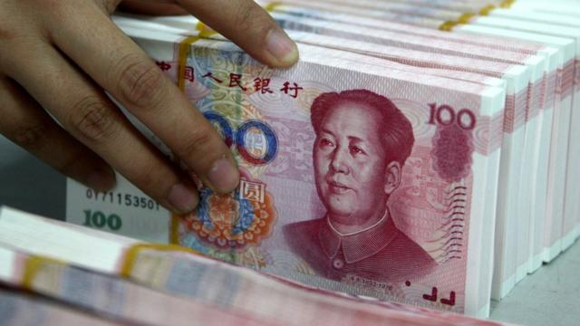
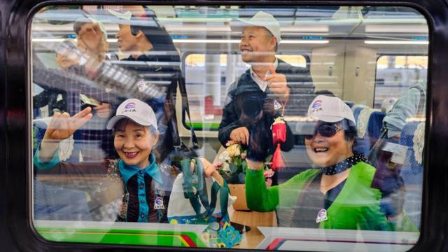

# [Chinese] 中国经济2024：如何丧失信心？又如何重建？

#  中国经济2024：如何丧失信心？又如何重建？

> 图像来源，  Getty Images

**去年此时，中国放弃严格的新冠“清零”措施，疫情期间遭受重创的经济，走出了病房，但过去一年，预期之中的快速反弹没有出现，而是在一场“长新冠”（Long Covid）中缓慢复苏。**

虽然电影院票房创下新高，中国各地“五一”和“十一”假期旅游景点人头攒动，但在2023年的更多时间，物价（CPI）、消费、服务业投资和房地产投资都不尽如人意，这些经济数据都在描述一个事实——老百姓没有信心。

“没信心”成为过去一年的高频词，也汇聚了中国经济困难的所有症结。在刚刚举行的中共中央经济工作会议上，也用一些中国官方语境中不常出现的词语来印证这一点：“有效需求不足”、“社会预期偏弱”、“国内大循环存在堵点”，等等。

上一次，“信心”两个词在中国成为焦点，是在2008年，当时金融海啸来袭，中国沿海出现外贸工厂的“倒闭潮”，时任中国总理温家宝在美国纽约的一次演讲中称，“在经济困难面前，信心比黄金和货币更重要”。有趣的是，中国随后出台规模庞大的"四万亿"计划，快速拉动经济，最后提振信心的，恰恰是“黄金与货币”。

这一次，中国面临的情况更复杂，内外部问题交织，如何真正重建人们的信心，将经济推回正常的轨道，药方变得不那么清晰和直接。“疫情让很多人都变成了医生，在经济领域很多人也成了医生，说我们需要这样或那样的治疗。”瑞银中国首席经济学家汪涛在近期香港一场活动上表示，“而作为宏观经济学家，我会说首先要稳定病人，然后再考虑其他事情。”

##  信心丧失？

> 图像来源，  EPA
>
> 图像加注文字，过去一年低迷的民间投资，使不少经济学家开始担心“借款人的消失”是否会重复当年日本经济停滞的老路。（图为一名戴着口罩的女士走过北京中央商务区）。

对于59岁的郭天然（化名）来说，信心的崩塌是一瞬间的事情。

疫情期间，郭天然在她生活的河南省买下一套房子，126平米，再加一个7万元的车位，一共花了82万元人民币。“买的时候，家里人还建议我买个大企业的，所以就选了恒大，风险小，而且物业服务好，结果没想到签约不到半年，就‘爆雷’了。”

原本是给儿子买的婚房，“爆雷”之后，郭天然还是不得不每月还贷款5923元，“我家那口子每月有固定工资，我偶尔打工，不稳定，现在每月能自己支配的也就一两千块钱。”郭天然说，甚至这些钱都不敢都花了，儿子毕业没找到合适工作，去杭州的公司里实习，还需要家里补贴。

郭天然并不是极端案例，在中国，仅恒大一家企业，留下的“烂尾楼”达到162万套，涉及600万业主。

> 图像来源，  Getty Images
>
> 图像加注文字，中国正处于历史上最严重的房地产衰退期。

“疫情之后，所有人都期待中国经济强劲反弹，然而一件事情破坏了这一复苏趋势。”汪涛表示，中国正处于历史上最严重的房地产衰退期，目前房屋开工率仅为2020年的35%，相比2021年的房屋销售量下降了40%以上。这一非常严重的房地产衰退期立即产生两个溢出效应：

其一是地方政府财政。中国地方政府很大程度上依赖土地出让金，以及依靠土地和房产作为抵押来举债的平台公司。每当中国低迷时，就需要更多债务来刺激经济，而现在随着房地产衰退，再无法做到这一点。因此，以往的渠道被堵塞了，与此同时，地方政府害怕公开违约，不得不削减开支，甚至推迟或削减公务员工资。他们所做的不是支持经济，而是财政紧缩，对经济毫无帮助。

其二是家庭消费。在中国，家庭财富的大部分是住房，超过60%。当房地产市场下滑时，家庭如何有信心消费，尤其是中产阶级，比如中产阶级的大件家电消费明显下降。

《经济学人》智库（EIU）首席中国经济学家苏月向BBC中文表示，在中国改变防疫政策之时，市场对中国经济过于乐观了。市场预期中国会出现其他主要经济体的快速、“V型”复苏。然而，中国缺乏以家庭为重点的财政转移支付，中国的家庭没有可随时用于消费支出的大量储蓄。

苏月补充称，储蓄水平的提高主要反映了消费者的谨慎态度，而不是等待消费的过多储备。因此，消费反弹的轨迹并不顺畅。此外，房地产市场疲软和地方财政状况也是影响形势的额外因素。而政府的应对措施过于零碎。

从最新的数据来看，11月中国经济在政府投资拉动和外部需求逐步企稳之下，稳步复苏。

但是零售额的增长更多由于去年低基数效应导致，剔除这一因素后，月度环比增长出现温和收缩。这结束了连续三个月的增长，表明消费者情绪依然脆弱。

苏月据此认为，消费可能还没有恢复到持续增长的轨道，而持续的通货紧缩反映出消费需求的减弱。

而需求减弱，会影响企业利润，推高融资成本，减弱民间投资，反过来进一步影响信心和整个经济的复苏。

郭天然是一个典型的代表，她买的房子“爆雷”后，她极为担心，“把养老的钱放进去，未来30年还每月把工资交出去，最后可能什么都没有”，因此储蓄的意愿甚至更强，消费的意愿更弱，再加上儿子毕业已经半年还未找到正式工作，使她“啥都不敢买，哪儿也不想去”。

> 图像来源，  Getty Images
>
> 图像加注文字，缺乏信心的民众，在经济决策时展现出保守的一面。

##  后果：停滞与陷阱

缺乏信心，使中国民众在各种经济决策中展现出保守的一面，与过去30年狂飙突进截然不同。

比如，今年上半年，大量贷款者继续涌入银行，申请提前还房贷，以至于银行开始设置“门槛”——有银行关闭手机客户端上的提前还贷功能，要求客户到线下网点排队申请；还有银行表示，总行设置了每月提前还房贷的额度，而目前额度用完，需要排到4月，甚至有网友说自己排到10月才能还款。

银行频频设置“门槛”限制提前还贷，还因为住房贷款对于中国的银行而言，几乎是最优质、最稳定，且规模巨大的资产。

截至去年底，中国个人住房贷款余额38.8万亿元，如果提前还贷的量达到10%，意味着银行的房贷量在短期内减少将近4万亿，对银行的盈利能力带来挑战。

一位武汉的房地产从业者称，以前建议别人买房子时，都是能贷多少就贷多少，因为作为一般人，住房贷款几乎是能贷到的利率最低的资金，即便有多余资金，也可以拿去其他投资渠道，而不建议全款买房。

> 图像来源，  Getty Images

“但现在我很难这么建议，因为各种投资渠道的盈利能力都大幅下降，小生意也不景气，再加上过去五年买房的人，利率都高到5%，这样对比一下，提前还房贷几乎是划算的选项。”上述房地产从业者表示。

再加上，过去一年低迷的民间投资，使不少经济学家开始担心“借款人的消失”是否会重走当年日本经济停滞的老路。

野村证券首席经济学家辜朝明长期研究日本这场旷日持久的停滞，提出了“资产负债表衰退”（Balance sheet recession）的概念，即泡沫破裂后，进入全民“负资产”时代，日本突然没有人借款了，企业的首要任务不是借钱扩张，而是赚钱还债，不追求利润最大化，而追求债务最小化。

结果就是，任凭政府怎么降低利率、超发货币，企业就是借钱还债，而不是用来投资，最终日本政府甚至一度将利率降为负，依然无法提振经济，出现了罕见的货币政策失效现象。辜朝明将其概括为“借款人的消失”，也就是日本经济长期停滞的根源。

不同的是，日本停滞时经济已处在较高水平，而中国人均GDP还是1万多美元，如果停滞，则面临掉入“中等收入陷阱”的风险。

> 图像来源，  Getty Images
>
> 图像加注文字，中国已故的前总理李克强曾表示，保经济，实质上是为了保就业。

##  重建信心：政府的角色

汪涛表示，当人们谈论信心缺失时，经常有两种声音，一种声音抱怨政府干预太多。

过去几年间，从互联网、教育培训，到房地产、电子游戏等产业接连遭受监管或打压，造成这些产业估值下降，投资乏力，但在今年其中不少政策又逐步放开，比如取消住房限购。频繁而不确定的政策，使市场抱怨政府的干预。

汪涛也提到另一种几乎相反的声音，比如华尔街投资者，他们抱怨政府介入得不够多，因为他们习惯于每当增长放缓时，中国政府总有一个刺激计划。

中国政府每年设定一个经济目标，然后无论如何都会动用自己的工具箱，达到那个目标，在中国几乎没有经济周期可言，“这不是正常的市场经济，你猜这么着？这次我们可能真的要在中国看到经济周期了。”

上海交通大学安泰经济与管理学院教授何帆提出中国政府在处理经济问题时的独特现象——中国经济政策在“结构性改革”和“较快经济增长”之间摆动。

何帆表示，长远来看，这两个目标是一致的，但短期来看如果改革，就要付出艰辛努力可能导致短期经济放缓，政府转而刺激经济；如果经济增速较快，政策重点就转向结构性改革，然后经济放缓，以至于政府担心会出现衰退或危机，就再次转向宏观经济的稳定。“因此明年我们也许可以期待政策重点转向增长。”

但这个过程并不简单，以房地产举例，何帆认为很难确知会发生什么，在买房者一方，很多人在恐慌过后，没有看到危机，那么他们会再次购买；但供应上却有问题，开发商不愿意购买土地，也不愿意造新房，届时需求回升而供给不足，房价短期可能飙升，这又使政策制定变得更加复杂。

苏月给出的办法则更加直接——中央政府应出台以家庭和消费者为中心的财政政策。发行优惠券、减税或提高社会福利等措施可极大地增强家庭部门的信心，鼓励增加支出。

她进一步称，以投资为重点的财政政策固然重要，但其对消费——目前经济中最薄弱的环节——的影响可能需要更长的时间才能实现。因此，优先采取直接刺激家庭信心和支出的措施，可以为经济提供更直接、更有影响力的支持。另外，要增强私营企业的信心，关键在于改善商业环境和政策环境的一致性。

> 图像来源，  Getty Images
>
> 图像加注文字，专家认为，短期稳定经济提振信心，要么直接发钱或消费券，要么解决居民的后顾之忧，比如养老和医疗。

“首先要稳定病人，然后再考虑其他事情。”汪涛表示，应该通过财政支持来稳定房地产市场。至于财政支持，首先要支持家庭部门，其次，如果你不想直接发钱，那就在医疗保健和养老金方面多花些钱，这样人们就会对未来的事情感到担忧，从而更有信心，他们就可以进行消费。

对于2024年的展望，汪涛预计，中国财政政策能稳定经济，市场将迅速稳定在一个非常低的水平，这仅意味着不再进一步恶化，然后消费开始有所改善，估计增长率会在4.5%左右。

《经济学人》智库预计，明年中国经济将增长4.9%，增速将放缓0.6%，如果考虑到基数效应，这将表明中国的基本面更加稳固。全球需求的改善将支撑这一表现。与2023年相比中国经济的基础将更加稳固。尽管疲软的劳动力市场和收入预期将拖累经济强劲反弹，但政府推出的在北京和上海延长购房宽松政策的举措将有所帮助。

“即使经济增长放缓，也不太可能进行更激进的改革；2023年底不会召开三中全会，这表明政府在市场改革方面将保持谨慎态度。”苏月称。

如何才能恢复信心？把这个问题抛给郭天然，她坦然说就两点：“我的烂尾楼能建好，我的儿子能找到工作，其他啥都不用。”

