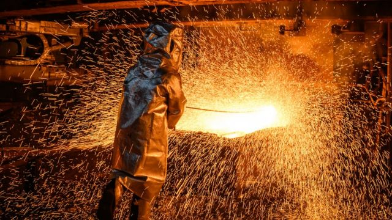
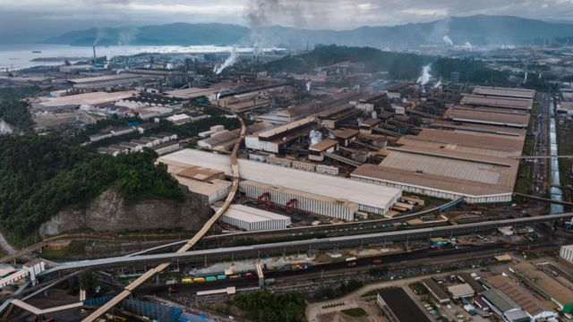
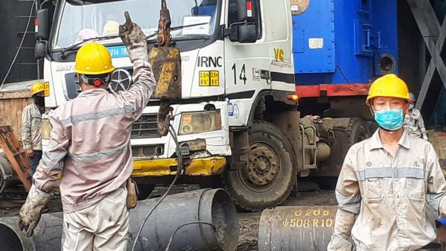
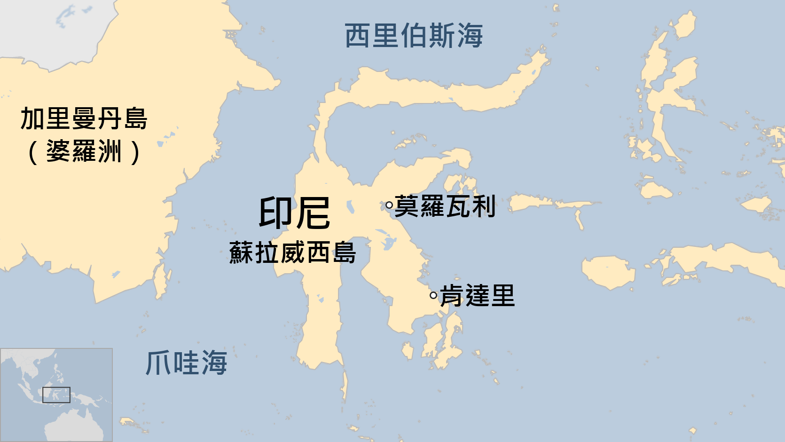

# [Chinese] 印尼青山工业园中资工厂爆炸致多人死伤 安全管理问题再引关注

#  印尼青山工业园中资工厂爆炸致多人死伤 安全管理问题再引关注

> 图像来源，  Getty Images

**印尼苏拉威西岛（Sulawesi island）青山工业园一家中资镍工厂发生爆炸，造成至少13名工人死亡，数十人受伤，其中一些严重受伤。死者是8名印尼人和5名中国籍工人。**

印尼官方初步调查显示，这是工人在维修一个冶炼炉时，不慎引燃易燃液体，引爆了附近氧气筒产生巨大的爆炸。

印尼是全球最大的镍生产国，镍被用于电动汽车电池和不锈钢制造。该厂所在的青山工业园，莫罗瓦利工业园区（Morowali Industrial Park，IMIP）一位发言人表示，由于冶炼不远处有许多其他氧气罐，第一次爆炸后就引起连番爆炸。

火灾发生后数小时后火势被扑灭，但不幸造成多人死亡。

IMIP是一家以镍加工生产为重点的企业，由一家中国公司拥有，主要生产不锈钢和碳钢。该公司表示将承担受害者的治疗费用。

一位目睹爆炸的工人告诉法新社：“他们的脸被烧伤，他们的衣服全部都被烧掉了。”

莫罗瓦利区的代理区长拉赫曼沙·伊斯迈尔（Rachmansyah Ismail）告诉当地媒体说，意外伤者中近一半是外国工人，其中至少有17人伤势严重。

由于中国致力于发展低成本的电动车行业，因此一直在印尼投资镍厂兴建。镍因此对资源丰富的印尼经济至关重要。在印尼政府于2020年禁止将未经加工的矿石出口后，数十亿美元的外国投资涌入该国，一些矿业设施在印尼偏远地区大幅增加生产。

随着生产的激增，近年来该地发生了几起致命事故。今年早些时候，同一工业园区的一家镍厂爆发抗议事件期间，一名中国工人和一名印尼工人被杀。

几个月前，同一工厂发生火灾，造成一名工人死亡，另有六人受伤。这些事件引发了对由中国公司资助和运营的设施的安全担忧。

镍矿资源丰富的印尼苏拉威西岛吸引了中国企业投资，中国移民工人数随此而增加。

> 图像来源，  Getty Images
>
> 图像加注文字，随着生产的激增，近年来发生了几起致命事故。

##  网络反应

根据该公司网站说明，中国印尼综合产业园区青山园区占地2000公顷，毗邻省际公路，距离摩罗瓦里县约60公里，距离肯达里市约260公里。开发业主为中方控股的印尼经贸合作区青山园区开发有限公司（IMIP），负责土地购买、租赁给专案公司、基础设施建设等。

中印两国政府十分重视印尼青山园区的建设。2013年10月，中国国家主席习近平访印期间，见证了印尼青山园区的建立。2015年5月，印尼佐科总统视察园区，宣布首个入园项目SMI公司镍铁厂正式投产。2016年8月，印尼青山园区通过中国商务部确认考核。

可以说，青山园区及相关等金属材料的工厂，是中国“一代一路”在印尼的重点计划，吸引了许多中国工人远渡重洋到印尼工作。此次园区死伤惨重的大火，在微信及抖音上引起许多当地中国工人的讨论。

> 图像来源，  Getty Images
>
> 图像加注文字，镍矿资源丰富的印尼苏拉威西岛吸引了中国企业投资，中国移民工随此而来。

有一位过去在青山园区工作过的女士，在相关视频下留言，为意外身故的前同事表达不舍及哀悼，她说：“我不管价格影响几何，我只心疼曾经跟我一起上班的同事。” 另一位在印尼工作的网民，则为印尼一些中资工厂最近发生的工安意外发出感叹，他留言说：“已经不是第一次炸了，他不重视生命，重视的是生产....。”

随着此次事故在中印媒体广传，许多当地中国员工都呼吁厂方及当地政府能够严格管理厂区工作安全，不要让意外再次发生。

