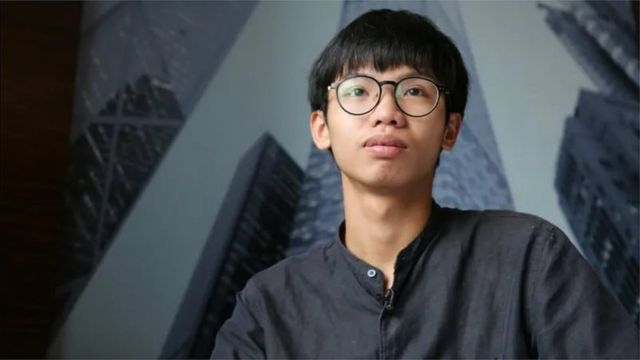
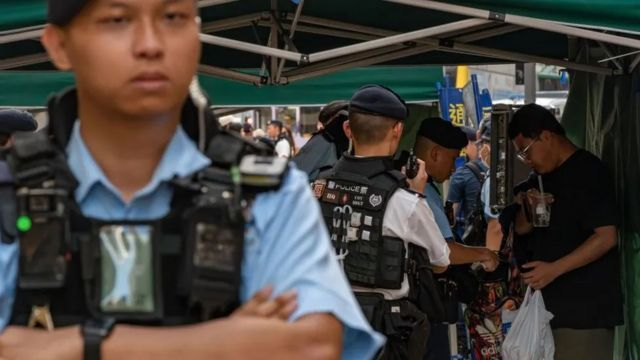

# [Chinese] 钟翰林：前“港独”青年在英国寻求庇护

#  钟翰林：前“港独”青年在英国寻求庇护

> 图像来源，  BBC CHINESE
>
> 图像加注文字，钟翰林于15岁时成立“学生动源”组织

**香港前“学生动源”召集人、独派人士钟翰林于周三 （12月27日）抵达英国寻求庇护。**

钟翰林告诉BBC，他在香港一直受到监查，警方让他承受了“巨大的压力”。

他还称，警察迫使他成为一名有偿线人，提供有关其他活动人士的信息。

22岁的钟翰林在2021年因“分裂国家”和“洗钱”罪被判囚，今年6月5日刑满获释。 由于他被判刑时不足21岁、刑期多于三个月，且获释前不足25岁，出狱后须接受法定一年的监管令。

但钟翰林说，获释半年以来，他面对着比牢狱更大的恐惧，就如置身于“一个更大、更加危险的监狱”。

钟翰林获香港惩教署批准于12月20日至25日前往日本旅行。他说，在日本时，决定前往英国寻求庇护。一想到不能回香港，他就“哭了”。

钟翰林是近年来逃离香港的数名民主抗议人士之一。

今月较早前，香港另一位前学运领袖周庭也宣布，将继续留在加拿大就学，放弃遵守保释条件，不再返港。 她在接受BBC访问时指，中国政府的严格审查损害了她的心理健康。

周庭因涉《国安法》下“勾结外国势力危害国家安全”受调查，其间获准赴加拿大留学。

2019 年香港爆发持续数月的大规模示威活动之后，北京实施了严格的国家安全法。

香港当局自北京在港实施《国安法》以来，以该法起诉和拘捕大量异见人士。 这也包括壹传媒创办人黎智英，法庭正在就他“勾结外国势力”等多项危害国家安全的控罪进行审讯。

同时，香港民主派47人因为涉参与2020年立法会初选，被控“串谋颠覆国家政权”罪，案件今月初已完成结案陈词。 据报， 法官将案件押后裁决，并曾预告裁决需时2至3个月。

##  “我怎么能拒绝呢”

钟翰林在初中时投身社会运动，主张以激进的手段进行抗议，是规模不大的独派学生组织“学生动源”的创办人。该组织已经在《国安法》实施后解散。

钟翰林在2021年承认两项“洗钱”和《国安法》下“分裂国家”罪，被判囚3年7个月。 在起诉两罪前，据传媒报道，他于2020年10月曾与其他活动人士尝试到美国驻港总领事馆寻求庇护，却在领事馆附近被捕。法院其后不准他保释。

2020年，钟翰林亦曾因非法集结和侮辱国旗罪成，被囚4个月。

钟翰林指称，在他6月5日获释后，国家安全警察每两到四个星期与他会面一次，询问他活动的细节，包括他与任何人会面和接触的信息。

“他们告诉我，接下来一年他们会定期与我见面，”他说，“我怎么能拒绝呢？我不可能拒绝他们的任何要求。”

钟翰林说，警方还要求他报告香港其他民主活动人士的下落和活动，“虽然我坚持只提供无关痛痒的信息，但我不能接受自己把认识的人的事情讲给警方听。”

> 图像来源，  Getty Images
>
> 图像加注文字，钟翰林说，警方会使用恐吓手段胁迫他透露更多信息

##  “做了这个决定后，已无法回头”

他说，当警方对他的回答不满意时，会使用恐吓手段胁迫他透露更多信息。

“他们告诉我......他们需要我证明我是可信的，没有什么可隐瞒的。这让我承受了巨大的压力。我没有办法告诉那些人他们已经成为目标。”

他说，他出狱前签署的一份保密声明限制了他向包括律师在内的任何第三方披露与国安警察的互动。

钟翰林说，经过两个月的例行会面，警方开始给他报酬，金额从500港元到3000港元不等。

他说，他觉得自己“别无选择”，因为不接受付款会引起对方怀疑他“不合作”，但拿了钱让他感到内疚，“即使我提供的信息无法引起实质的后果，但我仍有这样的感觉，”他说。

钟翰林说，他觉得自己无法控制自己的生活，他补充说，警方掌握他的所有个人信息，包括银行详细信息，学生证和学校时间表的副本存档。

他说，过去半年，身处香港的他难有一刻放松，即使是像散步这样简单的事情，对他来说也变得有压力 - 因为他觉得必须不断思考如何向警察解释自己的行踪，而且担心被捕。

由于持续的压力压垮了他的身心健康，他开始计划出国。香港惩教署批准钟翰林从12月20日起前往日本，条件是他在12月25日返回。

“当我在[日本]酒店筹备下一步行动时，我哭了。我曾想过有一天必须离开香港的现实，但没有想过要离开得那么快，”他说。

“但做了这个决定后，已无法回头。至少在不久的将来是这样。”

现在人在英国，展望将来，钟翰林盼望能在英国重拾学业，调整好情绪与身体健康，安顿好后，“我希望能再为香港做些事情。”

