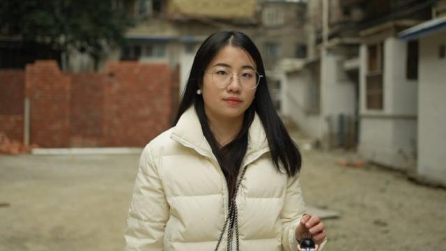
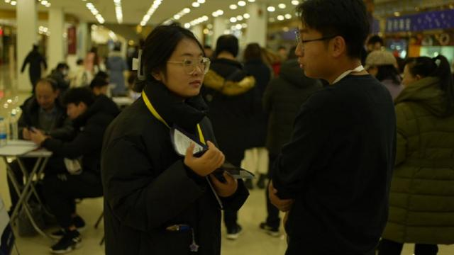
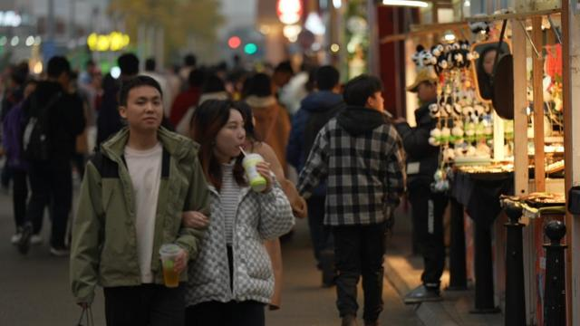
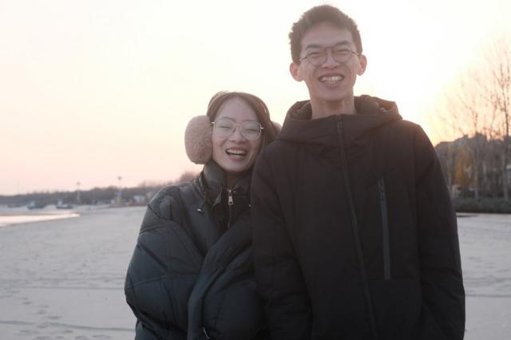

# [Chinese] 焦虑的Z世代正在重塑“中国梦”

#  焦虑的Z世代正在重塑“中国梦”

  * 劳拉·比克（Laura Bicker） 
  * BBC驻中国记者 

> 图像来源，  Wang Xiqing/ BBC
>
> 图像加注文字，乔伊·张是数百万正在努力找工作的中国大学毕业生之一。

**“过去几个月里，我做了有一、二、三、四……五份工作。”23岁的毕业生乔伊·张（Joy Zhang；音译）说。**

在中国西南部四川省成都市的一家食品市场，乔伊在摊位前边走边用手指数着。

“事实上，工作机会很多，问题在于你是否愿意降低期望值。”她补充道，然后转身去和卖豌豆尖的商家讲价。

乔伊的经历在今天的中国并不罕见，因为该国的毕业生已供大于求。她所在的班级共有32人，去年夏天毕业以来，只有约三分之一的人找到了全职工作。

根据2023年8月的官方数据，中国16岁至24岁的年轻人中有超过五分之一没有工作。自那以后，政府再也没有公布过青年失业率数据。

随着中国经济繁荣期的逝去，数以百万计的年轻人正在面对一个他们没有准备好的未来，而他们如何应对将决定这个世界第二大经济体的命运。

牛津大学人类学教授项飙曾花了大量时间与中国年轻人交流，他认为，中国Z世代的思想正在发生一场变革。

“年轻人的整个生活都被这样一种观念所塑造：只要你努力学习，那么在努力后，就会有一份工作和高薪体面的生活在等着你。现在他们发现这个承诺不再起作用了。”

在新冠疫情封锁的沉重打击下，中国经济增速放缓，债务不断攀升，这导致就业市场的机会已经萎缩。而在北京对经济的严控之下，中国现在对于饥渴的企业家和外国投资者来说，都是一个充满不确定性的地方。

##  新旧梦想

最近在北京举办的一次招聘会上，这一点显而易见。口若悬河的招聘人员大多提供低技能工作，如销售保险或医疗设备的助理。

“我认为困难只是暂时的，真正有能力的人会找到工作的。”一名25岁的硕士毕业生说。他和伴侶刚刚从德国回到中国，他表示：“世界的未来在中国。”

软件工程专业的应届毕业生天宇（音译）似乎对此有所怀疑。他说，虽然其掌握的技能“非常抢手”，但拥有类似简历的毕业生太多了。“所以找工作并不容易。”

> 图像来源，  Wang Xiqing/ BBC
>
> 图像加注文字，最近在北京举行的一次招聘会上，低薪的工作占大多数，令许多毕业生感到失望。

鉴于私营部门的黯淡前景，他的一些朋友打算寻找体制内的工作。去年11月，有创纪录的300多万中国人参加了公务员考试。

但天宇说：“很多人都在找工作，找到工作的人却不多。”而很多幸运找到职位的人在从事与自身专业并不相关的工作。

乔伊正是如此——她毫不气馁地接受了自己能找到的工作。去年夏天，她请求一家旅游公司雇她担任成都熊猫乐园的导游，她还卖过热饮，并在一家幼儿园实习过。

“这些工作在未来并没有很好的前景。”乔伊说，“工资很低，而且很容易被取代。这就是为什么大多数人宁愿呆在家里。”

她现在接受了一份教材销售工作。这并非她梦寐以求的工作，但她认为这是一种积累经验的方式。

然而，她的父母却很担心。乔伊的老家位于距成都400公里外的一个小山村，她是家里第一个考上大学的人。她的父亲非常自豪，曾为她举办有30多桌客人参加的升学宴。

“我的父母期望我大学毕业后能过上更好的生活，拥有比他们那一代更好的工作和收入。”她说。

“他们希望我在他们的支持下完成学业后，至少能有一份工作……但我会坚持自己的步伐走自己的路。”

她停下脚步买了一些红糖煎饼，同时指给我看一个正在做四川麻辣香肠的肉贩。她笑着说，这很好吃，但对她来说“太油腻了”。

> 图像来源，  Wang Xiqing/ BBC

在大学期间，她爱上了这座充满活力的城市。她想更进一步，有一天去澳大利亚旅游并学习英语。

就业市场可能很困难，但乔伊认为，她的生活仍然比父母那一辈要容易，当时中国比现在贫穷得多，梦想也更加遥不可及。

“我觉得这一代人很走运，也很幸运。”她说。

“我们有很多时间和机会去实现自己的目标，可以更深入地思考自己真正想要的是什么。与上一代人相比，我们不再那么在乎赚钱，更多考虑的是如何才能实现自己的梦想。”

##  “撸起袖子”

项飙教授将这称为“中国梦的改写”。他说，新冠疫情是Z世代新的中国梦的催化剂之一。

“年轻人有一种脆弱感……他们的生活可能会被强大的力量摧毁和改变。这让他们重新思考整个中国社会的组织模式和中国集体生活的组织模式。”

即使在中国严格的疫情封锁期间，年轻人也被鼓励上大学。他们的人数很庞大，仅在2023年就有创纪录的1160万学生毕业。

他们的挫败感激发了走红的表情包、玩世不恭的幽默，甚至是非常规的选择。一些人贴出了自己把毕业论文扔进垃圾桶的毕业照。“躺平”这个网络词汇则描述了一些想方设法希望远离现代生活中的激烈竞争的人们。

许多人已经完全停止找工作，而是回家做一名“全职儿女”。有些人在社交媒体上记录自己的生活，在为父母做家务或照顾家里的幼童后赚取少量的钱。

BBC采访了一位不愿透露姓名的年轻女性，她已经回到中国农村与父母住在一起。她说她有时间看书、和家人聊天，她很珍惜一种不同于城市工作的生活。她补充说，尽管知道这无法永远持续下去，但自己很满足于当下。

> 图像来源，  Getty Images
>
> 图像加注文字，北京的学生排队参加公务员考试。

“这不仅仅是工作、机会或收入短缺的问题，而是推动他们努力工作的梦想破灭了。”项飙说，“这不仅会带来失望，还会滋生幻灭感。”

北京可能担心这场危机会恶化，社会不满情绪上升，失望的年轻人会对共产党的统治构成威胁。

这并非没有先例。2022年，中国多地爆发了反对政府严格“清零”政策的抗议活动，这是几十年来对中共最直接的挑战。1989年，也正是对失业和通货膨胀的不满点燃了天安门历史性大规模抗议活动的最初火花。

但到目前为止，还没有这种迹象。

“这其中很重要的原因是代际财富的转移。”项飙说，“以家庭为基础的社会支持系统依然存在。他们的父母受益于中国的改革，有充足的储蓄和房地产资产。但现在这些资产的价值正在下降。”

但中国政府不会冒险。领导人习近平呼吁年轻人要学会“吃苦”。当局敦促毕业生不要再认为自己不能从事体力劳动，要求他们“撸起袖子”从事蓝领工作。

##  希望vs绝望

对于23岁的市场营销专业毕业生郑谷凌来说，这只是一个暂时的解决方案。

在离北京只有几个小时车程的秦皇岛，她正在一家桌球馆和男友言笑晏晏。他们在大学相识，目前都为找工作而犯愁。郑谷凌在考虑去一家信用卡公司从事与客户打交道的工作。

“当我去参加招聘会时，我发现大多数公司只招聘销售人员。公司很少，合适的职位也很少。“她说。

郑谷凌是中国南方小镇上一个有六个孩子的家庭中的一员。四年来，她主要是上网课，而没有与同学们一起走进过教室。她担心这使她错失了急需的技能。

> 图像来源，  Lan Pan/BBC
>
> 图像加注文字，郑谷凌想开一家卖肠粉的店。

郑谷凌和乔伊都在“撸起袖子”，寻找自己的路。项飙说，当然这并不是所有人的情况，但很多中国年轻人确实因为找不到工作而感到强烈的挫败。

但他相信，他们的绝望也会促使一种转变。他说，这是“非常强大的一代”，有可能改变中国。

“中国的叙事需要改写，它不再是繁荣、增长和国家的强大。”他说，“年轻人是改写中国梦的推动力。”

在新年贺词中，习近平说中国经受住了“风雨洗礼”，并宣布他“对未来充满信心”。

但最大的问题是，他的民族主义“中国梦”是否与感到幻灭和焦虑的一代人的“中国梦”相匹配，这些年轻人不确定未来将走向何方。

在一间俯瞰结冰的海面的茶馆里，郑谷凌在讲述自己的终极梦想时，脸上露出了喜悦的神情：她想自己做老板。

她希望能赚到足够的钱，在家乡开一家早餐店，卖粤式肠粉。“这会给我更多的自由。”她说，“这样我就可以做喜欢的事情，而不是一直给别人打工。”

她一边嚼着月饼、栗子和芒果干等茶点，一边解释说，她想要的是更大的世界。

“我的父母从未离开过他们的家乡。他们的生活圈子很小，只想过稳定的生活。但我们想看到更多的东西，看看外面的世界，想想我们真正梦想的是什么。”

