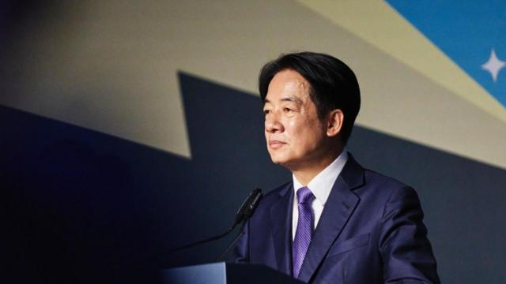
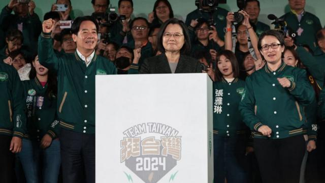

# [Chinese] 赖清德：台湾选出了一位中国厌恶的总统，接下来会发生什么

#  赖清德：台湾选出了一位中国厌恶的总统，接下来会发生什么

  * 傅东飞（Rupert Wingfield-Hayes） 
  * BBC记者 发自台湾 

> 图像来源，  Getty Images
>
> 图像加注文字，赖清德

**北京称他为“麻烦制造者”和危险的“分裂分子”。现在他将成为台湾的下一任总统。**

中国对台湾的主张并不新鲜——中国视台湾岛为其领土的一部分，习近平已将统一台湾作为目标。在过去一年里，中国对台湾的威胁不断升级。

然而，尽管中国一再警告不要投票给现任执政党民进党，数百万台湾人还是在风和日丽的周六前往投票站投票。

他们选出了64 岁的现任副总统、医生出身的政治家赖清德来领导台湾应对与中国的紧张关系。

这是民进党史无前例的三度连任，在中国看来，民进党过于接近其毫无疑问的红线——台湾独立。

赖清德如何应对北京以及北京对他的反应，将定义他的总统任期。

##  蔡英文3.0？还是新的开始？

赖清德承诺，他的任期将是其前任蔡英文八年任期的延续。

即使在周六的讲话中，他也谨慎地选择了自己的措辞，并提出了对话与合作。

在竞选活动中，他一再重复蔡英文的说法，即“没有必要宣布独立，因为台湾已经是一个独立的主权国家——它的名字叫中华民国——台湾”。

然而，长期以来，赖清德一直被认为比谨慎的蔡英文总统更具火药味。

他是民进党“新潮流”系的一员，主张正式宣布台湾独立。

赖清德和他的竞选伙伴萧美琴深受北京的厌恶和不信任，北京禁止他们两人前往中国大陆和香港。

萧美琴的母亲是美国人，父亲是台湾人，她此前曾担任台湾驻美国代表。

因此，中国极不可能与这位新总统进行任何对话。自 2016 年以来，双方一直没有正式沟通。由于蔡英文拒绝承认台湾是大陆的一部分，中国当时当时掐断了沟通渠道。

周六的结果也意味着台湾海峡已经非常紧张的局势将继续下去，中国的船只和军用飞机几乎每天都在入侵。

北京可能会大展军威以示不满，就像2022年美国众议长南希·佩洛西（Nancy Pelosi）访问台北时那样。当时，台北指责中国当时的行动近乎封锁了全台湾。

中国还可能加大经济和外交压力，引诱更多仍然承认台湾的小国与其断交，并制裁更多的台湾公司、产品和人员。

赖清德面对中国军事威胁的策略是继续蔡英文的路线。

他承诺增加台湾的军费开支，继续实施本土潜艇建造计划，并与美国、日本和欧洲建立更加密切的关系。蔡英文任期内尤其加固了与华盛顿的关系。

但是，鉴于赖清德的“台独”政治背景，美国会担心他担任总统后可能更具挑衅性。

然而，他的竞选伙伴萧美琴却多少让拜登政府吃了颗定心丸。她很可能带头说服美国相信赖清德不会挑衅北京。

##  “习近平需要学会沉默”

无论赖清德如何谨慎出牌，中国政府都无法忽视他获胜所传递的信息。

民调显示，这场竞选的胜负非常接近，但民进党的获胜优势比预期的要大得多。

一位年轻的民进党支持者在选举结果揭晓后告诉BBC，“他们在对中国说，我们不会再听你们的了，我们的未来将由我们自己决定，所以习近平需要学会在我们的选举过程中保持沉默。”

> 图像来源，  Getty Images
>
> 图像加注文字，赖清德、蔡英文、萧美琴

侯友宜和主要反对党国民党的竞选则强调了台湾人对中国可能攻击该岛的真实恐惧。

如果国民党获胜，中国很可能会减少针对台湾的在言论和军事上的恐吓，北京也更有可能同意与侯友宜对话。

2015年，习近平会见了台湾上一位国民党籍的总统马英九。这是1949年中国内战结束以来台湾和中国领导人的首次面对面会晤。

但反对国民党的人指责国民党对中国采取投降主义态度，不重视岛内防务，阻止增加防务开支，并将岛内兵役减少到仅四个月。

人们担心国民党政府会使台湾更加脆弱。像美国这样为台湾提供武器的强大盟国会质疑，如果台湾自己都不重视自己的防务，他们为什么要承诺保卫台湾。

台湾目前的国防开支约占其GDP的2.5%。这远低于美国或该地区面临严峻安全挑战的其它国家，如韩国。

因此，选民似乎已经做出明确的选择。他们意识到来自北京的危险，他们确实希望对话。但国民党并没有吸引那些年轻选民，而他们也越来越多地将自己视为台湾人而非中国人。

尽管国民党现在很少谈论统一，甚至“一个中国”，转而强调，该党希望通过改善与北京的关系来保护台湾的和平与安全。

过去的几个月或许也让人们明白了台湾最大的损失是什么。台湾的选举沸沸扬扬，民主制度还很年轻，投票热情高涨。

同样的民主也清楚地表明了对民进党的不满——不断上涨的房价、停滞不前的工资和日益减少的就业机会驱使年轻选民离开。

这就是为什么民进党注定失去其在议会中的多数席位。国民党与第三大党民众党一旦联手，很有可能掌控立法院，从而控制立法权，并有机会阻止赖清德的议程。

赖清德的前路并不平坦。除了他自己的政府和一个对他抱有敌意的巨大邻国之外，他的任期还将受到世界另一端另一场选举的影响。

如果唐纳德·特朗普（Donald Trump）成为下一任美国总统，赖清德必须做好准备，迎接白宫中截然不同的盟友。

