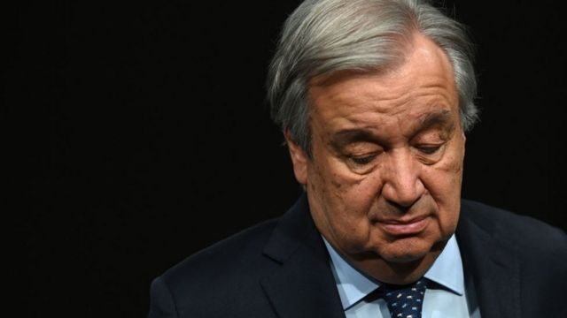
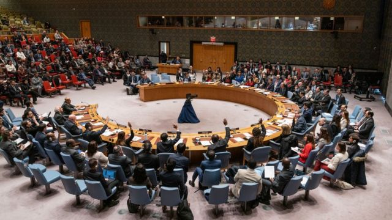
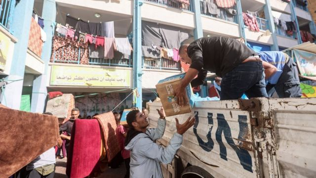
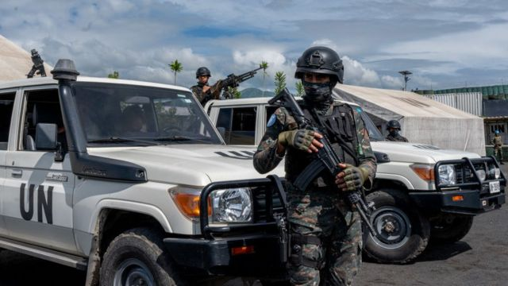

# [Chinese] 俄乌战争和以巴冲突致联合国受到批评，为什么？

#  俄乌战争和以巴冲突致联合国受到批评，为什么？

> 图像来源，  Getty Images
>
> 图像加注文字，联合国秘书长古特雷斯（Antonio Guterres）

**在过去的三个月里，尽管联合国不断发出呼吁，但加沙地区还是付出了惨重的人道主义代价，并且未能实现停火。这让人们不禁要问，联合国到底有多大的效力？联合国为何受到批评，如何才能更好地发挥作用？**

自加沙冲突开始以来，联合国秘书长古特雷斯（Antonio Guterres）便一直呼吁实施人道主义停火。上周，他再次重申了这一呼吁，并警告说交战各方都无视了国际法。

他说，他希望看到“一个以两国方案为基础，为以色列人和巴勒斯坦人带来持久和平的进程。”

上个月，他首次援引《联合国宪章》第99条，该条规定联合国秘书长可以提请安理会注意他或她认为对国际和平与安全构成威胁的任何事项。

以色列迄今为止一直拒绝停火呼吁，称将继续发动进攻，直到哈马斯被击败为止。以色列总理内塔尼亚胡（Benjamin Netanyahu）也否定了建立巴勒斯坦国的想法。

在去年10月7日哈马斯对以色列发动袭击后，以色列发动了旨在消灭该组织的军事行动。据哈马斯管理的卫生部称，至少有2.5万人在加沙丧生。

自加沙战争开始以来，安理会一直未能就停火决议达成一致。

去年12月，安理会通过了一项决议，敦促向加沙地带提供更多援助，但没有呼吁停火。此前的两项决议均被以色列的坚定支持者美国否决。

尽管联合国大会两次以压倒性多数投票赞成停火——在最近一次投票中，193个成员国里有153个支持该决议——但仍无法采取任何步骤实现停火。联大的决议不具约束力。

##  “联合国处于昏迷”

伦敦政治经济学院（London School of Economics and Political Science）教授法瓦兹·格尔盖斯（Fawaz Gerges）表示，两年前俄罗斯入侵乌克兰和现在的加沙战争表明，联合国安理会“已经瘫痪，功能失调”，而联大“与其说是一个执行机构，不如说是一个象征机构”。

他认为，联合国安理会的僵局是大国对抗回潮带来的副产品，一方是中国和俄罗斯，另一方是美国和欧洲。

“联合国，包括它的各个机构，都处于昏迷状态，”他说。“这是一个比冷战时期更糟糕的时刻。”

安理会有15个成员，包括10个非常任理事国和5个常任理事国。这些常任理事国一般被称为五常，即美国、英国、法国、俄罗斯和中国，拥有否决权，这意味着即使所有其他成员国都同意，每个国家也可以阻止一项决议通过。

美国否决了两项呼吁加沙停火的决议，俄罗斯也否决了有关乌克兰的决议。

“在联合国，双重标准是个大问题。”人权观察组织（Human Rights Watch）的路易斯·夏邦努（Louis Charbonneau）说。

“当美国就俄罗斯问题巧舌如簧，但却不把这些也适用于以色列时，那么他们声称的任何对国际法的承诺是完全空洞的。”他说道。

“不只是美国有双重标准，让人很难听下的是俄罗斯在一边谈论保护加沙平民的必要性，一边在乌克兰实施暴行。”

##  “逝去的时代”

智库卡内基欧洲中心（Carnegie Europe）的高级研究员希南·乌尔根（Sinan Ulgen）表示，联合国安理会的设计反映了一个逝去的时代。

“在80年前一场全球战争（二战）中碰巧处于胜利一方的五个国家拥有了否决权，其他国家都没有被赋予这种特殊的影响力。”他说道。

“例如，非洲在五常中没有代表权。印度作为世界上人口最多的国家没有代表权，拉丁美洲也没有代表权。此外，五常中没有一个以穆斯林人口为主的国家。”

“这已经不能满足当前全球秩序的需要了。”他说道。

> 图像来源，  Getty Images
>
> 图像加注文字，安理会的任何改革提案都需要得到三分之二的联合国成员国和所有五常国家的批准。

乌尔根还提出了其他有助于该机构现代化的改革措施，包括：

•欧盟可以获得一个席位

•可以对五常的否决权附加更多条件

•允许联大以一种超级多数表决制来推翻某个常任理事国的否决权。

他还提到了美国的立场，如果美国愿意的话，它可以批准或可能接受联合国安理会的第三种地位：没有否决权的常任理事国。

但他表示，尽管这将使安理会变得更具包容性和代表性，但这并不能消除联合国安理会像加沙战争中那样被单一国家的否决权（美国）所“绑架”的挑战。

安理会的任何改革提案都需要得到三分之二的联合国成员国和所有五常国家的批准。

##  援助提供者

国际危机组织（International Crisis Group）的理查德·高恩（Richard Gowan）认为，即使在加沙战争之前，联合国也正在经历一个充满挑战的阶段。

他说，在过去一年里，安理会在应对苏丹战争、尼日尔政变以及俄罗斯和西方国家在乌克兰问题上的持续争执方面举步维艰。

尽管存在这些缺陷，但他认为联合国安理会仍有其价值，因为它是美国、中国和俄罗斯能够走到一起并达成交易的少数几个地方之一，阿富汗就是一个例子。

“当美国离开喀布尔，西方大国撤出阿富汗时，是联合国留在了阿富汗，联合国机构继续运营学校，并向数百万人提供紧急救援。”他说。

“如果没有联合国在那里与塔利班谈判，整个国家可能会陷入全面饥荒。”

“同样，在加沙、叙利亚和其他许多地方，仍然是联合国援助机构在为遭受苦难的人们提供食物和药品。”

> 图像来源，  Getty Images
>
> 图像加注文字，100多名联合国援助人员在加沙冲突中丧生

联合国系统由众多基金会、项目和专门机构组成，每个机构都有自己的工作领域、领导层和预算。

这些机构包括难民署（UNHCR）、世界粮食计划署（WFP）、国际货币基金组织（IMF）、开发计划署（UNDP）、世界卫生组织（WHO）等，其重点关注可持续发展、经济增长、贸易、卫生、气候变化、安全、和平建设、结构调整和人道主义援助等领域。

“我们常常只关注联合国安理会，却忘记了联合国有多少人在冒着生命危险努力工作。”路易斯·夏邦努指出。

100多名联合国援助人员在加沙冲突中丧生，这是联合国78年历史上最大的损失。

他补充说，在联合国系统内，可以建立调查机制，也可以对其他国家实施制裁，以确保追究严重罪行的责任，还可以授权维和特派团，并在冲突后的局势中监督侵犯人权的行为。

但他承认，联合国安理会一直在苦苦挣扎。

“联合国归根结底是一个拥有193个成员国的组织，它的作用取决于组成它的国家。”他说道。

“无论是俄罗斯保护叙利亚或自己在乌克兰的暴行，还是美国保护以色列免受压力，亦或是中国保护朝鲜或试图压制外界针对该国对维吾尔人犯下的反人类罪行的批评……”

“你可以拥有完美的组织和完美的宪章，但如果各国不愿意履行自己的义务，那就轻如鸿毛。”

> 图像来源，  Getty Images
>
> 图像加注文字，联合国在非洲的维和行动

##  “长期斗争”

今年9月，联合国将举行一场“未来峰会”（Summit of the Future），其希望借此机会考虑全球治理改革和重建信任。

理查德·高恩认为，尽管这可能是一个讨论可能的改革的有力平台，但联合国官员将意识到，这次峰会距离美国大选只有不到两个月的时间。

“当外交官们认为2025年可能会出现一个特朗普政府时，要说服他们就联合国改革进行真正实质性的谈判是很困难的。”他说。

格尔盖斯教授认为，指望美国接受任何可能削弱其在安理会中的作用的结构性改革都是不现实的。

“这是一场长期的斗争。我们谈论的不是十年，而是几十年。” 他说，并强调世界仍然需要联合国。

“（如果联合国不复存在）后果将是一片混乱。那将是不折不扣的丛林法则。”

