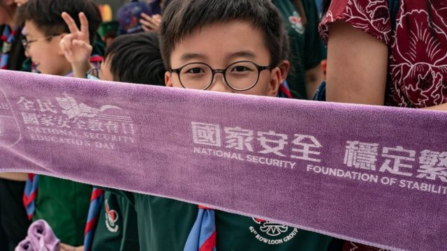
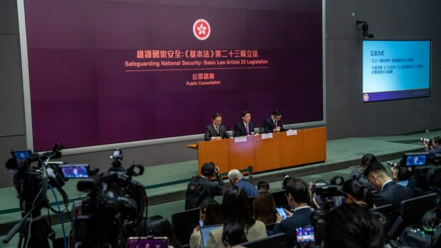
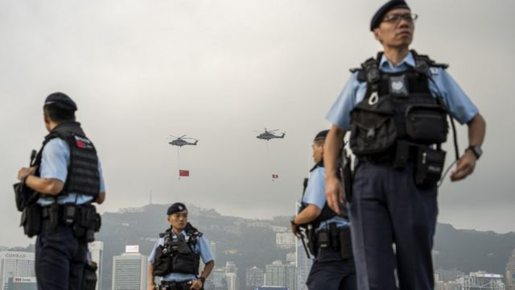

# [Chinese] 香港《基本法》23条立法启动 五宗罪细化国安罪名

#  香港《基本法》23条立法启动 五宗罪细化国安罪名

  * 李澄欣 
  * BBC中文记者 

7 小时前

> 图像来源，  Getty Images
>
> 图像加注文字，《维护国家安全条例》涵盖五大罪行。

**香港政府周二（1月30日）宣布正式展开为期一个月的《基本法》第23条立法公众咨询，立法建议包括订立全新的《维护国家安全条例》，涵盖五大罪行。**

文件不少内容引起关注，例如新增的“境外干預”罪将禁止港人与外国及台湾政治组织联系，“国家秘密”的定义涵盖“香港经济和社会发展的秘密”，“叛国”罪包含“隐匿叛国”等。此外，港府擬扩大警方执法权，可将羈留時間從目前不超過48小時大幅延长至14天，并可阻止被扣留人士諮詢某律師。

特首李家超1月30日上午在记者会表示，涉23条的案件将根据香港法律在香港审讯，不会送到中国大陆。他强调政府“容许”批评意见，指犯法的标准很“清晰”，是涉案人士“有没有意图、有没有用心”，但他没有进一步说明如何界定意图。

恒生指数当天一度跌近400点，李家超被传媒问及为何选择此时立法及会否影响经济时，他强调有关立法工作“已经等了26年，我们不能再等了”，又说有安全和稳定的环境“对经济发展必然有利”，否则都是“在浮沙上建立的一些假象”。

> 图像来源，  Getty Images
>
> 图像加注文字，特首李家超1月30日上午举行记者会，23条立法将展开为期仅一个月的公众咨询。

香港时事评论员刘锐绍对BBC中文分析指，23条立法的罪行范围包罗万有，反映当局将任何有可能出现的漏洞都放进去，“一个大网，让官方有最大的空间等以后有事可以用，而所谓意图和用心当然是由官方判断的。”

有关立法无论在香港本地还是国际社会都争议极大，但这次公众咨询期仅一个月到2月28日结束，中间横跨了农历新年假期，相较2003年上次尝试立法时的三个月更短。

刘锐绍认为，官方有计算过这段时间最有利，考虑到目前中美关系稍缓，中国外交部长王毅与白宫国安顾问苏利文刚结束会面，希望趁此空档快刀斩乱麻通过立法。

已移居英国的香港学者钟剑华则表示，港府法案咨询期一般有三个月，具争议的议题甚至会延长至半年，这次咨询期短反映特区官员“想邀功快快完成，但又没有信心，不想面对批评，所以就压缩所有意见表达的空间”。

##  23条包括哪五宗罪？

23条立法咨询文件共有九章，涵盖五大类危害国家安全的行为和活动。这五大类罪行中，包括“完善”部分现有法例，亦有新增法例。

**1.** **叛国：** 由以现行“叛逆”罪为蓝本改成，针对五类行为，包括加入与中国交战的外来武装力量；意图损害中国在战争中的形势而协助交战敌方；向中国发动战争；鼓动外国以武力入侵中国；以及意图危害中国主权、统一或领土完整而使用或威胁使用武力。此外将加入“隐匿叛国”罪，若知道有人犯“叛国”罪而没有上报即属违法。

**2.** **叛乱** **、** **煽惑叛变或离叛：** 将修例扩大煽惑离叛的对象，由现时只涵盖警员等，扩大至所有公职人员，煽惑有关人员擅离职守也属违法。“煽动意图”则包含煽动引起对国家根本制度、中央与香港特区行政、立法或司法机关等机构的憎恨及离叛行为等。另外引入“叛乱”罪，处理比一般“暴动”更严重行为。

**3.** **窃取国家机密及间谍行为：** 将详细定义“国家秘密”，除了国防和外交资料外，还包含中国内地和香港的“经济和社会发展的秘密”、“科技发展或科学技术的秘密”等；将涵盖所有公职人员，禁止非法获取、管有和披露国家秘密；将新增“现代间谍活动”，包括境外势力透过代理人发布虚假或误导讯息，并禁止参加、支援境外情报组织或组织利益。

**4.** **危害国安的破坏活动：** 防止公共基础设施受恶意破坏，并在“不诚实取用电脑”的基础上引入新罪行，禁止透过电脑或电子系统危害国家安全的行为。

**5.** **境外干预：** 禁止任何人透过境外活动破坏香港事务，包括立法及司法的决定、选举或损害香港与其他地方关系等；港府也会修改现行《社团条例》，禁止与外国或台湾政治性组织联系，并把监管对象由注册社团扩大至所有在港组织，包括本地的校董会、业主立案法团、甚至是外国在港组织，只要当局“合理地相信”为了维护国安所需，就可以刊宪禁止有关组织运作。

咨询文件指，将就上述某些罪行订立相称的域外效力，但没有提及这五大罪类的建议刑期。

> 图像来源，  Getty Images
>
> 图像加注文字，港府擬扩大警方执法权，可将羈留時間大幅延长至14天，并可阻止被扣留人士諮詢某律師。

学者钟剑华表示，上述内容定义广泛且模糊，23条立法通过后，北京及港府可以在港版国安法之外，再增添一个法律武器去对付异见人士，“这将进一步确认香港不再是国际城市，让这里充满威吓与威胁”。

根据1997年颁布的香港《基本法》，第23条是有关国家安全的条款，要求特区政府应自行立法禁止七类危害国安的行为。2003年港府曾推行立法，但触发50万人上街示威后撤回，此后一直未能立法。

2019年香港爆发更大规模的反修例示威后，2020年中国全国人大常委会颁布实施港版国安法，当中“四宗罪”与23条的其中两宗罪部分重叠，即分裂国家罪和颠覆国家政权罪。有关法律生效三年多以来，审结案件超过100宗，定罪率百分之百。

刘锐绍指出，港版国安法实施后已经不再有反对声音，现在重推23条分别不大，“只是满足了中国官方的心理需要，让他们觉得安心——就好像一副昂贵的盔甲，你穿上去只能保护自己，不能攻击人，从视窗往外看视野很狭窄，但是你感觉很安全。”

至于港府官员不断强调23条立法是参考英美等西方国家的同类法律，刘锐绍直言这说法是“外衣”。“为什么国安法律在外国没有引起反弹，是因为人家的政府是民选的，人民不满你，下次可以不选你。但香港不是。”

