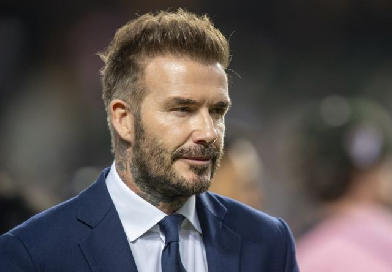

# [Chinese] 梅西缺席香港表演赛引发全场嘘声

#  梅西缺阵香港表演赛引发全场嘘声

> 图像来源，  Getty Images
>
> 图像加注文字，香港大球场举行的香港队与迈阿密国际队季前赛友谊赛中，球王梅西未能上场。

**在香港举行的一场季前友谊赛中，香港愤怒的球迷向美国迈阿密国际队发出嘘声，因为球王梅西（港译：美斯；Lionel Messi）未能上场。**

美国迈阿密国际队上周抵达香港，在全城掀起足球热潮。周日（2月4日）该队与香港明星队的比赛使有近四万个座位的香港大球场座无虚席。

但是，这位36岁的阿根廷世界杯冠军未能上场，使一开始全场的欢呼声最终变成了嘘声和要求退款的抱怨声。

甚至连香港政府也表达了失望。政府发言人表示，可能因梅西的缺席而扣减赞助款项。

“美斯未能上阵今日表演赛，政府和一众球迷同样对主办单位的安排感到极度失望。主办单位欠球迷一个解释。”声明写道。

> 图像来源，  Reuters
>
> 图像加注文字，国际迈阿密队梅西的球迷在看台上展示横幅。

香港大型体育活动事务委员会表示，已为该活动拨款1500万港元（192万美元）和100万港元（12.8万美元）的场地补助金资助。

除了梅西没有上场，乌拉圭前锋路易斯·苏亚雷斯（Luis Suarez）也因膝伤缺席了这场比赛。苏亚雷斯于去年12月加盟国际迈阿密。

在比赛下半场，随着梅西继续坐在后备席上观看比赛，场内传出越来越大声的“We want Messi”（我们要梅西）的口号。

最终，迈阿密国际队以4比1击败香港队。在终场哨响时，迈阿密国际共同持有人贝克汉姆（David Beckham）试图感谢支持者给予“难以置信的支持”，仍被一片嘘声淹没。

> 图像来源，  Getty Images
>
> 图像加注文字，在终场哨响时，迈阿密国际共同持有人贝克汉姆（David Beckham）试图感谢支持者给予“难以置信的支持”，仍被一片嘘声淹没。

很多球迷用英语和广东话高喊“回水”（退款的意思）。据路透社报道，此次比赛的门票于去年12月开始发售，售价在880至4,880港元（约合113至624美元）之间。

“我真的很失望。”球迷乔纳森·王（Jonathan Wong；音译）告诉法新社。“每个人都是来看梅西的，所以我觉得有点上当了。”

“没有他，这就像一场普通的香港超级联赛，门票只需80元。这次我们付了5000元。”

主办方Tatler Asia发表声明称，对梅西及苏亚雷斯没有上场感到失望，并说没有收到任何关于两人缺席的信息。

迈阿密国际主教练马蒂诺（港译：马天奴；Gerardo Martino）在赛后记者会上解释，梅西和苏亚雷斯没有上阵，是要避免两人再受伤。马蒂诺曾在赛前称，会尽可能让梅西上场。

“我知道球迷们对于梅西和苏亚雷斯的缺席非常失望，我们对此道歉，但这是我们根据他们的伤情一起做出的决定。”他说，并指梅西出现内收肌受伤。

“我们也想让他们在场上至少踢一会，但是我们不能冒险。”他说道。

这是梅西第七次来到中国。去年夏天，阿根廷国家队在北京与澳大利亚队进行友谊赛，梅西的热潮也席卷了中国大陆。

> 图像来源，  Reuters
>
> 图像加注文字，2月2日，国际迈阿密队的梅西和队友抵达香港国际机场。

