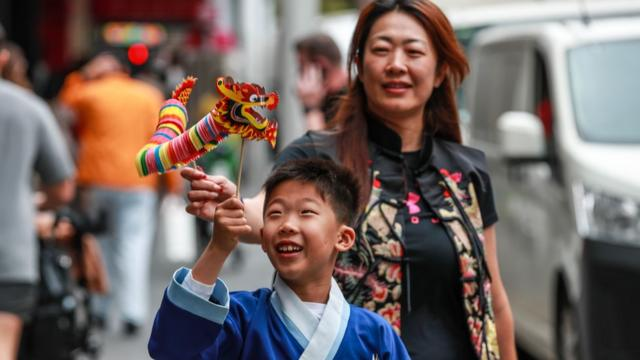
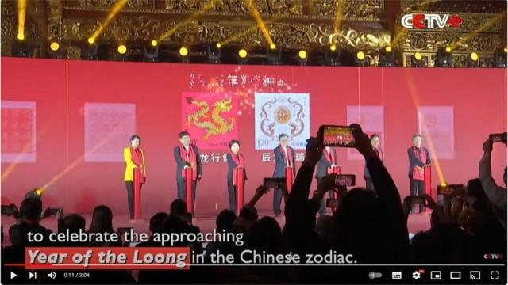
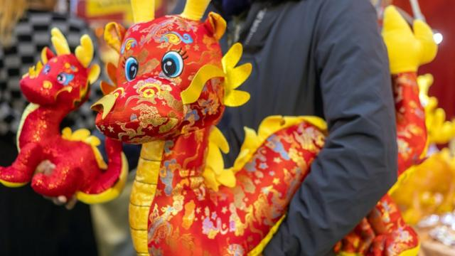

# [Chinese] 龙年英文要摒用“dragon”？中国官媒称应改用“loong”为何引起讨论

#  龙年英文要摒用“dragon”？中国官媒称应改用“loong”为何引起讨论

  * 李澄欣 
  * BBC中文记者 

> 图像来源，  Getty Images

**农历甲辰龙年将至，中国网络上掀起“龙”一词的英文翻译之争。**

今年有官媒摒用“dragon”，改为“loong”（龙的音译）。中国环球电视网（CGTN）在报道“新春龙舞挑战赛”活动时，将龙年译为“Loong Year”，“龙舞”译为“Loong Dance”，央视春晚吉祥物“龙辰辰”的英文名也译作“Loong Chenchen”。

对照2012年的上一个龙年，中国政府并没有使用“Loong”，当年官媒《环球时报》和英文报纸《中国日报》都采用 “Year of the Dragon”。

有学者对BBC分析指，这反映了中国官方希望掌握话语权，展现“文化自信”，但世界未必会流通这个翻译。

央视网引述北京外国语大学英语学院副院长彭萍教授指，19世纪初，英国传教士马什曼在著作中提到中国的龙，注音是loong，解释时使用了dragon一词，后来英国传教士马礼逊编出史上第一部《华英字典》，将龙译为dragon，这个翻译延续至今。

> 图像来源，  cctv

报道指，西方龙是“口吐烈焰+巨翅长鳞+烈性如火”，形象负面，中国龙则是“马头+鹰爪+鱼鳞+鹿角+蛇身+没有翅膀”，代表好运吉祥。因此，“Loong”更贴近中国龙的原意。

《北京日报》评论文章指，很多西方人看待中国的目光、翻译中国的文化，带着一种对异域文化居高临下的审视，“比如近代史上，别人就把我们表述成‘黄祸’、 ‘东亚病夫’”。文章强调，“在解决了‘挨打’、 ‘挨饿’问题后，强起来的中国必须解决‘挨骂’的问题，主动进行自我宣介”，又称翻译问题“绝非没事找事，实则关乎潜移默化的形象认知”。

对此，有中国网民表示支持音译，指“dragon那种像大蜥蜴，跟中国龙不一样”、“中国龙是独一无二的，汉语走向全世界，就应该把‘龙’这个词音译”。持反对意见的网民则认为“越来越民族主义”，反讽称“建议英文直接被拼音取代”。

> 图像来源，  Getty Images
>
> 图像加注文字，有意见认为中国龙与西方龙不一样。

##  “文化自信”与“去英语化”

新加坡国立大学政治学副教授、卡耐基中国项目研究员庄嘉颖对BBC中文表示，此事反映出中国在习近平的领导下，变得更加民族主义和强调所谓的“文化自信”。

“大国，经常都希望留下自己的imprint（印记）。其实就好像美国人说职棒是world series（世界大赛），美式橄榄球超级杯是greatest sporting event in the world（世界上最伟大的体育活动）。但跟美国一样，其他人可能不会管你，只是自我感觉良好。”

他表示，这跟近年的“去英语化”趋势一脉相承，中国一方面希望表现出自主性，同时却没想清楚自己要什么，因此在“民族自信”与“国际化”之间迷失。

“我们要问，到底要到什么程度？如果翻译要改用汉语拼音，那么春节应该改为Chun Festival或Chunjie，农历新年应译作Nongli New Year，以后People's Republic of China（PRC）要不要换成Zhonghua Remin Gongheguo（ZHRMGHG）？”

> 图像来源，  Getty Images
>
> 图像加注文字，北京市民与龙年装饰合影。

2001年中国加入世贸组织，教育部同年将英语学习从中学提前至小学三年级，英语被视为面向世界的象征。但习近平上台后提倡“四个自信”，抵御“西方影响”，近年英语的地位明显降级。

中国各地把英文翻译改成汉语拼音，例如北京地铁将“Station”改为“Zhan”，街道路标的也以拼音“Lu”替代“Road”。而在去年中国两会期间，有全国政协委员提议取消初高中英语主科地位，或者降低高考外语分值。

时事评论员刘锐绍告诉BBC中文，中国共产党视语言为一种思想工具，也是教育的先天条件，官方的大趋势是不希望英语流行。

“但现阶段中文还是无法取代英文，只能在一些的小节上做，用中方宣传机器来慢慢改变。‘dragon’改为‘loong’就反映出中国渴望掌握话语权的现象，但这是自嗨居多。”

他认为，有关做法违反约定俗成的语言习惯，相信“loong”很难成为世界主流用法。“语言是有生命力的，会随着时代发展，如果所有字都要追溯到原文，这不是现代化的思维。”

往年过年，也有“Lunar New Year”（农历新年）和“Chinese New Year”（中国新年）的争论。学者庄嘉颖强调，农历新年是亚洲多个地区的共同节日，如果英文译名要在地化，“中国讲Year of the Loong，那我们在星马印尼要不要来一下Year of the Naga（那伽）”。

他认为，中国更改自己的译名没问题，“你喜欢怎么改就怎么改，只要别强加在其他地方和文化，要求别人换就可以了。”

