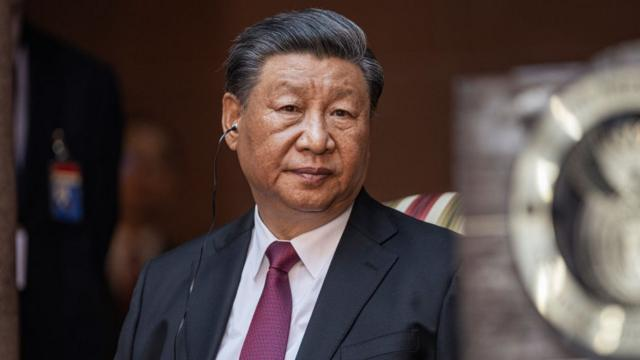
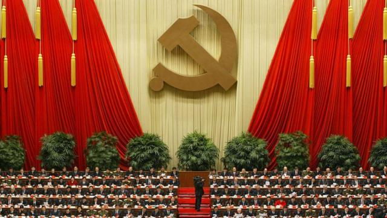
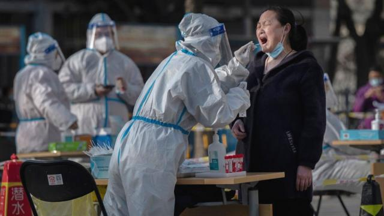

# [Chinese] 习近平的反腐斗争为何永无休止

#  习近平的反腐斗争为何永无休止

  * 麦笛文（Stephen McDonell） 
  * BBC驻中国记者 

> 图像来源，  Getty Images

**习近平最新一波反腐行动伸向金融高层和火箭军，外界开始质疑反腐行动何时结束。**

简单答案是：不会。

反腐行动已成为中国领导人管治体系的核心支柱。

习近平利用反腐运动来整肃异己，他的反腐行动更像是失控的斯大林式的清洗运动。

但也有人不这么看。

佐治亚州立大学（Georgia State University）中国研究学者魏德曼（Andrew Wedeman）说：“习近平可能对高层腐败有偏执，但他的恐惧并非妄想。”

“他担心的腐败肯定是真实存在的。当然，习近平利用镇压行动来获取政治优势也可能是事实”。

在毛主席时代，只要培养爱党情绪就可以减少贪腐。

随后在邓小平和江泽民时代，一种理念深入人心，即如果让人们生活变好，他们就不会有太多动机去腐败。

到了胡锦涛时期，大多数中国人生活变好很多了，但也有一些人想要更多，并准备不择手段地获得更多，这再次助长了大规模的欺诈行为。

现在，人们感觉习主席又回到了毛泽东的行事方式，大力强调对党忠诚。

这些反腐行动都是从党内发起的，调查围绕涉嫌违反党纪的行为展开。实际上党可以随心所欲地开展调查。

##  “人就那样消失了”

中国共产党之所以能做到这一点，是因为在中国社会中担任高级职务的大多数人都是共产党员——无论是在金融机构、体育组织、政府部门还是大学。

一旦成为党员，就有可能触犯党纪，而党纪指控有时非常模糊，可以是涉及个人道德问题和败坏党的声誉。

> 图像来源，  Getty Images
>
> 图像加注文字，在中国社会中担任高级职务的大多数人都是共产党员。

在调查过程中，令人生畏的中纪委会让人消失。

理论上，受查人士被带到秘密地点接受审问之前，他们的家人应该会收到通知，但谁也不能保证这会发生。

有一天你不再公开露面，下一天你就会被认为受到了无限期的调查，没有法律代表或外部问责。

反腐行动本应是为了扫除阻碍经济的障碍，使经济运行更加顺畅，但打击行动很可能会产生反效果。

多伦多大学政治学系教授王慧玲（Lynette Ong）对BBC说：“这削弱了对创新、创业和冒险精神的激励，而自1979年以来，创新、创业和冒险精神一直是（中国）经济增长的动力。”

在今天的中国，你经常听到“躺平”这个说法。有时，它指的是那些20多岁就退出“内卷竞争”的人，他们住在父母家里，玩电子游戏消磨时间，对生活没有大的抱负，因为他们看不到前景。

但这个词也被用来形容国有企业或私营部门的官员，他们工作只是为了保住饭碗，仅此而已。在他们看来，推动创新或过于雄心勃勃地去追求脱颖而出，实在风险太大。

曾任中共中央党校校刊《学习时报》编审的邓聿文说：“习近平希望官员廉洁勤政。”

“但在习近平重点关注腐败的情况下，他们就会‘躺平’。当然，习先生不允许这样，他要求他们努力工作，免得他们的腐败行为被曝光。但打击已经持续了十多年，官员们已经习以为常。如果你追着我干活，我就会多花点力气。如果你不再用鞭子抽我，我就会放松一段时间，‘躺平’”。

##  巨额资金，巨额贿赂

不过，几个月来在金融领域发生的高调落马事件则是另一回事，其矛头直指那些被指控因错误原因而过于活跃的高管。涉嫌收受巨额贿赂而受到牵连的人包括大型银行的前董事长和曾经的监管者。过去一年已有100多名金融部门官员受到处罚。

“几十年来，太多官员卷入了金融腐败。不可能在一两年内清理干净，”邓聿文说。“银行业是去年的主要目标。今年也是，明年也是。”

韦德曼教授认为，“我们应预料到银行业会出现大量腐败现象，毕竟银行是巨额资金的所在地”。

如果说中国的钱在银行业，那么最终权力是在军队手中。

人民解放军不是国家的军队，而是党的军队，党对军队拥有绝对控制权。

因此，火箭军将领及国防部长李尚福下马，就显示出中国的反腐斗争已经到了何等严重的地步——据报道，不道德的采购过程将有缺陷的装备一路推入核武库。

> 图像来源，  Getty Images
>
> 图像加注文字，中国前国防部长李尚福。

加拿大智库瑟希斯集团（Cercius）首席执行长亚历克斯·帕耶特（Alex Payette）说：“我们谈论的不仅是挪用资金或收取回扣的问题，而是购买劣质军事装备并可能在解放军使用的问题。”

新加坡国立大学李光耀公共政策学院副教授吴木銮则说，火箭军中的腐败会给习近平带来沉重打击。

他对BBC说：“他对火箭军寄予厚望。如果我拥有非常强大的火箭军，那么将来与台湾开战，绝对会发挥重要作用。”

他是否认为重组人民解放军这一关键组成部分，实际上可以推迟任何武力夺取台湾的行动？

“当然，当然！”

然而，观察中国反腐斗争的分析人士发现，习近平的做法存在一个明显缺陷，那就是完全缺乏系统性变革。

中国问题专家帕耶特说：“尽管共产党努力发展其监管机构和纪律检查规则等，却未能遏制腐败。只要共产党仍然是获取国家资源的唯一机构，它就无法遏制系统性腐败。”

其他国家引入了真正独立的反腐败机构，提高透明度，改善法治，并让独立媒体报道腐败现象。中国没有做这些事情。

相反，共产党是在自我监督。剩下的就是永无休止地寻找“害群之马”，却没有从一开始就阻止它们出现。

除此之外，中国研究学者魏德曼教授认为社会观念也需要彻底改变： “减少和控制腐败不仅需要法律、法规和监督方面的变革，还需要官场文化和新一代的社会化发生了更深层次的变化，对他们来说，腐败和徇私舞弊不再是标准的、可接受的做法。”

习近平大刀阔斧的反腐行动，也有可能让一些官员不敢表达意见，尤其是那些与他关系密切、本应向他提出坦率建议的官员。

对许多人来说，在经历了三年新冠疫情后，这一点变得更明显。当时世界各地已经重新开放，中国却依然封闭，即使经济低迷也受到严格限制。

> 图像来源，  Getty Images
>
> 图像加注文字，中国在世界各地重新开放后仍坚持清零政策。

政治学教授王慧玲说：“毫无疑问，他（习近平）身边有很多聪明人，但他坚持‘清零’，直到爆发大规模抗议活动为止。这让我觉得，他并没有听进去那些懂经济的人的话。”

其他中国观察家担心，习近平身边都是“唯唯诺诺的人”。

“在这一点上，习近平并非是在寻求坦诚的建议。他要的是忠诚，”中国问题专家帕耶特说。

“习近平似乎陷入了被只想升官的干部不断赞美的境地。纵观中共早期历史，他应该知道，党的干部为了避免被清洗以及升上党和国家机构的上层，都会阿谀奉承。”

某种程度上，人们认为所有官员都是腐败分子（不管是高层的 “老虎”还是基层的“苍蝇”），而那些被挑出来的人，不管出于什么原因，都是对习近平的威胁。

在这场反腐行动中，估计有500万人受到不同程度的处罚，其中一些人受到警告或罚款，另一些人则被判处重刑甚至死刑。

但许多人认为，这不仅没有让民众相信国家有更好的治理，反而损害了党的声誉。

正如魏德曼教授所说：“我猜想，十多年的打贪和似乎无休止的‘笼中虎’游行，很可能加深了公众的犬儒情绪。”

“很简单，如果你花了十年时间与老虎展开一场‘生死之战’，而在打老虎十年之后，你抓到的老虎数量与你开始打老虎时的数量一样多，这强烈表明你并没有把老虎打到灭绝的地步，甚至可能没有显着减少老虎的数量。”

