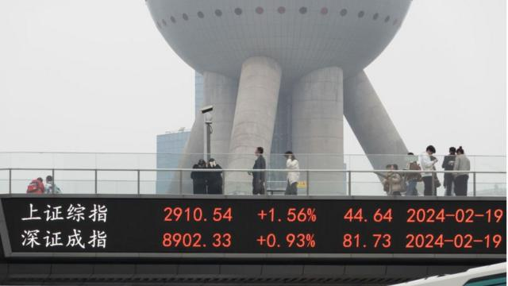
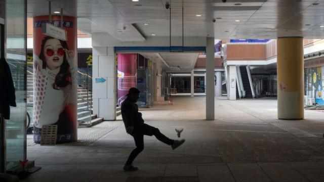

# [Chinese] 中国经济：过半省份2024年GDP增长目标低于去年，中国增长是否会进一步放缓

#  中国经济：过半省份2024年GDP增长目标低于去年，中国增长是否会进一步放缓

> 图像来源，  Getty Images
>
> 图像加注文字，龙年首个交易日中国两大股指上涨。春节长假之前，中国股市遭遇了连续暴跌，此后政府出手救市，导致最后几个交易日股指有所反弹。

**随着中国全国人大和政协会议（两会）即将于3月召开，中国各地方政府在春节前闭幕的地方“两会”上，陆续公布了2023年经济发展成绩单以及2024年的GDP增速预期目标。**

在春节长假之前，中国股市遭遇了连续暴跌， 美国驻华使馆微博成了网友“哭墙”  。此后政府出手救市，导致最后几个交易日股指有所反弹。

一般认为，根据各地先公布的今年预期数字，能够先预测今年中国全国经济增速的风向。

根据官方出台的数据，中国31个省级经济体中，有17个未能达成2023年GDP目标。展望2024年，几乎所有地方的经济增速目标都低于去年或与去年持平，态度趋于保守。主因之一是在地产业的风暴罩顶之下，一些债务负担重的省市不得不降低今年的成长目标。主要经济大省及直辖市，譬如北京及上海将目标锁定在5%左右。

分析称，中国要在2024年经济全面恢复至新冠疫情之前的水平并不乐观。专家告诉BBC中文，预计两会公布的全国经济增速目标落在5％以下或左右。

法国外贸银行亚太区高级经济学家吴卓殷（Gary Ng）接受BBC中文采访时称，从中国地方政府发布的数据来看，多数省级政府对未来前景信心不足。他说，2024年地方政府需要摆脱对房地产的依赖，寻找替代成长来源，尤其是在债务扩张受到严格控制的情况下，“只有那些基本面较好的企业在2024年才会更有韧性”。

德国柏林墨卡托中国研究所（Merics）首席经济学家曾林（Max J. Zenglein）则解释，这些数据看出，中国经济成长的分布变得更加不均。他告诉BBC，数据显示较发达的省市受益于制造业和高科技的优先发展，因此能够弥补房地产行业放缓的影响，“但对于欠发达省份来说则要困难得多”。

曾林同时强调，由于中国国内内需疲软，地缘政治紧张局势加剧，外部阻力加大，2024年对中国经济来说可能是充满挑战的一年：“只有解除房地产危机、消费反弹更强劲，经济才会开始好转。”

##  数据说了什么？

去年中国“两会”开幕时，即将卸任的总理李克强在政府报告中公布了当年度经济增长目标——“5%左右”。这一数字引发全球高度关注。彼时对饱受新冠疫情摧残后的全球各大经济体来说，5%是极为可观的增长。不过，中国在多年两位数增长率下，最近十年增速已逐步回落到个位数。在2005年之前中国连续六年的增速目标都设定在7%，2005年开始连续七年都设定在8%。

观察各地方先 出台的数字  ，中国经济第一大省广东设定增速预期目标5%。而全中国GDP总量排行分居第2、3的江苏与山东则设定为“5%以上”。北京、上海则设定目标为“5%左右”。

> 图像来源，  Getty Images
>
> 图像加注文字，疫后的经济复苏，消费是难点。分析称中国服务消费恢复快于商品消费。

此外，天津市设定目标最低为“4.5%左右”，并且是连续3年设定目标在全国垫底。

四川、湖北都设定目标为6%，与其2023年增速持平；海南及西藏自治区则最高，目标为“8%左右”。

总体来看，地方两会的数据显示，共有13个省市自治区的2024年增长目标低于2023年实际增速，5个持平；16个省市自治区的2024年增长目标低于2023年的增长目标，11个持平。

分析数据，经济学人智库 (EIU) 全球贸易首席分析师马志昂(NickMarro) 向BBC解释，地方政府出台的数据说明了中国国内成长前景差异。马罗告诉记者，中国不同地区的经济状况可能有很大差异。譬如东北地区经济体的发展，与沿海省份、西南部地区面临的挑战或机会是截然不同的：“当我们想到中国时，该记住的是，这个国家的国内经济格局极为多样化，每个地方享受国家发展的好处或面对的困难是很不平均的。”

此外，还有一些分析认为，地方政府普遍下调今年经济增速的主因是去年的增长其实是得利于2022年的数字极低，还有去年疫情后也有消费反弹，这些因素的加总作用在2024年会开始减弱。据此，中国国务院发展研究中心究员张立群接受中国媒体《经济观察报》采访时就说，从官方数据可以看见，经济大省在提振经济方面面对不容忽视的压力。展望2024，为了达到更好的经济成长，他认为经济大省还需更努力克服困难。

> 图像来源，  Getty Images
>
> 图像加注文字，恒大旗下的一个废弃商场

##  全国经济增速目标

在地方先公布的数据后，3月初的“两会”要给出的全国经济增速目标。一月中，中国已经宣布2023年全国经济增速为5.2%，官方表示这说明中国经济继续朝着复苏繁荣前进。但许多专家称，三月两会将宣布的全国经济增速目标可能还是落在5%左右。主因仍是房地产衰退预估短期不会结束，民营企业弱势状况还会继续，国内消费疲软将继续拖累经济增速。

法国外贸银行分析师吴卓殷预估中国今年GDP增速目标将落在4.5%左右。他告诉BBC，除非房屋销售和消费者信心大幅好转，否则今年中国面对经济挑战还是很大。他认为，三月的两会将是关键，应该关注中国中央政府是否会在地方政府资源日益匮乏的当下，“在发债和刺激方面承担更多责任。”

经济学人智库（EIU）的预测则更为保守。马志昂透露，该智库预计中国经济将在未来十年内继续走在减速的道路上，EIU预测2024年中国实质GDP成长是4.7%，“到2030年，我们预期经济成长将下滑至3%以下”。他解释，此分析来自经济中的结构性问题——包括住房问题，以及与地方政府债务、人口老化、生产力低下、政策不确定性和不断恶化的地缘政治有关的问题——都将使中国经济在未来几年承受相当大的压力。

马志昂强调，这其中许多其实都反映了中国经济中的抵销因素。例如，即使政策制定者加倍实施“工业升级”策略，但对潜在生产力的任何提升，预期都会受到更广泛的经济改革议程停滞之限制。

此外，根据路透社，近期有12个省区市被中国监管部门认定存在债务违约的“高风险”，这些地方包括辽宁、吉林、贵州、云南、天津、重庆和三个自治区。中国国务院已责令这12个省区市放缓或停止一部分“基建项目”，收缩开支以防止债务危机恶化。

> 图像来源，  Getty Images
>
> 图像加注文字，较低的经济增长目标可能意味着政府不会放松之前的监管措施，这对互联网和房地产巨头可能不是好消息。

##  “唱响中国经济光明论”

北京当局在春节之前仍对经济前景持续表示信心十足。1月19日中国全国政协在北京召开的会议上，政协主席王沪宁于会上要求政协委员，宣传阐释好中共经济政策“唱响中国经济光明论”。

2月8日，中共总书记习近平在春节团拜会上发表讲话称：“即将过去的兔年，中国全面贯彻新发展理念……经济总量超过126万亿元，粮食总产量再创新高，就业、物价总体平稳，放眼全球仍然是风景这边独好。”

此外，去年12月，中国情报机构国家安全部在微信公众号发布了警告，指出中国国家安全面临新的威胁，包含不断出现的“各类意图唱衰中国经济的“陈词滥调””及“建构中国衰败”的“虚假叙事”。国安部称其为认知陷阱，将强调“加强经济宣传和舆论引导”之工作。

