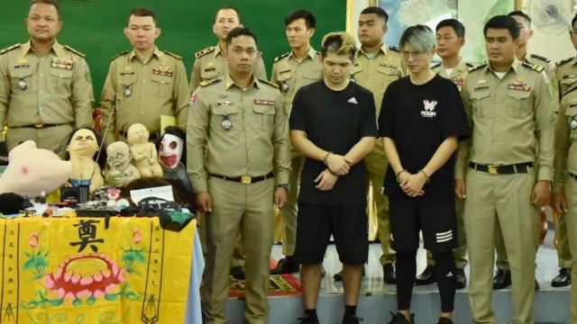

# [Chinese] 台湾网红在柬埔寨直播造假判刑两年，洪森称“无法宽恕”背后的考量与禁忌

#  台湾网红在柬埔寨直播造假判刑两年，洪森称“无法宽恕”背后的考量与禁忌

  * 李澄欣 
  * BBC中文记者 

> 图像来源，  Cambodian National Police
>
> 图像加注文字，台湾网红"晚安小鸡"及其同夥"阿闹"在柬埔寨被控煽动制造社会动乱罪，判刑两年。

**台湾网红“晚安小鸡”及其同夥“阿闹”日前在柬埔寨开直播指在诈骗园区内被绑架殴打，后来遭揭发是自导自演。当地警方迅速逮捕两人并控以煽动制造社会动乱罪，判刑两年。**

事件受到高度关注，柬埔寨前首相洪森（Hun Sen）及现任首相洪玛奈（Hun Manet）先后开腔批评两人的行为抹黑该国形象，呼吁司法部门不要减刑或特赦。

台湾碍于柬埔寨遵从中国大陆的“一个中国”政策，在当地没有代表处。中国驻柬使馆则表示，“事发后，柬西哈努克省政府及时向我馆驻西哈努克领事办公室通报有关情况”，该馆要求柬方在保障当事人合法权益的前提下依法依规处理。

学者对BBC中文分析指，网红为了拼流量走偏锋，这次恰好触碰到柬埔寨政府及洪森家族的敏感神经，因而引发轩然大波。

##  发生什么事？

台湾网红“晚安小鸡”2月12日晚间开直播，自称闯入柬埔寨西哈努克港（Sihanoukville，西港）的凯博园区，被人暴打、一度囚禁，但逃了出来，他隔日声称还遭到勒脖、电击及剃头。

柬埔寨警方调查后，发现有关影片系造假，当局在2月14日逮捕“晚安小鸡”与同夥“阿闹”，并在现场找到许多鬼娃和鬼面具。

柬埔寨西港省初级法院15日判决指出，两人到柬埔寨是为了拍摄人口贩运、凌虐、性侵和器官交易的造假影片，触犯煽动制造社会动乱罪，判处两年有期徒刑，每人罚款400万柬币（新台币约3万元）。

西哈努克省省长郭宗朗同日举行记者会，指两名网红从今年1月筹划到柬埔寨拍片，2月11日飞抵金边但没有拍摄成功，当天下午转往西港，途中购买军装、假枪、假血等道具，12日晚间到烂尾楼开直播称闯入诈骗园区后被追捕，并中断直播制造被绑架失联的假象，但实际上直播结束后一群人就返回饭店。

在记者会上，两名网红下跪求情，承认直播造假，称柬埔寨治安良好适合观光，希望当局再给他们机会拍片为柬埔寨平反。但郭宗朗指两人须承担法律责任，刑满后将被驱逐出境。

##  为何惊动洪森？

而据《柬中时报》2月19日报道，柬埔寨首相洪玛奈出席由中国贷款兴建的百达隆巴萨河大桥动工仪式时回应事件，指饱受内战蹂躏的柬埔寨不断努力发展，致力吸引外国游客，但两名网红为了一己私利造假，让外国人误解柬埔寨绑架猖獗，损害观光业导致当地人民失去收入。

他强调，为免同类事件发生，柬埔寨将依法严惩造假者，二人将被判刑，刑满后驱逐出境，列入入境黑名单。

而在前一天18日，前首相洪森表示，两名网红意图扭曲柬埔寨的形象，令人“无法宽恕”，呼吁司法部门不要减刑或特赦，务必让两人服满刑期，并指将对任何造谣抹黑国家形象的行为“零容忍”。

洪森自1997年发动政变夺权后掌控柬埔寨近40年，至去年8月卸任交棒给儿子洪玛奈。洪森曾表示，其政治生涯在交棒后仍未结束，会担任其他职务至少到2033年，被视为柬埔寨的“太上皇”。

洪森一直希望把西港建立成经济特区，配合中国的“一带一路”倡议，引进了大批中国投资进驻，却沦为博弈（博彩）产业和电话诈骗集团的犯罪天堂，经常有关于人口贩卖的报道。

台湾国立暨南国际大学东南亚学系副教授​​张春炎对BBC中文分析指，近年中国不断施压柬埔寨政府要求当局扫清犯罪集团，洪森也作出承诺，但问题没有好转，人口贩卖的情况持续。

“虽然直播是假的，但本质上那些问题是存在的，打脸了柬埔寨的执政能力、打击犯罪能力。这对于洪森这位政治强人来讲非常丢脸，他当然要高举他的法治来立权立威，又刚好抓到拙劣的网红，而且是台湾人，他不用顾虑外交层面的事情。”

张春炎指出，手机普及后柬埔寨人民依赖网络收集讯息，而洪森很了解网络的力量，“他自己也是网红”，很早就经营“脸书”去做宣传和讯息控制，加上疫情后柬埔寨观光客人数只恢复了不到三分之一，当局正努力重振旅游业，因此对这次事件更加高调处理，希望杀一儆百。

##  “晚安小鸡”是谁？

“晚安小鸡”本名陈能钏，现年31岁，在Youtube和脸书分别有近13万和19万粉丝。据台湾媒体报道，他主要在脸书开探险直播，经常拍类似鬼影的片子，2020年在台北一家废弃医院探险时发现一具干尸而爆红，去年5月也前往日本恐怖医院探险成为网路热门话题。

“阿闹”则本名鲁祖显，现年34岁，同样是灵异探险直播主，经常直播自己到闹鬼医院、校园、酒店等探险。

这并非两人首次因直播内容惹上法律争议。“晚安小鸡”两年前曾闯入彰化一栋危楼声称遭游民拿刀追杀，中途拿出赞助商的产品“压惊”，事后被警方指控散布谣言，但法院判无罪。

“阿闹”就在三年前与一个直播团队擅闯高雄眷村，直播一对男女在废弃建筑物内“打野战”进行性行为，事后团队四人被控无故侵入他人建筑物罪、播送猥亵声音及影像罪等，被判刑拘役35至75天。

台湾中国文化大学广告系专任教授钮则勋对BBC中文指出，网红之间竞争非常激烈，往往会在维持流量的巨大压力下走偏锋，加上他们拥有大量粉丝，部分人沉浸在“知名人士”的光环下有“大头症”（自我膨胀），影响其心理和判断能力，做出有损社会利益甚至违法的事。

“但在民主社会，如果针对内容去立法限制，可能是侵犯言论自由，是很严肃的争议。所以还是要靠他们自律，以及用现有的法令机制例如毁谤等等去规范。”

他表示，最重要是强化民众的媒体识读能力（media literacy），多看不同平台和内容，不要偏听偏信。“不过现在的观众、网友也很聪明，对网红的印象就是炒作声量，所以这类造假事件网友也见怪不怪。”

