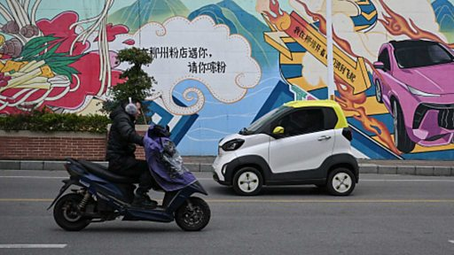

# [Chinese] 电动车：低价微型车渗透中国小城市，“接送孩子买买菜上下班”

#  电动车：低价微型车渗透中国小城市，“接送孩子买买菜上下班”

**电动车：低价微型车渗透中国小城市，“接送孩子买买菜上下班”**

在中国南方城市柳州，街头随处可见色彩绚丽、身形小巧的微型电动汽车。

“就是用来接送孩子买买菜，上下班的，”47岁的柳州市民曹女士表示，经济实惠、停车便捷是人们选择这类小车的主要原因，“停车方便，充电也方便，又便宜。”据称柳州当地还为这类电动车提供免费停车等服务。

中国是全球最大的电动汽车市场，特斯拉和比亚迪等高端车型在中国富裕的大城市屡见不鲜。但在广大的欠发达地区和中小城镇，价格低廉的微型电动车正占领街头，成为市民首选代步工具。

一款柳州的工厂参与生产的微型电动车在中国的年销量已经超过百万，其中最便宜的一款车售价仅为3万多人民币。

业内人士称，低端微型电动汽车为曾经买不起车的人群提供了新选项。

但在更大范围的消费群体中，还是存在对微型电动车安全性和充电设施普及程度的担忧。

（影片来源：法新社AFP）

