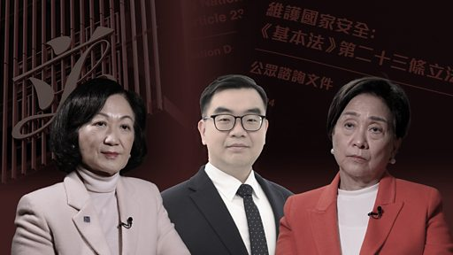

# [Chinese] 《基本法》第23条：在香港讨论立法是否已成公众禁忌？

#  《基本法》第23条：在香港讨论立法是否已成公众禁忌？

**《基本法》第23条：在香港讨论立法是否已成公众禁忌？**

同样是《基本法》第23条的立法咨询，相隔21年后香港的社会气氛和舆论有强烈的对比。

2024年初，香港政府就《基本法》第23条立法开展谘询工作，为期1个月。这是继2020年北京在香港实施《港区国安法》后，第二部聚焦国家安全的法例。当局计划引入新的罪行定义，包括“叛国”、“境外干预”和“窃取国家机密”等，被认为比《国安法》更严厉。

2003年，港府曾尝试推动“23条”立法，引发了数十万人上街抗议，是香港主权移交以来最大规模的游行。 当时有亲北京的立法会议员倒戈，政府最终搁置立法。 主导立法的时任保安局局长（现任行政会议召集人）辞职。

在21年后，BBC中文早前在香港街头随机访问市民，却发现不少人对该话题避而不谈。

当年主导谘询工作的叶刘淑仪和有份表达反对意见的刘慧卿，向BBC中文谈及他们对两次立法工作的观察和感受。

