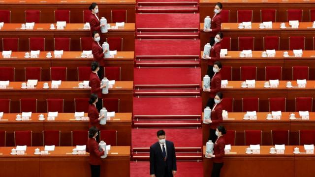
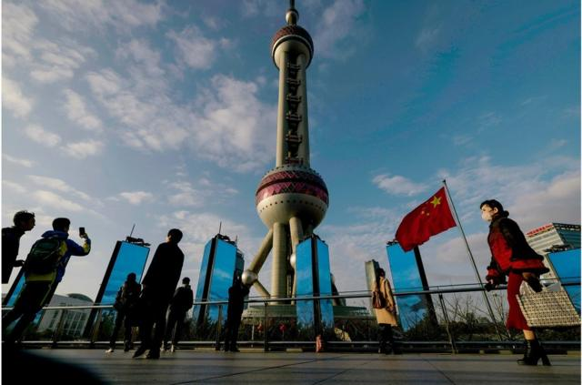
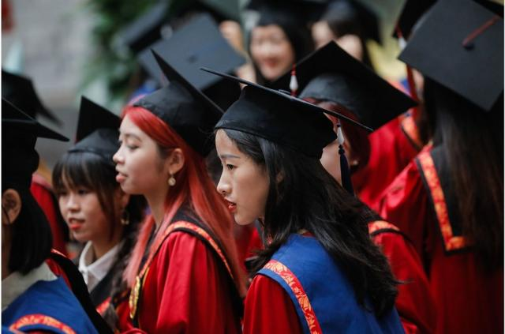
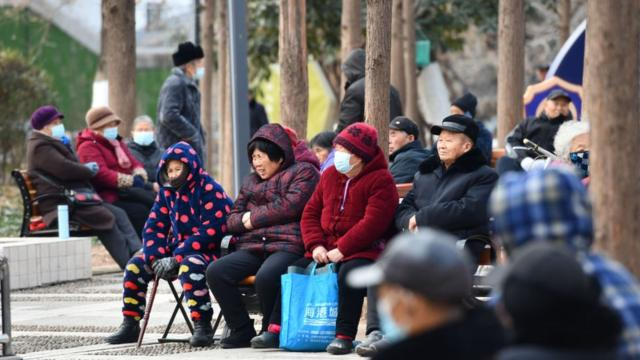

# [Chinese] 中国两会2024：有哪些重要的关注点

#  中国两会2024：有哪些重要的关注点

> 图像来源，  Reuters

**中国将在3月4日和5日，在北京召开全国政协十四届二次会议和十四届全国人大二次会议，即俗称的“两会”。**

今年将公布中国国务院总理李强任内首份《政府工作报告》，随着“两会”在即，中国领导人正面临一些压力，包括是否推出政策保障经济潜力。

##  经济

近年中国的经济发展备受关注，包括全年经济增长的目标，在新任领导人的带领下，会否有新的经济复苏计划。然而，普遍认为，中国会将GDP（国内生产总值，亦称国内生产毛额）增速目标维持在5％。

> 图像来源，  ALEX PLAVEVSKI/EPA-EFE/REX/Shutterstock

早在全国“两会”举行前，中国各地方政府已经举行地方“两会”，陆续公布了2023年的经济发展情况及2024年的GDP增速预期目标，大体维持在5%的预期目标；然而，在农历新年前，中国股市面临股灾，此后政府出手救市才有所反弹。

而在出台的数据中，有一半的省级经济体未能达成2023年GDP目标。有专家认为，估计今年仍然会与上年的预期一样，预计是5％左右的增长目标。

《经济学人》智库（EIU）中国经济高级分析师徐天辰向BBC中文表示，外界一致的估算反映中国经济目前面临的挑战非常多，短期包括房地产以及债务问题等，长远则有中美关系、人口挑战等。

徐天辰指，另一个值得关注的财政事项是今年赤字率有机会比较高，达到3.5%的水平，预期政府有机会发行特别国债，令整体赤字率再度提高，因此2024年的经济增长能否符合预期，要视乎中国政府的财政支出。

> 图像来源，  WU HAO/EPA-EFE/REX/Shutterstock
>
> 图像加注文字，分析人士指，中国在疫情时扩招了研究生，这几年会陆续毕业，加上技术职位的培训不多，仍会令青年失业率高企（图为在中国人民大学学位授予仪式上等待领取硕士学位证书的毕业生）。

另一个就是青年就业的问题，中国在去年8月暂停公布青年失业率，被批评是“掩耳盗铃”，至年尾才公布数据，当时16到24岁青年失业率大幅降至14.9%，但仍比总失业率高企。

徐天辰表示，这方面的工作备受关注，有关问题比较长期，即使去年的工作报告有提到，但估计青年就业问题不会有太大改善。

他还指出，在疫情时，中国扩招了研究生，这几年会陆续毕业，加上技术职位的培训不多，仍会令青年失业率高企，估计当局会继续发动国企增加短期就业职位等政策措施。

##  政治

去年的会议是政府换届的时间，产生了新一届中国领导人，而今年的会议上，外界关注被免除职务的前外交部长秦刚及前国防部长李尚福的继任人。

在2月下旬的中国全国人大常委会会议中，常委会公告的罢免及辞职名单中出现了秦刚的名字，至于李尚福，也从中央军事委员会的委员名单中被移除。

“两会”向来是中国政治层面的大事，而在“两会”前夕，上述二人再被除名，外界预测“两会”可能再次公布新的中共高官人事调整，此举亦将影响中国处理国际关系的方向以及态度。

美国巴克内尔大学（Bucknell University）国际关系系教授朱志群对BBC中文说，这次人大会议期间很可能有人事方面的宣布。

董军已在去年12月被任命为新国防部长，但尚未被任命为国务委员——这一头衔通常也授予防长。

##  外交与两岸

按照惯例，“两会”期间公布的《政府工作报告》，都会交代来年的外交工作。

过去一年，中国的外交和国防人事出现重大变动，上任仅数月的秦刚及李尚福被免除职务，中共中央外事办主任王毅重新接任外长、谢锋则接任驻美大使，防长则于去年底由非中央军委委员的海军前司令员董军出任。

> 图像来源，  MARK R CRISTINO/EPA-EFE/REX/Shutterstock

而加上台湾大选刚举行，民进党赖清德当选台湾总统。外界关注“两会”的外交政策会否因为此等格局而有所转变。

朱志群说，不论国防部长或外交部长的人选是谁，中国的国防和对外关系的方针不会改变，因为他们只是政策的执行者，而非制定者，不会改变中国的国防和外交政策。

他补充说，唯一令人关注的可能是新的外交部长会不会在工作方式上有所不同——是身段比较柔软，还是一位“战狼”。但不管外界如何定位，他一定是中共中央外交政策的忠实执行者。

朱志群指，近期中国外交大致有两个重点，亦预料“两会”的报告会维持一贯的方向：一是继续跟美国保持“斗而不破”的局面，争取合作共赢， 二是继续压缩台湾的外交空间，争取更多国家明确支持“一个中国”，反对“台独”。

他认为，“两会”的工作报告不会直接提到台湾大选，只会宣示一些原则立场，例如坚持“和平统一，促进两岸交流，坚决反对‘台独’”等。

##  人口

> 图像来源，  Getty Images

在今年1月公布的最新人口数据，中国人口为14.1亿人，人口减少了208万人，归咎于出生人口进一步减少，同时死亡人口进一步增加，2023年人口出生率为6.39％，几年间跌至个位数。

在人口红利的时代过去，外界关注会否因而拖垮中国经济，特别是中国政府会否尽快推出政策改善问题，其中更预期“两会”会推出延迟退休的政策。

徐天辰指，随着人口下降，如果不作出相应的措施去应对问题，中国的劳动力下降的速度会加快，估计今年“两会”或三中全会非常大机会提出延迟退休政策，相信政策会令平均退休年龄延迟两至三年，缓冲劳动力下降的趋势，同时减轻养老金的压力，但效果最快要在2028年才见到。

新加坡国立大学政系副教授庄嘉颖则认为，人口仍是中国需要面对的问题，而“两会”可能延迟退休年龄，或鼓励生育，他指延迟退休只能暂时调整劳动力长期减少的问题，要改善人口压力，长远仍要靠提高生育率或开放移民，但以现时中国政府的处事手法，未来会如何应对人口问题，他仍然无法估计。

