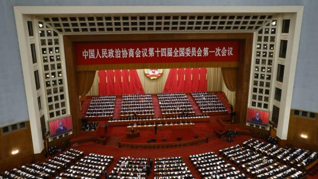
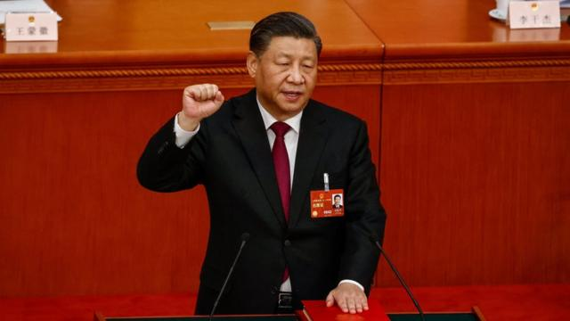
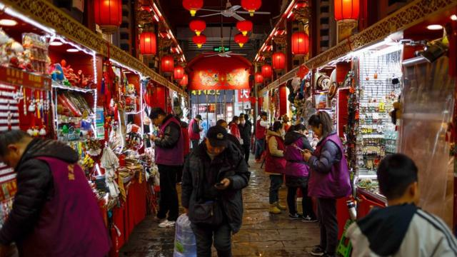
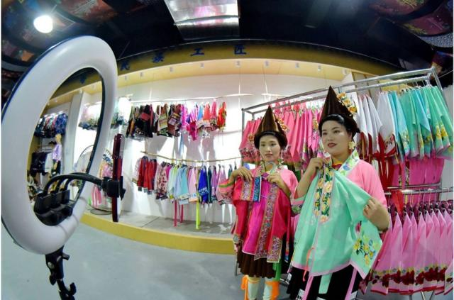

# [Chinese] 中国两会2024：北京能否为陷入困境的经济找到出路

#  中国两会2024：北京能否为陷入困境的经济找到出路

  * 麦笛文（Stephen McDonell） 
  * BBC驻中国记者 发自北京 

> 图像来源，  EPA
>
> 图像加注文字，数千名代表将齐聚北京人民大会堂参加“两会”（图为2023年3月4日中国政协会议开幕会议资料照片）。

**中国政府正面临着为陷入困境的经济提出解决方案的巨大压力。在全国人民代表大会于周二（3月5日）拉开帷幕之际，人们将密切关注任何新的动向。**

近3000名全国人大代表每年都会聚集到人民大会堂，在超过一周的时间里表决通过法律、人事任免，并授权更小规模的全国人大常委会在全年其他时间处理政务。

这在很大程度上都是一场政治表演，为在幕后已经做出的决定盖上橡皮图章。

但鉴于会议所传达的信息代表了执政者深思熟虑的结果，分析人士将密切留意党的官方路线发生的任何变化，以及这对中国和世界可能意味着什么。

例如，某个新措辞可能预示着产业政策的变化，或新的投资法规的出台。

对中国共产党来说，相比经济，更重要的是确保其维持对中国的长期统治。 对现任领导人习近平而言，这在生活的几乎所有方面都绝对是重中之重。

近几十年来，随着经济腾飞，大多数中国人的生活水平逐年提高，这似乎并不是什么大问题。

但如今，亚洲的经济增长引擎却陷入了一场房地产危机，许多家庭的毕生积蓄因购买了烂尾楼而化为乌有；大批高校毕业生找不到好工作；地方政府背负巨额债务，这使政策制定者无法像过去那样，在经济困难时向基础设施注入资金。

曾经一个新建道路项目或一系列桥梁项目即可以吸收大量失业人口、闲置钢材和过剩的混凝土产能，但现在光景不在。现在，中国面临的是一个充满不确定性的时期。

“今年的全国人大会议将在一个不寻常的动荡期召开，尤其是在经济政策方面。” 《党》（The Party）一书的作者马利德（Richard McGregor）  说。该书研究了中国的政府结构。

他告诉BBC，有消息称“政府正在寻求发表某种大型声明来恢复信心，并促进经济增长。人们普遍对经济状况感到不满，进而不满于习近平为国家设定的方向”。

在过去，当一些大型政策引发普遍担忧，人大投票会出现相当的反对票，例如为建设三峡工程而淹没大片历史区域的决定。

但在习近平的领导下，这需要鼓起勇气才能做到。

马利德说，他并不指望本次两会期间会出现对领导层的谴责，因为“所有代表都已经学会了与官方步调一致”。但他补充说，“即使是批评性的杂音也很重要”。

纽约大学教授李淯（Ann Lee）认为，本届大会可能会通过立法为私营部门提供更多支持。

“这默认了中国经济需要更多的创业投资，以实现习近平提出的高质量增长目标。”她说。

##  “新质生产力”

> 图像来源，  EPA

自去年年底以来，习近平在谈到国家发展方向时一直使用的一个词是“ 新质生产力  ”。在未来几周的讲话中，这句话很可能也会出现。

但是，这是什么意思呢？

德克萨斯大学圣安东尼奥分校的乔恩·泰勒（Jon Taylor）教授说，习近平指的是“强调以新兴智能和环保技术为核心的科技、数字化和高端制造业的发展和商业化”。

他补充说，虽然这是一个“相当有趣的口号”，但这类产业起飞需要时间，部分原因是“中国经济中的这些行业相对较小”，而且“问题在于因经济表现不佳，中国面临着一些严峻的挑战”。

他表示，从长远来看，对技术创新的新一轮重视可能会带来回报，但“从短期来看，中国仍依赖于基建支出和摇摇欲坠的房地产市场”。

习近平提出“新质生产力”有一个有趣的方面，即他在1月份的政治局会议上说，这些生产力将“摆脱传统经济增长方式、生产力发展路径”，这似乎暗示着即将到来的高科技突破可能是由党组织的，并为党服务。

跨国投资银行瑞银集团（UBS）前首席经济学家乔治·马格努斯（George Magnus）认为，“这强调了党对‘新质生产力’的领导和控制地位，以及利用其开展意识形态工作的能力。反过来，这意味着其是一项有助于加强党在经济核心的数字和科学领域主导地位的产业政策。”

> 图像来源，  EPA
>
> 图像加注文字，房地产危机和青年高失业率成为今年“两会”的关注话题。

李淯认为该词的使用非常重要，因为它表明“在房地产行业受挫以及与西方的贸易关系持续紧张之后，习近平决心重振中国经济”。她认为这“可能预示着一个转折点”。

##  精心策划的问答和堆积如山的术语

这场大规模政治集会以总理李强的马拉松式讲话开始，他在演讲中宣读《政府工作报告》，以非常公式化的方式总结了中国过去12个月中在经济、环境、农业等广泛领域的表现。然后，报告转入党对下一年工作的计划。这是了解政府思路转变的关键所在，但可能需要放大镜才能在堆积如山的专业术语中发现它们。

全国人大会议期间，还将举行一系列精心安排的记者会，只允许记者提出经过筛选的问题，几乎所有的回答都经过排练。

近年来，中共还在这些新闻发布会上安排了“假外媒”记者，他们看似代表国际媒体，实则来自总部设在海外但由中国政府控制的门面公司（Front companies，或称幌子公司）。

马利德说：“各部委和省级代表团在大会期间举行相对坦率的新闻发布会的时代已经一去不复返了。”

这场规模庞大的会议可能是一场精心策划的秀——忠诚的代表们低头沉浸在冗长的报告中——但这并不意味着它不会取得重要进展。

> 图像来源，  Getty Images
>
> 图像加注文字，中国贵州省黔东南州的一家服装公司，苗族妇女通过在线直播销售刺绣产品。

泰勒教授认为，“虽然人大往往是一种明显的表演性专制活动，但也会有一些政策创新元素涌现”。

他说，中国正处于艰难时期。

中国“今年将继续面临若干挑战： 在脱钩期间鼓励外商直接投资、系统性地解决地方政府债务问题、恢复私营部门的信心、提高科技自主程度，提振消费需求”。

这个超级大国面临着重要问题，现在正是寻找答案的时刻。

