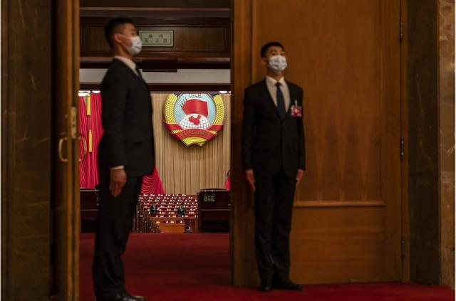
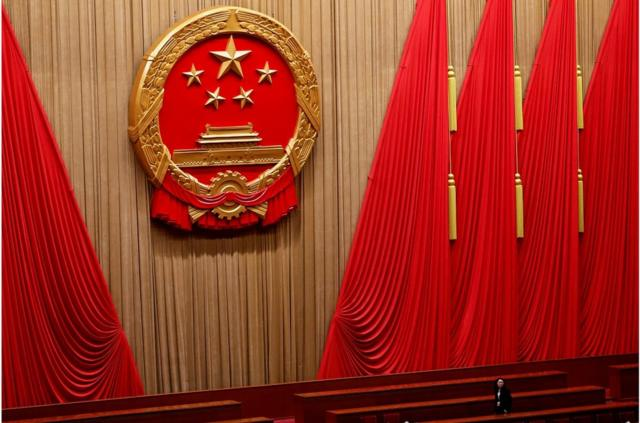
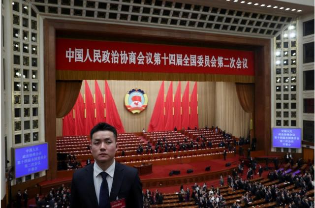
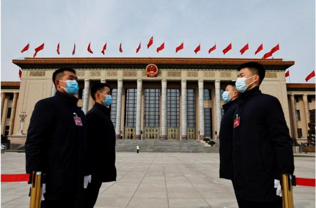

# [Chinese] 中国两会2024：总理记者会被取消 打破30年惯例

#  中国两会2024：总理记者会被取消 打破30年惯例

> 图像来源，  Getty Images

**中国进入一年一度的“两会”时间。全国政协和人大会议分别在周一（3月4日）和周二（3月5日）拉开帷幕。**

今年“两会”是中国当局四年来首次全面恢复对媒体开放，在新冠疫情时期记者无法在现场采访的限制措施被取消。

不过，中国官员周一无预兆地宣布，将取消今年和未来几年总理在人大会议闭幕后召开的记者会，打破了30年的惯例。

此次“两会”召开正值中国经济面临多重挑战之际。近3000名人大代表和2200名政协委员前往北京，参加为期近一周的会议。

##  总理记者会被取消

中国全国人大发言人周一表示，国务院总理李强将不会再于人大闭幕后会见传媒代表。维持了30年的中国总理“两会”记者会传统在此告一段落。

新任全国人大新闻发言人娄勤俭说：“今年十四届全国人大二次会议闭幕后，不举行总理记者会。如无特殊情况，本届全国人大后几年也不再举行总理记者会。”

BBC驻北京记者麦笛文（Stephen McDonell）分析，此举将被解读为在中共中央总书记兼中国国家主席习近平进一步扩权之际，中国第二号人物的影响力被进一步削弱。

他表示，尽管总理记者会往往经过精心安排，只允许媒体提出事先经过筛选的问题，但似乎习近平仍“不希望被中共党内的另一名高级人物抢了风头”。

在微博上，“十四届全国人大二次会议闭幕后不举行总理记者会”一度成为热话标签，但从BBC记者团队所见，该标签不久便遭屏蔽。

> 图像来源，  Getty Images

2023年3月13日，李强首次作为中国总理会见中外媒体记者，这将成为他本届任内——至2028年全国“两会”闭幕为止——唯一一次记者会。

1991年，时任中国总理李鹏首次出席全国“两会”闭幕后举行的记者会。1993年起，“两会”总理记者会开始成为常态。

在高级官员很少接受媒体采访的中国，每年的总理记者会都备受关注。在照本宣科的回答之外，中国二号人物也偶尔会有超出预料的言论。

其中最知名的一次，当属2012年时任国务院总理的温家宝在其任内最后一届记者会上，罕见地严厉抨击时任重庆市委书记薄熙来，后者随即被罢免。他还呼吁进行“政治体制改革”，这在中共党内一直被视为敏感议题。

去年卸任总理的李克强也曾因在记者会上提到中国有六亿人“每月收入仅1000元”，引发互联网热议。

##  恢复媒体现场采访

> 图像来源，  Getty Images

尽管被视为是“两会”重头戏的总理记者会被取消，但今年“两会”也标志着该年度政治会议重新全面恢复对媒体开放。

自2020年开始，连续四年的人大和政协会议都因新冠疫情而大幅削减现场报道的记者人数，一些例行活动——如各个地方代表团的开放日等——都被取消。

记者们还被要求提前入住政府指定的酒店，在进行多次核酸检测和隔离后，才被允许“闭环”进入部分会场，与参会的代表们完全分隔开。很多时候记者只能通过远程视像连线向官员提问。

今年，几乎所有的限制措施都被取消，只不过在记者办理报道手续时，仍需要现场做一次核酸检测。

不过，官方宣布的“两会”会期仍只有一周，这延续了疫情时期的长度，几乎是疫情前的一半。原因尚不清楚。

天安门广场又会出现记者们的“百米冲刺”——来自国际媒体和中国国内媒体的记者们在清晨就带着各种拍摄器材抵达人民大会堂门口排队，随后冲进会场抢占机位。

然而，在中国当局不断加强对于任何异议声的管控的情况下，“两会”的参会者们相比几年前无疑更多地选择谨慎发言。

当记者周一在人民大会堂询问参加政协开幕会的委员们如何看待目前放缓的经济时，绝大部分人都拒绝了评论。

也有一些人表达了自己的看法。

中国全国政协委员牛同栩表示，作为法律人士，他关注的领域是民营经济的发展。他认为，需要有专门的民营经济促进法为民营经济发展提供更大空间。

全国政协委员舒勇则表示：“我觉得各种各样的问题都是社会在进步中需要（面对）的。”他认为，中国经济仍然是“整体向好的”。

他表示，作为文艺工作者，他希望通过对传统文化的创新来更好地为经济“赋能”。

##  北京安保严格

> 图像来源，  Getty Images

在“两会”拉开帷幕之际，首都北京已全面加强了安全保卫措施。

有北京市民表示，今年的安保工作比去年更加严格，包括地铁站在内的很多地方都有警察拦住路人，核验身份证。

北京公安局在上周发布的通知中表示，从3月1日至12日，北京将禁止使用无人机。

国家邮政局也专门召开会议，要求对所有寄往北京的邮件实行落地“二次安检”，以打造“安保护城河”。

一些地方的“看桥员”也重新上岗。

2022年中共“二十大”前夕，一名抗议者曾在北京西北部的一座立交桥上悬挂抗议中国领导人习近平的标语。为防止模仿行为发生，当局在有重要政治会议召开时在一些主要立交桥增派维安人员。

