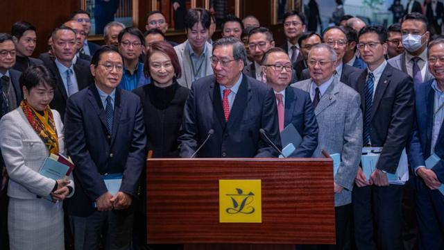
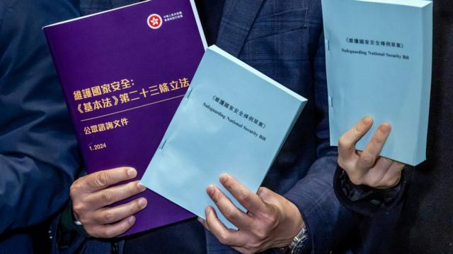
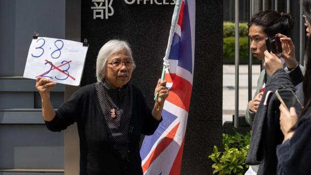

# [Chinese] 香港国安法：“23条”草案送交立法会 叛国、叛乱等可判无期徒刑

#  香港国安法：“23条”草案送交立法会 叛国、叛乱等可判无期徒刑

8 小时前

> 图像来源，  EPA
>
> 图像加注文字，中国香港特区立法会主席梁君彦（中）称将“尽一切努力，早日完成立法”。

**中国全国“两会”召开之际，香港特区政府加速《基本法》第23条国家安全立法，立法会加开全体会议。行政长官李家超重申要“尽早完成立法”，批评人士担忧香港所余不多的人权与自由将进一步遭受蚕食。**

立法会星期五（3月8日）加开全体会议，听取政府动议辩论 《维护国家安全条例草案》  。其内容包括叛国、窃取与披露国家秘密、叛乱等罪行。这些内容在中国全国人大常委会2020年颁布的《香港国安法》中并未涵盖，一些罪行可招致无期徒刑。

与《香港国安法》相同，《国安条例草案》中多项条文写入域外效力条款。此外，警察将获准在法庭授权下，将未被起诉的国安案件嫌疑人拘留调查最多16天——多于一般罪行的48小时——并可限制嫌疑人咨询律师，政府也将有权以国家安全为由宣告禁止个别组织或企业运作。

有媒体引述政圈传言称，当局希望在4月15日中国“全民国家安全教育日”前完成立法。立法会议员何君尧认为，当日是理想的完成立法日子。

中国香港特区保安局局长邓炳强强调，落实“23条立法”是要“堵塞国家安全的缺口”，又重申 稍早前开展的公众咨询  取得98.6%的支持意见，“显示立法实实在在有很强大民意基础”；香港立法会主席梁君彦称将“尽一切努力，早日完成立法”。

在提交草案前夕，特首李家超 在Facebook上发文  ，重申要“实践香港26年来仍未履行的宪制责任”，“早一日完成立法，国家安全受威胁的风险便少一日”。

一些原本在北京出席全国“两会”的香港立法会议员相继赶回香港出席星期五的特别会议。与此同时，全国人民代表大会常务委员会委员长赵乐际 星期五宣读工作报告时  ，多次提到维护国家安全，包括要“落实特别行政区维护国家安全的法律制度和执行机制”。

##  香港“23条”国安立法草案的部分建议罪名与罚则

> 图像来源，  Bloomberg/Getty Images

  **“叛国”** ——终身监禁（无期徒刑） 

  **“未有披露他人犯叛国罪”** ——监禁14年 

  **“叛乱”** ——终身监禁 

  **“非法操练”** ——监禁7年 

  **“勾结境外势力作出煽动”** ——监禁10年 

  **“非法披露国家机密”** ——监禁10年 

  **“间谍活动”** ——监禁20年 

  **“危害国家安全的破坏活动”** ——监禁20年 

  **“境外干预”** ——监禁14年 

  **“参与受禁境外组织的活动”** ——监禁14年及罚款100万港元（折约12.79万美元；90.7万元人民币；401.43万元新台币） 

##  仓促通过？

香港立法程序下，法案草案须经过一读、二读、三读辩论并表决通过，再交由行政长官签署生效，并报全国人大常委会备案，其中二读开始后一般会先“中止待续”，将法案送交专责委员会细审后，再送回大会恢复二读。星期五的这次特别会议一次过完成了一读到二读中止待续程序，相关委员会还在下午加开会议，开展审议。

香港一些媒体引述政圈传言称，李家超政府希望在4月15日中国法定“全民国家安全教育日”前完成立法。立法会选举委员会界别议员何君尧在大会后集体会见记者时说：“按照目前的速度及成效，以及现在团结一致推动工作，如果在4月15日国家安全日能启动，完成香港国家安全法，这一条是维护国家安全条例，我认为是一个挺理想的日子。”

“4月的星期三、四恢复二读、三读，是不是挺理想、令人振奋？”

> 图像来源，  Bloomberg/Getty Images
>
> 图像加注文字，香港示威常客“王婆婆”王凤瑶孤身在特区政府总部外挥舞英国国旗与自制标语牌抗议“23条”立法。

Skip podcast promotion and continue reading

* BBC 時事一周 Newsweek (Cantonese)   **

BBC國際台粵語節目，重溫一周國際大事，兩岸四地消息，英國境況。並備有專題環節：〈記者來鴻〉、〈英國生活點滴〉和〈華人談天下〉。

分集

End of podcast promotion

香港总商会在法案首读后发表声明表达支持。香港东方资本研究公司（Orient Capital Research）董事总经理安德鲁·科利尔（Andrew Collier）则对路透社评论说：“他们想要赶快通过‘23条立法’，说明他们担忧公众反对。除非有条文保障个人权利，否则商界不会高兴。”

香港大学法律学院副院长杨艾文教授也对路透社说，草案中的罪行定义宽松，尤其是“境外干预”与“勾结境外势力”部分，或会让企业感到受挑战。

杨艾文说：“也许那些跟外国政府有些许联系的企业或团体将落入‘境外势力’的侦测范围。”

台湾大陆委员会发言人詹志宏星期五说，对于港府宣称“23条立法”获得全面支持不感到意外，但他还说：“我们担心的跟全世界各国所担心的是一样的：香港过去的自由、民主跟人权，还有它独立的司法等等，是不是逐渐逐渐的在被消失、被剥夺当中。”

“这个会影响到香港750万居民的生活方式，也会影响到香港在全世界，过去一向被尊重的经济、司法，种种的尊崇的地位。”

目前居于英国的前香港众志党副主席郑家朗星期四（7日）接受BBC连线采访时形容，《香港国安法》下的香港已没有多少人愿意发声批评政府。

郑家朗说：“基本上，敢言的人都已被关进牢里，剩下的人不再愿意发声。”

香港记者协会认为，“23条”立法草案“印证了记协于咨询期提出法例将钳制本港新闻及言论自由的忧虑”。

“记协认为草案的多项内容，只会严重加深已经发生的寒蝉效应，将香港变为单一声音的城市。记协留意到关于国家秘密的罪行，有加入涉及公众利益的披露豁免，惟豁免范围仍较记协早前建议狭隘，亦未有厘清公众利益定义，记协就此表示非常遗憾。”

美国国务院与英国外交部此前分别公开呼吁港府重新考虑“23条立法”。英国外相卡梅伦勋爵（Lord Cameron）称，英国明白所有司法管辖区均有权立法保障国家安全，也明白香港有宪制责任完成“23条立法”，但港府目前的立法建议将妨害言论、表达与媒体出版自由。

中国外交部先后反对和批评英方与美方言论“粗暴干涉中国内政和香港事务”，“是赤裸裸的政治操弄和虚伪双标”。

中国外交部发言人毛宁星期五称：“今日刊宪的23条立法草案充分表明，这一立法平衡兼顾维护国家安全和保障权利自由及经济发展，将为香港高质量发展和高水平开放保驾护航，为‘一国两制’行稳致远提供坚实保障。”

