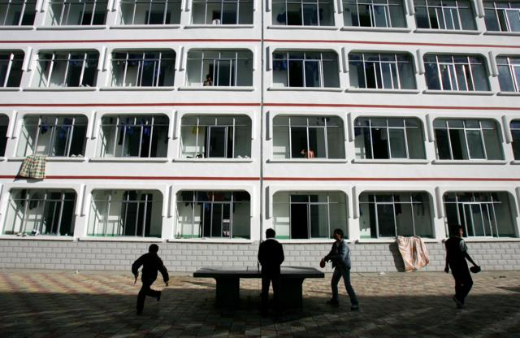
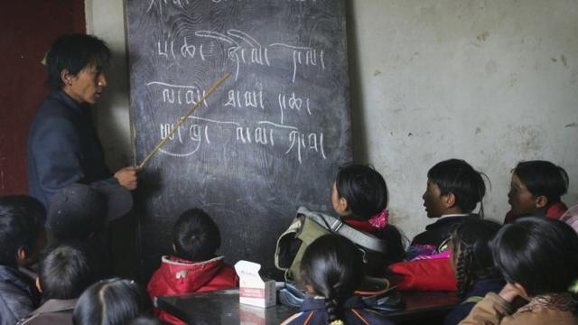
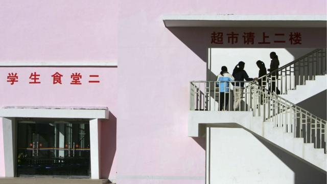

# [Chinese] 西藏：中国被指透过寄宿学校制度压缩藏语教育

#  西藏：中国被指透过寄宿学校制度压缩藏语教育

  * 白麦克（Michael Bristow） 
  * BBC记者 

> 图像来源，  Getty Images
>
> 图像加注文字，活动人士估计，现在有80%的藏族儿童，总数可能达到一百万，从学前到成年都在寄宿学校接受教育。

**藏族教育社会学者嘉洛（Gyal Lo）说他能够流利地讲普通话，但他宁愿不这样做。**

过去这几年来，他一直在向世界讲述北京对藏区正在施行的“全面教育改革”，但他不愿使用被他视为殖民压迫者的语言。

中国扩大了寄宿学校针对的人群，甚至将四岁的藏人儿童送到寄宿学校，并用汉语取代藏语成为主要教学语言。

北京则表示，这些改革能够为藏族儿童成年后的生活做出最好的准备，因为在这个国家，主要的沟通语言是汉语普通话。

但是，嘉洛博士却持不同意见，他认为北京的真正目的是通过瞄准社会中最年幼的人来削弱藏族的身份认同。他说：“他们设计了一个课程，将催生一个未来无法使用自己语言和文化的人口。”

“中国正在利用教育作为一种工具，来减少藏族人的社会能力。没有人能够抵抗他们的统治。”

多年来，海外人权组织一直强调中国在西藏地区的所谓的虐待行径，但近年来关注点已转向北京如何针对新疆的穆斯林维吾尔人以及管束香港的民主抗争。不过，许多活动人士表示，中国官员在西藏的活动也没有停歇。

> 图像来源，  Getty Images
>
> 图像加注文字，中国藏区正在用汉语取代藏语作为主要的教学语言。越来越少藏族儿童能接收到充分的藏文教育。

譬如，近年来，中国政府在藏区关闭了许多乡村小学，以及教授藏语的私立学校，并扩大了寄宿学校的使用。这些寄宿学校在中国的一些人口稀少的地区已经运作了许多年，但在藏区，它们似乎已成为主要的教育手段。

活动人士估计，现在有80%的藏族儿童，总数可能达到一百万，从学前到成年都在寄宿学校接受教育。

在发给BBC的声明中，中国驻伦敦的大使馆表示这项政策是必要的。

他们表示，由于藏区人口高度分散，“孩子们必须长途跋涉才能上学，这非常不方便。”

“如果在学生居住的每个地方都建立学校，将很难确保足够的教师和教学品质。这就是当地政府设立寄宿学校的原因。”

> 图像来源，  Getty Images
>
> 图像加注文字，活动人士称，近年来，中国政府在藏区关闭了许多乡村小学，以及教授藏语的私立学校。

Skip podcast promotion and continue reading

* BBC 時事一周 Newsweek (Cantonese)   **

BBC國際台粵語節目，重溫一周國際大事，兩岸四地消息，英國境況。並備有專題環節：〈記者來鴻〉、〈英國生活點滴〉和〈華人談天下〉。

分集

End of podcast promotion

但反对者表示，这种寄宿学校教育导致孩童被强行与家人分离，进而对他们造成心理创伤。

一位曾在寄宿学校就读多年直到10岁的藏族青少年在接受BBC访问时称：“寄宿生活中最具挑战性的部分就是想念我的家人。”

她后来逃离了西藏，现居住在印度。

BBC通过一个人权组织与她取得了联系。她向记者说：“还有很多其他孩子也想念家人，也会哭泣。有些年纪较小的孩子经常在半夜哭醒，然后跑到学校大门口。”

BBC还曾与其他藏族流亡者交谈过，他们从家乡的亲戚那里也听说了类似的抱怨。

嘉洛博士也有自己的故事，他的两个外甥女在分别只有四岁和六岁被送到寄宿学校。在一次家庭晚餐中观察她们后，他意识到她们在说母语时感到尴尬。

他称：“她们坐在那里的方式让我觉得，她们不愿意与家人分享相同的身份。她们就像是客人一样。”

这促使这位当时在兰州的西北民族大学工作的社会学家造访了50所藏族寄宿学校，看看其他孩子是否有同样的情况。观察结果都很相似。

嘉洛将这些寄宿学校与曾经在美国、加拿大和澳大利亚运作过的寄宿学校进行了比较。

原住民孩子被从家庭中带走，进行同化的过程现在已被证明是错误的。

他说：“这些孩子与他们的文化根源以及他们父母、家庭和社区之间的情感联系完全断绝了。”

教育体系的第二个重大变革涉及藏语，这是一种悠久的口述和书面传统，可以追溯到一千多年前。

中国将藏语替换为汉语普通话，作为主要教学语言。

中国大使馆表示，中国的少数民族拥有“使用和发展自己口语和书面语言的自由”。

但是，BBC采访到的一名学生表示，她的学校只鼓励使用汉语。她说：“除了藏语课程外，所有的课程都是用汉语教的。我们学校有一个大图书馆，但我没有看到任何藏文书籍。”

根据联合国文化权利特别调查员亚历珊德拉·桑塔基教授（Alexandra Xanthaki）的说法，这项政策似乎与国际人权法相违背。

她向BBC强调，学童父母有权将孩子们送到使用他们选择的语言教学的学校：“这意味着仅仅一两个小时的、作为外语方式的教学是不够的。”

事实上，约一年多前，桑塔基教授和其他两位联合国调查员向中国当局发了一封信，详细列举了他们对中国在西藏的教育改革的一系列投诉。

这封信指出，中国试图“同质化”少数民族，使他们更加汉化，而汉语普通话被视为实现这一目标的工具。嘉洛博士则忆起他与中国云南省一所大学副校长的一次争论，那是他从兰州转到该大学工作的时候。

> 图像加注文字，嘉洛对于藏语文化以及该地区的年轻人的未来感到悲观。

那次争论表明了在中国，汉语被官方认为应当凌驾于其他语言之上。

嘉洛回忆道：“他有一天来到我的办公室告诉我说：你都在写藏文文章，但没有写汉语文章。’”

“这让我感到不舒服和愤怒。我告诉他我不想写汉语文章。后来，这位行政人员脸红着怒气冲冲地离开了。”

那次争论之后，嘉洛于2020年逃离了中国，现居加拿大。他在那里参与活动强调在西藏正在发生的教育变动。

北京方面正在积极抵制像他这样的活动人士提出的论述。他们发起了一场宣传活动，试图让世界相信中国在藏区的“改革”是有益的。他们也试图抹黑那些持不同观点的人。中国指责桑塔基教授散布假消息。嘉洛也同样成为了目标。中国官媒上针对他的发言权威性提出质疑。

尽管如此，嘉洛仍然坚持自己的观察，他对于藏语文化以及该地区的年轻人的未来感到悲观。

“我们的孩子正在成为与外界疏离的世代。许多人未来既无法适应中国社会，也无法适应藏族社会。”

