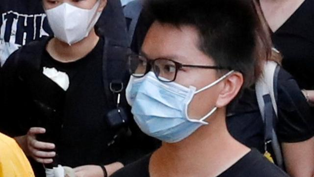
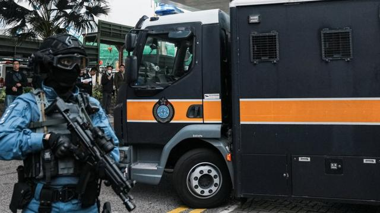

# [Chinese] 香港“23条”与国安法：新条例下“第二代美国队长”马俊文遭拒减刑

#  香港“23条”与国安法：新条例下“第二代美国队长”马俊文遭拒减刑

7 小时前

> 图像来源，  Reuters
>
> 图像加注文字，“第二代美国队长”马俊文自2020年11月起被收押，一年后被判刑。

**中国香港特区通过《基本法》第23条国家安全立法并颁布生效后不到一周，一位国安案件囚犯被褫夺因行为良好获扣减刑期的法定待遇，提前释放遭撤销。**

被媒体和示威者称为“第二代美国队长”的青年马俊文因中国《香港国安法》下的“煽动他人分裂国家”罪被判监五年，获扣减刑期后，原定星期一（3月25日）获释，但前往迎接的友人被告知监狱因《维护国家安全条例》实施而不会提前放人。

香港行政长官李家超星期二（26日）间接证实此事，并称不获减刑从今以后将成为“一般做法”。
 被香港保安局局長鄧炳強形容为“境外反华组织”  的非政府人权组织国际特赦组织（Amnesty International）对BBC中文评论称，“23条”立法实施短短数天便发生此事，“令人深感担忧”。该组织再次促请香港当局废除《国安条例》。

##  从收押、判刑、上诉到不获减刑

被起诉时30岁的马俊文被指控在2020年间多次在公开示威中叫喊鼓吹“港独”口号，遭到拘捕后于2020年11月正式起诉，并被收押候审，至2021年11月香港特区区域法院以《香港国安法》下的“煽动他人分裂国家”罪判处监禁五年九个月，是2020年6月30日中国全国人大常委会对香港颁布该法以来第二位被定罪判刑的示威者。

马俊文不服判刑而上诉，2022年8月获特区高等法院上诉法庭减刑至五年，成为《香港国安法》首例上诉得直案件。

2024年3月19日，由亲北京人士全面主导的香港特区立法会经过连日“加班”后，一致通过了《维护国家安全条例》。特首李家超同日宣布将于23日在宪报（政府公报）刊登新法，即时生效。

到25日——《国安条例》生效第三天——多家香港媒体引述消息人士称，马俊文因在狱中表现良好，获扣减三分之一刑期——即减至约三年四个月——将于当天刑满出狱。

然而，据报道几位友人到大屿山塘福惩教所迎接马俊文，久候多时却未见其踪影。他们后来获监狱福利官告知，因“23条”立法生效之故，马俊文无法如期出狱。

多家媒体向主管监狱事务的特区惩教署查询，署方称不会评论个别案件。其中，《星岛日报》引述消息人士称，马俊文未能让惩教署署长信纳他在出狱后不会对中国国家安全不利。

如此，连同收押候审期间，马俊文将要到2025年11月方才有望获释。

##  “23条”条文对国安案犯人刑期有何管制？

> 图像来源，  Reuters
>
> 图像加注文字，《国安条例》下囚犯须让香港监狱部门首长信服其不会再次危害中国国家安全，方可获考虑减刑。

根据香港特区《监狱条例》下的《监狱规则》，囚犯实际刑期超过一个月者，“可因勤奋及行为良好”而获得减刑不超过总刑期的三分之一。

但《国安条例》对《监狱规则》加入了新条文：“如某囚犯是因被裁定犯危害国家安全的罪行而服刑，则除非（惩教署）署长信纳该囚犯获得减刑，不会不利于国家安全，否则该囚犯不得……获得减刑。”

新条文该规定还对仍在狱中人士设有“追溯期”：“为免生疑问，不论……囚犯的刑罚是在该款的生效日期之前、当日或之后判处的，该款亦适用。”

26日，特首李家超在每周出席行政会议前的例行记者会上被问及马俊文案。李家超说：“因为危害国家安全的罪行严重，我们必须让所有人都明白，如果犯了涉及危害国家安全的严重罪行，正常来说都不会获得减刑。”

“不获得减刑是一般做法，而只会在惩教署署长信纳该囚犯获得减刑是不会不利于国家安全，才会作出考虑。这正正是要告诉大家，不要尝试去做任何危害国家安全的行为和活动，一般是不会获得减刑，所以不要以身试法。”

李家超还说：“处理任何此类个案时，惩教署署长当然会按照法律进行，任何人对其决定不满意的话，可以寻求法律方法，为自己的情况，看看法庭如何看整件事的处理。”

##  各方如何评价？

国际特赦组织发言人对BBC中文称，马俊文因“23条”立法实施而被拒提前获释，“让人尝试到此新法对香港人民所带来额外一重打压的滋味”。

“短短几天之内，此法已对人权产生影响，并且正在追溯适用，令人深感忧虑，可谓不祥之兆。”

以英国为基地的香港观察组织（Hong Kong Watch）也称，新法实施短短48小时后便看到此事发生，说明《国安条例》对香港人和平行使公民权利“构成严重风险”。香港保安局局长邓炳强此前同样曾将香港观察标签为“境外反华组织”。

香港特区立法会89名议员中唯一自称属非建制派的社会福利界议员狄志远26日对香港媒体称，马俊文的处境“观感不好”，让市民误以为“23条”会导致“加刑”。他促请港府切莫“矫枉过正”。

中共《人民日报》旗下小报 《环球时报》英文版  则引述香港法学交流基金会秘书长陈晓锋称，国安案件犯人不获减刑是“国际惯例”，减刑才是“例外”。要是不能确保获释囚犯不危害国家安全，将为社会带来“莫大伤害”。

