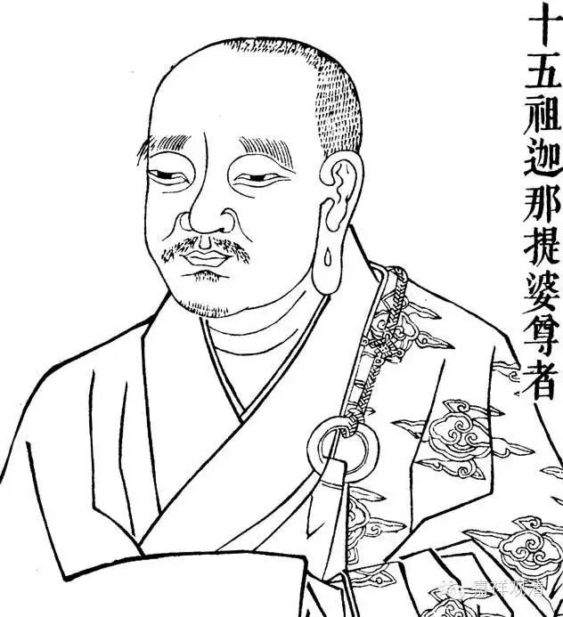

##  二、作者论 

刻本首题 “ 提婆菩萨造 ”， 似乎作者无疑义。然事实仍须刊定。 

一者 ， 论首归敬颂若云提婆自造 ， 云何自归依 ？ 

二者 ， 此书论本当然为提婆造 ， 如颂末云 “ 此是《百字论》 ， 提婆之所说 ” 。印人 著 书与 汉 土异 ， 题目作者俱在後出。此译全依旧式 ， 亦列最後。又 ， 文轨《广百论疏》 ， 谓此《百字论本》为提婆作 ， 故知《百字论本》实为提婆所造无疑 。 此在西藏本(唐时译 ， 虽题龙树造 ， 名为《中观百字论》 ， 或《百字中论》) ， 但据 汉 译 ， 可见其说实系误传。 

不过此 《 论释 》 谁氏所作 ， 仍须研考。 

旧传此释亦提婆自作 ， 此有三种理由 ： 

谓论本非自释不易解。论本二十句 ， 虽不深奥 ， 而文过简 ， 非他人所能明了 ， 必须自释 ， 如《俱舍颂》及《唯识二十论》等 ， 皆待自释而後了解。提婆既意在教人而作此论 ， 其自加注解 ， 亦复可信。 

二 、 谓藏译论释 ， 即是自注体裁 ， 由此而知 ，汉 译 《 本 》《 释 》 可以出於一人手笔。 

三 、 谓藏译无归敬颂 、 可知汉译归敬颂乃译人所为 ， 於释论之为提婆自造 ， 并无冲突。 

然此三种理由,皆不确定。如： 

一、谓论本非自释难解，但提婆百论亦简略而无自注，安知《百字论》不同一例？ 

二 、 藏传本释同系龙树之作 ， 今既不信其为龙树造之说 ， 而信其 《 本 》《 释 》 同出一人手笔 ， 亦属不可。 

三 、 汉藏两译原来各有增减 ， 原本有无归敬一颂尚不能定。 

除此以外,由录、写、刻三方面刊定,亦见提婆作释之说不甚可靠。 

录谓经录。旧时流支元魏二录不存,但取其材於彼者 ， 有三种隋 录 ,即法经、长房、仁寿也。三录皆但题译人而无作者。此 《 论释 》 题提婆菩萨造 ， 始於 《 开元录 》 而所据不明 ， 故 《 释论 》 自作 ， 不能确定也。 

写谓传 抄 本。在各经未有刻本之时 ， 写经格式如何 ， 亦有记载。如现存唐玄逸之《释教广品历章》 ， 即於各经经题、品目、行格、字数 ， 乃至卷帙长短 ， 均加考定 ， 正是唐人写经格式。章中对於此书即无提婆菩萨造之说 ， 玄逸之作在《开元录》之後而不依《开元录》 ， 当别有所见。由此可知 ，《 释论 》 作者不定为提婆本人也。 

刻即刻本。刻经始於北宋 ， 现难见其全本矣。但依宋刻记载之《法宝标目》等 ， 此书首题提婆菩萨造五字 ， 似乎宋刻即已断定作者 为 提婆 ， 但不足信也。盖刻本错谬不一而足 ， 如经录旧 载 流支译《破外道四宗论》 ， 而刻本改作 《 提婆菩萨破 楞伽经 外道小乘四宗论 》， 误认楞伽出於提婆之前。又《楞伽》四句之说不限於一异俱非 ， 尚有常 无常 等 ， 若但以一异俱非破之 ， 岂非乱《楞伽》本意 ？ 

由此等处 ， 可知旧录无提婆菩萨作之记载 ， 而刻本有之 ， 并不足置信也。每一部译典 ， 必须经过录 、 写 、 刻三方考证 。 今考证《百字论释》之作者 ， 只能谓其不确定耳。 

至於作者时代大略可指。因释论中述及数论学说,从其特点上,可断定释论之作,必在提婆以後。如释论第八章 “ 外曰无法非因生 ” 以下,举数论因中有果说(果已先在因中,待时而现),而以五因成宗,此全依《金七十论》第九颂之说(释论译文不明,今勘藏译而显),彼颂云:无 不可作故(即无法非因生)。必须取因故(即以 因缘 生),一切不生故(即非一法为因生多),能作所作故,随因有果故,故说因有果。《金七十论》乃数论师自在黑所造,出於世亲之後,可知此释可能晚出也。但《金七十论》颂文,并非全由自在黑自作,亦有据《六十科(门)论略抄》之处。其第九颂文是否出自《科论》,今《科论》不存,无法取证,只作者学说宗趣尚可考耳。《科论》乃数论大家雨众所作,雨聚思想在《瑜伽》(卷六)《显扬》中均曾引及。其成立因中有果论之理由,虽与五因之说大同,但列举止四种。可知雨众之时,五因之说犹未具备。而五因即非自在黑所说,亦必成立於雨众与自在黑之间。由此推知《百字论释》作者时代当相接近也。 

