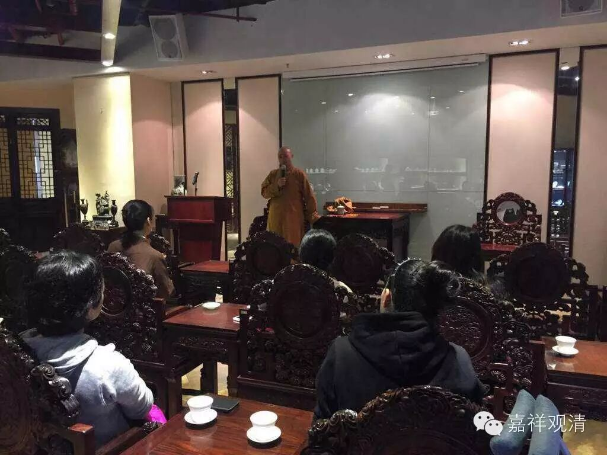
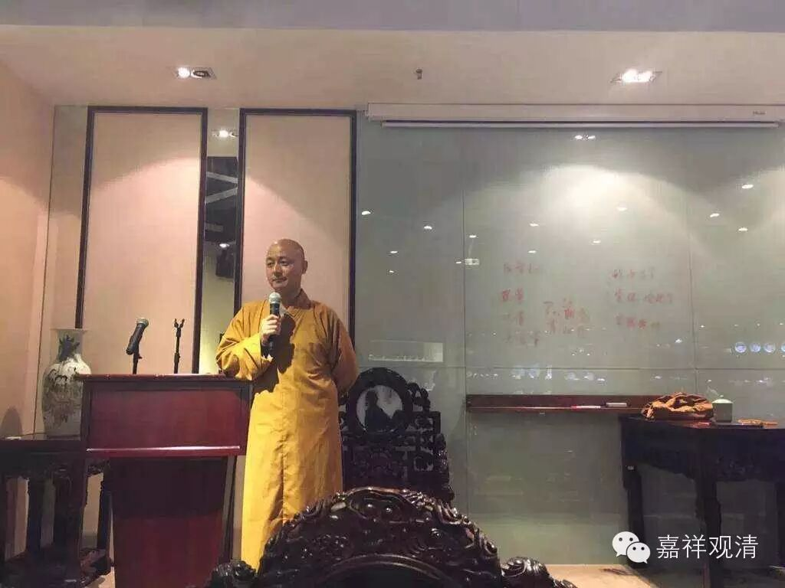
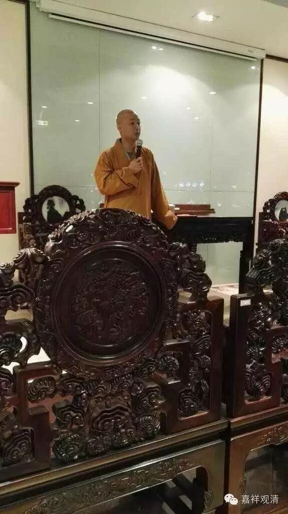
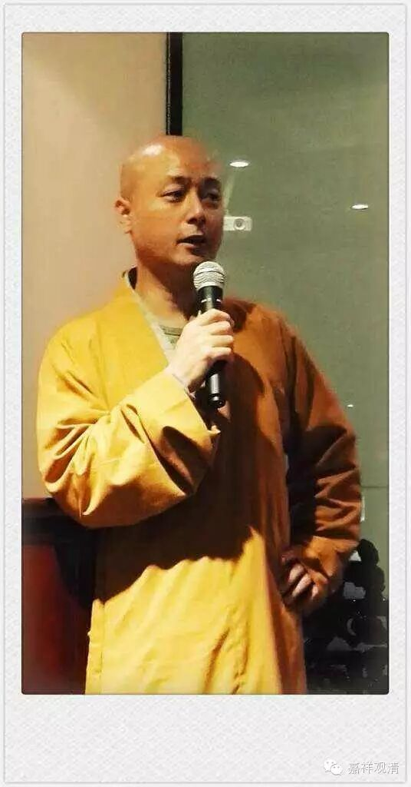
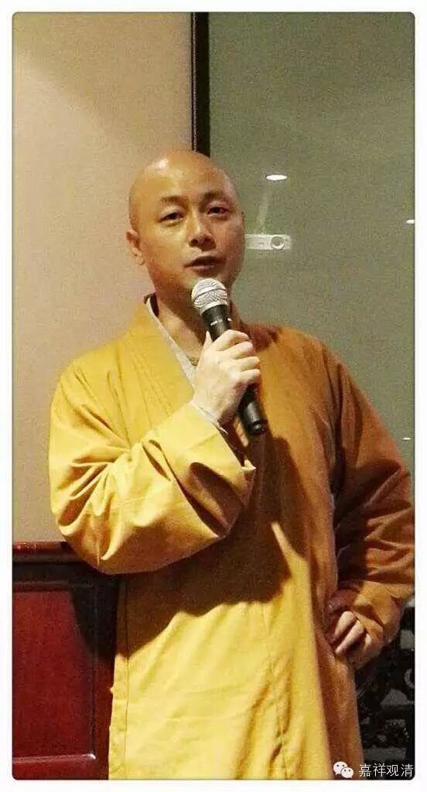
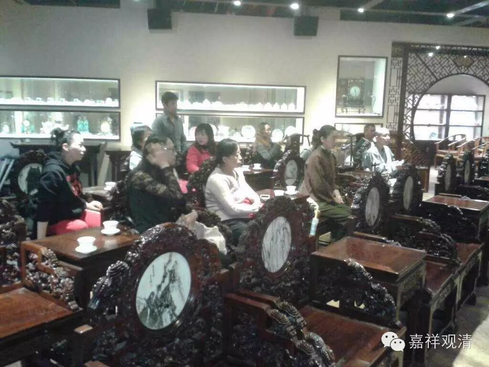

##  元中堂佛学讲座（一） 

##  学佛的第一堂课 

##  观清法师讲述 

##  仁信整理 

什么是佛 ？ 

简单说，慈悲，智慧的圆满就是佛。 

佛学三个层 面 

1、 形而上学：佛教的最高哲学是空相应的教法 

空的哲学，是佛学区别其它哲学的根本特点。 

空的意思是缘起无自性 

2 。伦理 

一、要有感恩的本心，心怀 “思 众皆有恩 ” 的情怀。感恩的结果是让对方得到圆满的快乐 ！ 得到究竟的快乐。 

二、 大乘追求帮助所有众生。 

三、小乘追求随缘而助。 

3 。佛学实践 

戒 诸恶莫作，诸善奉行 

定 学会控制自己的心 

慧 智慧是根本上解除烦恼  ！  把握事物的本质。 

以身载道 ： 行为就是理论的 最佳 注解。 

佛教的目的：离苦得乐！ 

佛学的本质是佛陀的教育。 

汉传佛教八大宗派： 

一、 教下 天台 、 华严 、 三论 、 唯识 

二、行门 律宗 、 净土 、 禅宗 、 密宗 

一句话解释佛教： 

一切为了众生，为了一切众生 ！ 

