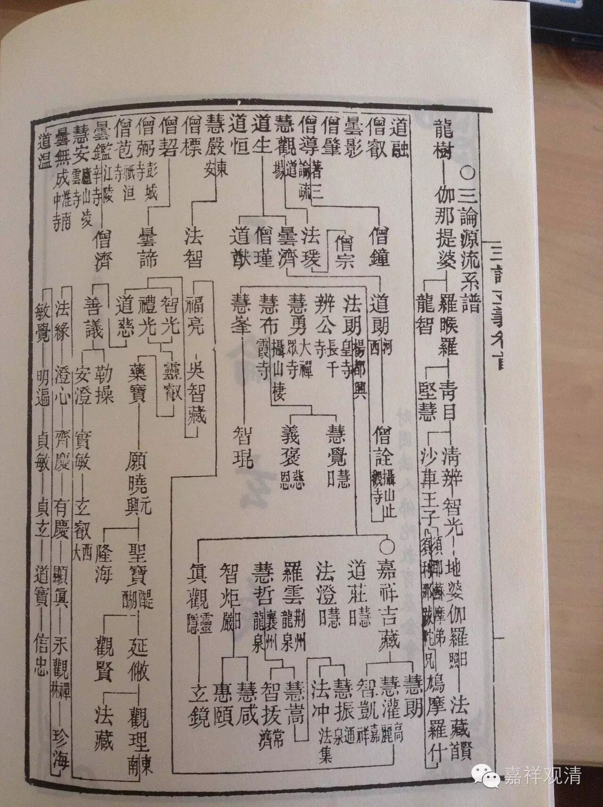

##  日本所传三论宗的源流图 

****

这是一张日本所传三论宗的源流图。 

顺便聊几句老生常谈： 

这个传承图中，**“鸠摩罗什——道生——昙济——河西道朗——僧诠”**之间，止观僧诠之师，《源流图》作“河西道朗”。按：当作“高丽道朗”或“高丽僧朗”，此“河西道朗”与“高丽道朗”非是一人。则，自道生而昙济而河西道朗之间的授受关系，与高丽朗传止观诠无关。且道生与昙济之间、昙济与河西道朗之间的授受关系也未可知。 

有说： 

**日本凝然在其《八宗纲要》中提出三论宗在中国的传承是：**

**罗什 ——道生——昙济——道朗——僧朗——法朗——吉藏 。**

**此说日本比较流行。**

按：其中，和上图一致，而“法朗”之师的“僧朗”显然是“僧诠”之误。 

又说： 

    **前田慧云在其《三论宗纲要》中提出三论宗在中国的传是：**

**罗什 ——僧肇、道融——道朗——僧诠——法朗——吉藏**

按：此说中，僧肇、道融和道朗之间的师承仍属臆测，并无依据。 

**     境野黄洋在其《支那佛教史讲话》中又标新解：**

**罗什 ——僧嵩——僧渊——法度——僧朗——僧诠——法朗——吉藏**

按：法度和僧渊并无师资关系，而法度与僧朗（道朗）亦只是同乡兼同修之关系，并无证据表明二人间有“三论”的授受传承。 

高丽朗之师资，目前只能泛泛说“得关河旧说”，具体传承人物已不可考，不必强扯，也不必如蕃地所传之教史，强拉月称去直接做了龙树弟子。 

