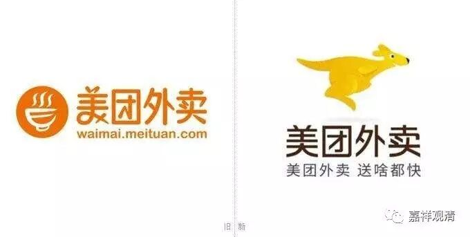

##  《俱舍》与“美团”

“美团”，大概是今天很多八零后、九零后的首选，我尚未和它发生过实质的交集。印象里，它是一个送餐饮的网站，百度了一下，原来是个团购网站，有口号是“团购一次，美一次”。大概现在主要做餐饮外卖服务吧。 

偶然的，在《俱舍》里读到了 “美团”。玄奘版《俱舍论》卷六： 

**“……毘婆沙师说：生等相别有实物其理应成。所以者何？岂容多有设难者，故便弃所宗。非恐有鹿而不种麦，惧多蝇附不食 美团 。故于过难，应懃通释，于本宗义应顺修行。 ”**

这是说，有部在回应 “生住异灭”的建立时，说：不能因为责难的人多就放弃了自己的观点！比如，不能因为鹿回来吃就不种庄稼了，不能因为有苍蝇叮就不吃 美团 了。所以呢，对别人的责难，自己要好好的想办法解释，守住自己的宗义。 

这里的 “美团”，看来是一种食物，真谛译本里做“果”，当是意译。检《根本说一切有部毗奈耶》卷 23 ： 

**“既见展已，持一 美团 授与令食。**

**彼既食已，问言： ‘气味何似？’**

**答言： “圣者！此 欢喜团 极成美妙。 ”**

**问言： “汝曾得此美好食耶？”**

**答言： ‘实未曾食。’”**

这里说，有个比丘拿 美团 给人吃，问： “怎么样？以前吃过这么好吃的东西不？”回答说：“非常好吃，从来没吃到过这么好吃的东西。”按此处的说法，这 “美团” 又名 “欢喜团” ，单单从这两个译名来看， “美团” 就应该是印度的一种美食了。 

《根本说一切有部毗奈耶》卷 32 又说： 

**“若我邬波难陀常得乳粥及 美团 者，我亦常能教授 ……”**

这是邬波难陀说： “如果我也能常常得到乳粥和 美团 ，我也能经常给你们讲课！ ”这里的意思，仍旧是说，“ 美团 ” 应该是印度的一种很好吃的食品。 

再引一则就打住。 

《根本说一切有部毗奈耶杂事》卷 5 ： 

**“汝何所识？一、将盛饭，二、拟贮麨，三、用安饼，四、著 美团 ，五、受羹菜，六、置乳酪，七、请助味。 ”**

三藏里提到 “ 美团 ”的余处尚多，兹不广引。 

美团网也许原先没想到， “ 美团 ”本身就是美食的意思。我看他们以后可以加这个意思进去。谁给我 @ 一下他们，也许我们的图书馆就靠这篇文章了。 

