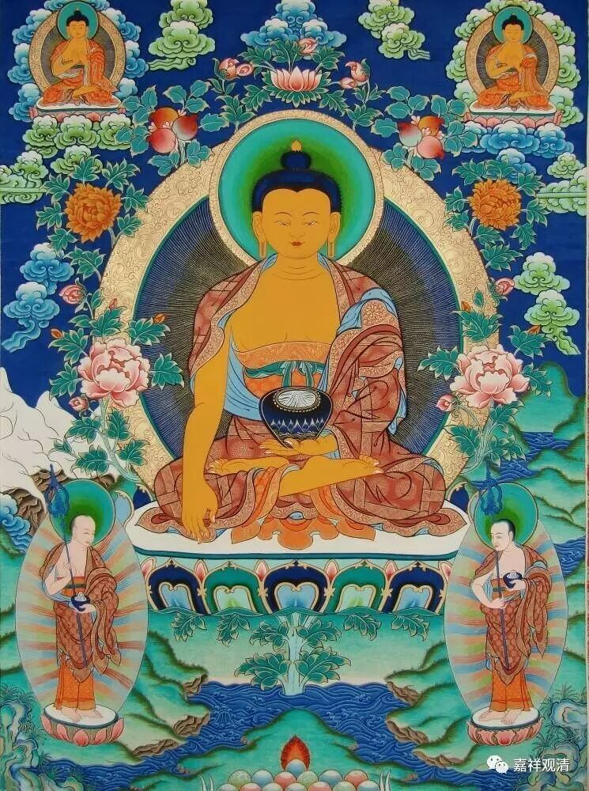

##  《金刚经》017（中） 

好，接下去就是世亲菩萨科判的二十七个问题了。 

我们可以先把文字过一遍，最先的一段是：**“须菩提，于意云何，可以身相见如来不？ ”**须菩提，可以以如来的身相见到如来吗？**“不也，世尊，不可以身相得见如来。 ”**不是这样的，世尊， 不可以身相得见如来。 为什么呢？**“如来所说身相，即非身相。 ”**这个身相是指什么呢？这个身相是指如来的色身，就是佛的色身，比如我们常说的三十二相、八十种好。 

这个问题在《金刚经》中至少提到过两次，但是内容和说法是不一样的。在最前面谈到这个问题，指的是什么呢？我们来简单地说说。对此，我曾经给过一个简单的总结： “无相之因，云何感有相之果？”这一段是在讲这个。 

大家在听到佛之前讲的经之后，聪明人很快就反应过来： “哎，我们说要成佛，成佛呢就会有三十二相、八十种好。佛的样子——三十二相、八十种好，就是佛的色身，这个是福德资粮。如果说我们在行布施的时候，是以无相、无自性、无执的背景去布施的话，那么，在因地上是以无相的背景去修行，为什么最终所感的佛果——三十二相、八十种好， 却 是有相的呢？ ”所以 世亲论师说，这是第一个问题， 我给的总结是： “无相之因，云何感有相之果？”

在世亲菩萨的说法当中也是这样的。世亲菩萨说的是 “若不 住 于法而行施者 ”，如果不 住 于法或者说通达空性以后，对一切法的无自性都能够了解，那么他在行这些布施、持戒、忍辱、精进、禅定、智慧的时候，就是 “若不 住 于法而行施者 ”。这样的情况下，“如何为求正觉胜果行慧施耶？”也就是说，为什么我们要向趋向于最后佛的胜果呢？我们看到，释迦牟尼佛有三十二相、八十种好，这里又提到了。 

功德施菩萨也有一部对《金刚经》的解释，其中说到： “世尊说已，圣者须菩提疑曰：‘若菩萨施时，法亦不住，云何以相好故行于施耶？’”应该说圣者须菩提是代大家提问的，因为他已经证得了胜义空，这个问题须菩提应该是不会有了，他是代大家问。问的什么呢？如果菩萨布施的时候，不住于法的话，为什么要为了成佛，为了获得三十二相、八十种好而行布施呢？ 

在声闻乘的经典当中也讲了，成佛的话要有三十二相、八十种好，要积累无边相好的因，其中有布施、持戒、忍辱、精进、禅定、智慧等等。那么，为什么要以无相的背景，去求这个有相的果呢？世尊的色身，是有百福庄严、千福庄严、万福庄严。世间一切功德的庄严，都比不上世尊相好的功德；世间所有善的功德，都比不上世尊一个毛孔的功德；所有毛孔的功德，都比不上一个相的功德；所有相的功德，都比不上一个好的功德；所有好的功德，都比不上一个眉间白毫相的功德 …… 以无相的因，怎么能感得这样有相的果呢？就有这样一个问题。这个问题应该下面的听众都会有的，所以说须菩提发起了这个问题。 

