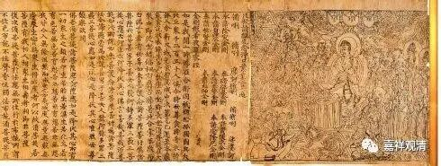

##  《金刚经》023（上） 

好 ，我们继续《金刚经》。 

上次讲到哪儿了我有点忘了，反正讲的也不多，我们先来看吧。比如说**“所有一切众生之类 ……”**这里肯定是讲完了，这是指所有一切的众生都要度，都要利益。利益的背景就是**“……令入无余涅槃而灭度之”**，这里 的 无余涅 槃 其实是 指 向 佛的 “ 无住涅槃 ” 的 ， 就是把一切众生引导向究竟的佛陀的果位 。 

还有**“无我相、人相、众生相、寿者相”**应该 也 已经谈到过了 ， 实际上 “ 我 、 人 、 众生 、 寿者 ”之间 并不是一个递进的关系 ，而 是并列的关系 ，包括 摩那婆 、阿特曼 等等 ，也是并列关系。 在另外一个版本当中是八个并列的 ，是同一个意思，都是无我相的意思。有汉人解释错了，某些藏人现在也按照错误的来解释了。其实**“**我、人、众生、寿者 ”只是不同的词，指向的意思是一样的，是并列的，并没有递进的关系。某某堪布在讲课的时候说这个是递进关系，应该是看到了一些汉地的书吧。 

关于四方的虚空不可思量，它的意思有两方面。一方面代表多，东南西北方的虚空不可思量， 比喻， 菩萨布施的功德假如有数量的话也是不可思量 ， 很多很多 。另一方面， 有一种教授说，这一段 也可以用来 配合 观修的。 

接下来， “ 无相之因，云何感得有相之果？ ” 前两天正好有一个人也在问这个问题，对应哪一段呢？就是这一段：**“‘须菩提，于意云何，可以身相见如来不？’‘不也，世尊，不可以身相得见如来。何以故？如来所说身相，即非身相。’佛告须菩提：‘凡所有相，皆是虚妄，若见诸相非相，则见如来。’”**

这一段的意思是，前面讲完了以后，明明讲的是诸法空相，那为什么空相的因或者诸法无自性的因，感得的果却是有相的呢？这是对方的一个问题，或者说是我们的问题，是须菩提替我们来问出这个问题。为什么呢？成佛以后，佛就有三十二相、八十种好，这个是佛才有的身相。其中的 三十二相 部分 ， 转轮圣王 也是有 的 （ 但是 也说 只有佛才具备这个圆满的相好 ） 。于是对方就问：既然最后证得的是无余涅槃，是需要依靠般若智慧来证得 ， 此智慧通达诸法 无 自 相， 那么以无相的因 —— 般若之智 ，为什么会感得成佛以后三十二相、八十种好的有相之果呢？ 

