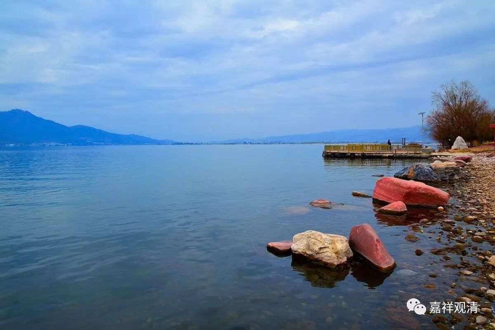
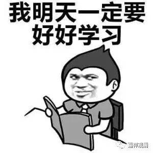

##  《金刚经》024（下） 

昨天我们也讲了，如果一定要说如来的身相的话，我们就讲自性身，或者讲智慧身。 “集福智资粮，愿成福智身。”福德资粮就是色身，色身当中最 上最第一 的色身就是佛的最圆满的色身 ——三十二相、八十种好，或者说圆满相好的色身。 

那么，这个色身是不是如来呢？色身不是如来，色身只是如来的一个相。在这经文里讲：**“凡所有相，皆是虚妄。 ”**我们所见的这个有为法的相是什么呢？是障碍我们见到真实的。那么真实是什么呢？**“若见诸相非相，则见如来。 ”**如果观察到诸法的无自性、诸法的空性的话，这才是观察到真实， 才 是和 “ 如来 ” 相应的，是真正通达如来所讲的法的。 

这里就讲到了世俗谛和胜义谛，我今天发了一篇文章，没有讲得太完整，这里差不多也是一样的意思。**“凡所有相 ”**，这个 “ 所有相 ” 是什么呢？它是世俗谛，或者 说 是世俗。**“皆是虚妄 ”**，这个虚妄是什么呢？它是障碍见到真实的。**“若见诸相非相，则见如来。 ”**胜义谛是什么呢？是诸相背后的 “ 非相 ” ，是无自性的部分。 “ 非相 ” 是它的胜义谛的部分，是它的究竟的 、 真实的部分。 

这样去通达 二谛 ， 了解 佛所要 开示、并令 你 悟入 的 “ 诸法无自性 ” ， 这 也就是 断除 无明 最直接的手段 —— 证知诸法缘起性空。 

二十七个问题，第一个： “ 无相的因， 怎么 能感有相的果呢？ ” 我们回答说： 这个问题错了，无相的因，不能感有相的果。无相的因，感无相的果，有相的因，感有相的果。 

我再重复一下 龙树大师的回答 ： “集福智资粮，愿得福智身。”福德资粮是什么呢？除了智慧以外，其他的全都是福德资粮。积集福德资粮后获得什么呢？获得佛的色身，或者说是福德身。佛的福德身，就是佛的报身和化身。我们看到的是化身，报身是地上菩萨才能看到的 …… 这里 就不展开了。 

那么，智慧身是什么呢？智慧身是佛的无相之因 ——智慧资粮圆满的结果。无相的因，感无相的果 ； 有相的因，感有相的果。 

其实这样讲不能算很好 、 很精准 ，但是因为有些是新人，就让大家稍微能够了解一点。我再说一下，这个微课堂其实是讲得稍微简单一点的，是为了让大家能够理解，并不完美，是照顾到一些新人。微课堂的意思呢，它比较短，每天差不多十分钟左右，让大家对一些佛教的知识点能够反复听到，所以可能会反复反复地讲，大家也会反复反复地听到，加深印象。有些词第一次听的时候并没有记住，但是反复反复听的话就会记住。 

当然了，也要你愿意听才行。我们碰到很多人，听了半天什么也没听进去。大家有问题也可以在这里问，但是这个群不说废话。 

今天有人问了一个问题： “明明学佛了，为什么烦恼还这么重？”我说：“你最多算知道了现在的苦而已，后面的都没学呢！”我们讲佛法中有四谛， 即使 算你百分之一百知道了苦，那你也是只知道了苦而已，烦恼没断过，灭谛没证过，道谛没修过 ——四谛当中三个都没干。即使前面第一个 “ 知苦 ” 全部送给你 算你满分 ，你也只是 “ 知苦 ” 而已。所以不要觉得自己单单知道苦就算了，后面还有很多的要学呢！ 

还有些人就是比较懒哦，哪些是烦恼都不知道 ， 嚷嚷要闭关 ……呵呵 。反正多少耕耘多少收获吧！ 套用一句话 ——因果不虚！还有一句我们常说的：“不要自己骗自己！”

今天先讲到这里，谢谢大家！ 

