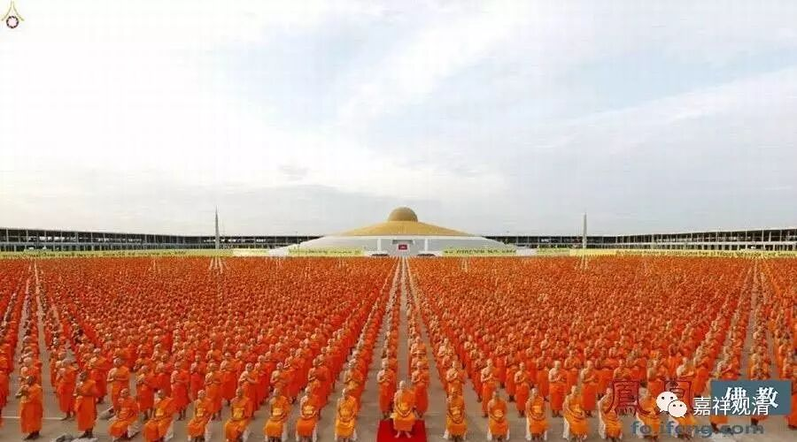

##  《金刚经》027（四） 

那么，佛教认为诸法都是什么呢？大乘佛教认为，诸法 “无定法”， 一切事物都 不是 独立、 实有的， 简单说，都 是基于它的条件而存在的，或者说最后要基于这个名言而存在的 ——“唯名言有”。可以称为“自性空”、“胜义空”、“独立实有的空”，这几种理解都是 佛教内部 对空的 不同 解释。 

**“何以故？如来所说法，皆不可取，不可说，非法，非非法。”**

有些人讲解这里的时候就顺着前面 “佛所讲的法没有一定”的讲法 ——**“皆不可取，不可说”**，别太认真，**“非法，非非法”**， 佛教就是 一会 儿正过来讲 这个，一会 儿翻过去 讲那个。 都没有一定的 ……

《 金刚经 》 是这样的 意思 吗？不是的！这是在讲**“如来所说法”**是**“不可取”**、**“不可说”**——这是 “ 胜义无 ” 的意思啊！**“非法”**的意思就是法无自性。那么**“非非法”**怎么说呢？还是前面讲的我们的习惯。我们在讲 “非法”或者法的自性无的时候，很多人会把自性无当作是一种“有”而成立，所以**“非非法”**的意思就是也不要认为 “非法”是一种独立实有的存在。 

比如说，我们已经破掉了 “得”，就是没有“得”，而我们往往就觉得有一个“ 无 得 ”在那里 。 是不是这样？不是的！所以说，**“非法，非非法。”**正面 的 要否定，负面 的 也还是要否定。最终它要否定的不是法本身，要否定的是法的自性。如果自性这个问题你没解决的话，你甚至会把 “非法”也当作有自性的来执着。所以，**“如来所说法，皆不可取，不可说，非法，非非法”**是这样的意思，不是那种 “ 玄之又玄 ” 的解释。 

**“所以者何？一切贤圣，皆以无为法，而有差别。”**这里在其它版本当中是**“一切贤圣皆证无为法”。**这个 “ 贤圣 ” 是个偏义复词，一切贤圣 ——一切圣者都证无为法。**“而有差别”**是什么意思呢？其实贤圣在无为法上怎么会有差别呢？在证得无为法上是没有差别的。而他们在后得位上是有差别的，在有为法上而显出差别。所以**“皆以无为法”**是在胜义谛上讲的，**“而有差别”**是在世俗谛上讲的。 

**“一切贤圣，皆以无为法，而有差别。”**有些版本是写**“皆依无为法”**或者**“皆证无为法”**。**“而有差别”**，是指显示的各个差别。是什么差别呢？比如说接下来会讲的初果、二果、三果、四果、初果向、二果向、三果向、四果向，比如说二十七贤圣 …… 这些在有为法上所显出的差别，就是贤圣的差别。 

