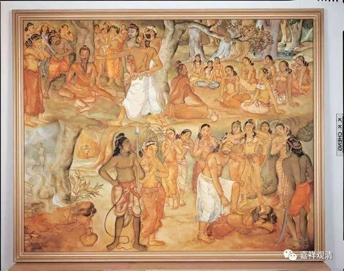

##  《金刚经》039（中） 

释迦菩萨和歌利王的故事是这样的：佛陀当年做忍辱仙人的时候，有一次在树荫里面打坐，正好歌利王带着他的嫔妃们出来 郊游 。 国 王 累了，休息睡着了 。 一帮妃子们 自己到处晃荡 …… 看到有这样一个修行人就围了过去 ， 请教问讯 …… 结果歌利王醒过来以后， 也走过来了， 就看到他的女人全都围着一个修行 模样的 人，觉得很 暧昧，国王觉得这个是假修行，忽悠他的女人，就 生气，就要砍他 ——割截身体。 

歌利王就问： “你到底是真修行，还是假修行？”忍辱仙人回答：“我是真修行人。 我修忍辱 …… ”歌利王就 让人 砍了忍辱仙人的身体，问： “我砍你的身体，你有没有嗔恨心？”忍辱仙人说：“我没有嗔恨心。”并且 发誓 说： “如果我刚才所说的 ‘ 没有嗔恨心 ’ 是谛实语的话，我的身体就能平复如故 ——还原成本来的样子（在 《 般若经 》 里经常有这种情况）。 ”然后忍辱仙人的身体就平复如故。 

这个歌利王呢，在佛教的典籍当中说他就是后来的阿若乔陈如。当时忍辱仙人 对歌利王 说： “我成佛以后，要第一个度你， 你是我座下第一个成就的弟子 …… 因为你的嗔恨心太重了。 ”据说歌利王先是 因为伤害了菩萨而 下了地狱，后来因为 和 忍辱仙人 —— 释迦佛 的 这段 因缘，成为 释迦佛座下 第一个 成就 的 阿罗汉 —— 乔陈如。 

那么，这里是在讲什么呢？是在讲忍辱事。忍辱有没有我相、人相、众生相、寿者相 、 或者自性执 、 或者有自性呢？没有！你看这里，**“我于尔时，无我相、无人相、无众生相、无寿者相。”**如果这个时候有我相、人相、众生相、寿者相，那就是凡夫菩萨了，就有可能生嗔恨心了。而他证得了一切法自性空以后，已经是大乘的圣者了，按照一般的说法，这个时候他是在修忍辱波罗蜜多。在十地的菩萨当中，专修忍辱波罗蜜多的是第三地的菩萨，是按照布施、持戒、忍辱 …… 这样的顺序。后面说五百世做忍辱仙人等等，都是指专修忍辱波罗蜜多的三地菩萨。三地菩萨的智慧很超胜，禅定也很超胜，他一定是证得性空的圣者菩萨。 

**“须菩提，又念过去，于五百世作忍辱仙人，”**这以后或者这前后五百世做忍辱仙人，这个时候是专门修忍辱波罗蜜多。六度当中的布施、持戒、忍辱、精进、禅定、智慧，对应的是初地到六地，第七地是 “方便”，第八地是“愿”，第九地是“力”，第十地是“智”。这个忍辱波罗蜜多是对应第三地。 

**“于五百世作忍辱仙人，于尔所世， ”**在那些时候，**“无我相、无人相、无众生相、无寿者相。”**这个时候呢，已经证得圣果了，对一切法的自性空能够证悟和通达。 

