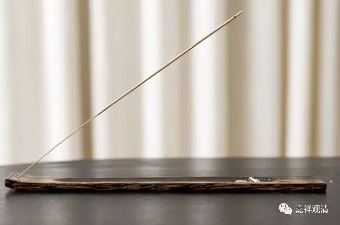

##  《金刚经》042 

好，那我们继续《金刚经》。 

前面我们讲到 了 第十个问题，在凡 、 在圣其实都是有无为法的 ， 那么凡和圣有什么差别 ？开头 一段里面就讲了 ， 凡夫不能证知无为法，而圣者是能够证知无为法的。下面一段就讲般若波罗蜜多的闻持 —— 听闻、受持、读诵、书写、演说等等，是悟入空性 、 悟入甚深的方便。如果悟入甚深 、 悟入空性 ， 那就是圣者了 。 而要达到圣者的方便呢 ，就是 闻持般若 。 

接下来就是 较量功德。**“须菩提，若有善男子、善女人，初日分，以恒河沙等身布施；中日分，复以恒河沙等身布施；后日分，亦以恒河沙等身布施。如是无量百千万亿劫以身布施。若复有人闻此经典，信心不逆，其福胜彼， ”**这个福德就要超过之前以这么 长 久的时间来布施 身 命的福德 。**“其福胜彼，何况书写、受持、读诵，为人解说。”**听 闻 这 部 经典，再加上有信心，这个福德都能胜过之前那么多劫去布施身体的， 更 何况书写、受持、读诵。因为以前没有印刷，所以最重要的就是读诵、书写，包括为人解说 。那么， 这里面较量功德的背景是什么呢？是因为闻持般若 是 悟入甚深的方便，不闻持般若的话 ， 永远不能悟入甚深 。 从这个方面来讲，闻持般若 —— 听闻 、 受持、读诵 、 书写 、 演说等等，都有无量无边的功德。 

**“须菩提，以要言之，是经有不可思议、不可称量、无边功德， ”**为什么呢？**“是经”**，是指整个的般若经 。如果 通达般若的话，就能够有解脱的机会，证悟空性的话就能够入圣。**“如来为发大乘者说，为发最上乘者说。 ”**这个 “ 说 ” 的 内容 是指般若 。**“若有人能受持、读诵、广为人说，如来悉知是人，悉见是人，皆得成就不可量、不可称、无有边、不可思议功德。”**这里是说，如果有人能够受持 、 读诵 、 广为人说的话，如来以他的五眼六通， 以他的神通、智慧， 能够知道这个人 。**“悉知是人，悉见是人， ”**知道 、 见到 什么呢？知道这个人成就不可量、不可称、无有边 、 不可思议 的 功德**。**

**“如是人等，则为荷担如来阿耨多罗三藐三菩提。 ”**这样的人能够荷担如来的家业，就是荷担如来的阿耨多罗三藐三菩提。**“何以故？须菩提，若乐小法者，著我见、人见、众生见、寿者见（者），则于此经，不能听受、读诵、为人解说。”**般若经是属于大法， 对 吧 ？这里的**“小法”**不是指小乘法哦，是指不和般若相应的其他的教法，都是着我见、人见、众生见、寿者见的。着小法的这些人，或者以方便为解脱的这些人，是不能够通达佛教的与空相应的教法 ， 那么对般若经典就不能理解，就不能够受持 、 读诵 、 为人解说 。 

