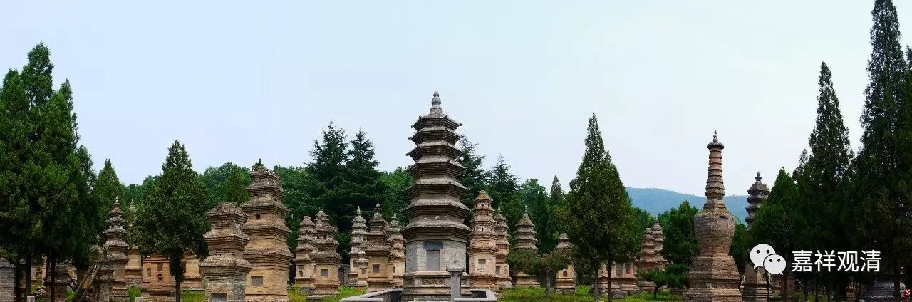

##  《金刚经》042（中） 

**“须菩提，在在处处，若有此经，一切世间天、人、阿修罗，所应供养。当知此处则为是塔，皆应恭敬、作礼、围绕，以诸华香而散其处。”**有般若的地方，就是有佛的地方。塔的意思是什么呢？塔是代表了佛身的 。 那么 ， 有般若的地方就代表有佛身的，也是能够令我们最终成佛的 ， 般若是佛母嘛 。《赞 般若波罗蜜偈 》 当中就这样说 ： “诸佛及菩萨 …… 般若为之母 ……佛 为 众生父，般若能生佛，是则为一切 ， 众生之祖母 。 ” 有这个说法，很有趣啊 ！有 一位法师就有开玩笑说 ： “ 怪不得佛在说般若的时候反复说 、 反复说，原来是众生之祖母 ， 祖母一般都比较唠叨嘛 ！ ” 这个当然是玩笑。 

有般若的地方 ， 就是有佛的地方。那么 ， 塔 就 代表了佛身，就是有佛身体的地方 。 对于这个地方 ，**“皆应恭敬、作礼、围绕，以诸华香而散其处。 ”**这个地方，是 六道众生都应该要供养的，天 、 阿修罗等等都来供养这个地方。 就如同 有佛的地方要供养一样，有般若经的地方也要供养。 ‘

**“复次，须菩提，若善男子、善女人，受持读诵此经，若为人轻贱，是人先世罪业，应堕恶道，以今世人轻贱故，先世罪业，则为消灭，当得阿耨多罗三藐三菩提。”**这个大家都听 得 比较多了，就是 “ 重报轻受 ” 。实际上大部分人在类似的问题上，就是对因果的问题上还是不了解 。 比如说 ， 很多人已经学了很长时间 的佛法 ， 还 来问我类似的问题 。 这 种 问题我已经被问了无数遍了，有些人有豁然开朗的感觉，有些人还是听不懂，其实我的话放在那里时间很长了 。 

有些人说 ： “ 师父 ， 我开始学佛了以后，生意也不顺了，这是怎么回事？ ” 或者说 “ 我布施了以后，今年也不顺了，孩子又生病了，是不是供 得 不对了？ ” 我回答说 ： “ 你到底信不信佛啊？ ！ 如果 是 苦果的话，一定有以前作恶的因 ； 如果是善的因，一定会有乐的果。你为什么要把这 两 件事情掺在一起呢？前面明明是做了好事，你却把接下去发生的不好的事情，认为是它的果吗？ ！ ”

我们好 像非常 习惯 把 我 前 面做的事情作为后面 发生的 事情的因，其实这个不一定的。我发现很多人学佛已经多年，这个问题还是没有搞清楚。比如今天早上烧香，下午摔断腿了，好象今天早上烧香就是下午摔断腿的因 —— 不可能是这样的。苦果一定是恶的因造成的，你今天的苦果肯定不会是今天早上烧香造成的，你今天早上烧香一定有其他的结果，你不要 “ 非因计因 ” 啊 ！ 学了很久的佛法，结果连因果的问题都没有搞清楚。 

