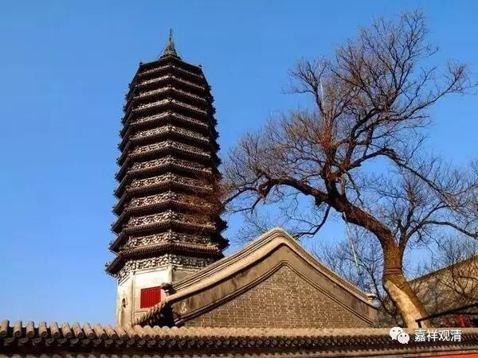

##  （通州燃灯佛舍利塔） 

##  《金刚经》043（上） 

好，继续《金刚经》。 

第十个问题着重是讲无为法： “无为法本无在凡、在圣之差异，云何见有凡夫、圣者？”本来在凡、在圣就没有差异的，但是为什么有凡夫和圣者的差异？凡夫和圣者的差异就是有没有证得无为法，是吧？ 

后面就有一长段的较量功德。那么，这里较量功德的原因是什么呢？原因就是：闻持般若，就是闻持般若波罗蜜经，是悟入甚深的方便，或者说是证入空性的方便。 

上次还没讲完，先看昨天讲过的一个地方。**“何以故？须菩提，若乐小法者，著我见、人见、众生见、寿者见，则于此经，不能听受、读诵、为人解说。 ”**这里有一个字漏了，在其他版中是这样的：**“何以故？须菩提，若乐小法者，著我见、人见、众生见、寿者见者， ”**就是这样的人，**“则于此经，不能听受、读诵、为人解说。 ”**这个**“小法”**，应该是指不和般若相应的教法。 

后面一段的**“若为人轻贱”**，大家一定注意啊！一定要知道：善的因，一定获得乐的果；如果是苦的果，则一定是恶的因所造成的。我们绝对不能认为今天做好事是做错了，希望这种情况不要再出现了。有些人，也可以说大部分人都没有意识到，实在是不太了解因果了。 我说过， 甚至也碰到过有些学得很好的法师都有这方面的问题，包括我们自己也都有这样的问题。 

好，下面一段。**“须菩提，我念过去无量阿僧祗劫，于燃灯佛前，得值八百四千万亿那由他诸佛，悉皆供养承事，无空过者。若复有人，于后末世，能受持、读诵此经，所得功德，于我所供养诸佛功德，百分不及一，千万亿分乃至算数譬喻所不能及。 ”**

这里的**“我……于燃灯佛前 ”**是什么意思呢？不是指在燃灯佛的面前，而是指在遇到燃灯佛之前。在遇到燃灯佛时候，是得授记嘛。在遇到到燃灯佛之前，**“得值八百四千万亿那由他诸佛，悉皆供养承事，无空过者。”**就是在那么多佛的面前修学佛法。但是，在这个时候并没有证得般若波罗蜜多。 

