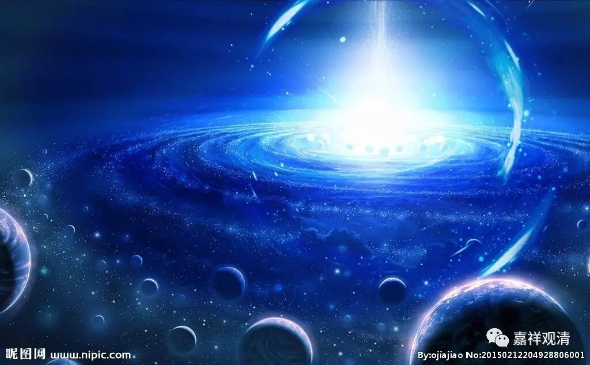

##  《金刚经》048（中） 

慧眼呢 ，**“不见众生，尽灭一异相，舍离诸著，不受一切法。”**慧眼观察 不到其他的生灭 法 ，**“智慧自内灭，”**心观察的 就 是空性，**“是名慧眼，但慧眼不能度众生。”**这个是《大智度论》里面 的 原文啊。**“所以者何？无所分别故。”**

接下来就是法眼。法眼呢， 《 大智度论 》 说：**“知一切众生各各方便门，”**知道度众生的各个方便，然后呢，**“令得道证。”**令得众生得道、得证。但是，法眼不能遍知一切众生的方便，也不能遍知一切事物。 

那么佛眼呢，**“无事不知”**，垢障尽除，无不知见 ——这就是佛眼。 

另外，**“肉眼所见不遍故”**， 肉眼见色， 不周遍、不全部的 ， 有限有量 。 

**“天眼缘世界及众生无障无碍”**， 天眼见色等法无碍， 但是不见空。 

**“慧眼知诸法实相”**， 慧眼 见空不见有。 

**“法眼见是人以何方便、行何法得道。 ”**法眼主要是要了知这个众生需要什么相应的引导最终趋向解脱。 

《大智度论》本身就是对般若经的解释，般若经当中是这样说肉眼的：**“佛告舍利弗：‘有菩萨肉眼见百由旬，有菩萨肉眼见二百由旬，有菩萨肉眼见一阎浮提，有菩萨肉眼见二天下、三天下、四天下，有菩萨肉眼见小千世界，有菩萨肉眼见中千世界，有菩萨肉眼见三千大千世界。舍利弗，是为菩萨摩诃萨肉眼净。’”**就是说肉眼能够见三千大千世界以内的 、 没有障碍的。 肉眼是 怎么见呢 ？ 上次我们说了，是不障碍见 。 

《大智度论》怎么讲呢？**“不以障碍故见。若无障碍，得见三千世界，如观掌无异。 ”**如果没有障碍，三千大千世界 之内的物质 都能见，就像看到手上的东西一样。这个就是 “ 肉眼 ” 。那么这里的肉眼呢，是不需要获得禅定的，跟天眼是不一样。 

