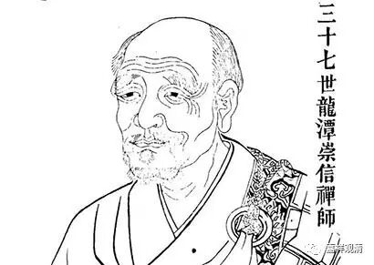

##  《金刚经》049（三） 

很多人就觉得**“过去心不可得，现在心不可得，未来心不可得”**是有玄之又玄的意义，其实没有 啊， 没那么复杂 。 

我们先把那个故事讲完吧。 

德山宣鉴禅师 一下子没回答出来，估计是脑子转不过来了，就没吃到饭，然后上山了。这个也有好处吧 ？ 吃得少，走得多 。 他从北方一直走到南方，吃得少又走得多 ， 就有个好处 ， 他不会胖 ， 是吧 ？ 

上山以后 ， 他还是挺狂的 。 碰到了那位龙潭崇信禅师 ，就说： “ 哎呀 ！ 我来找你挑战来了。 ” 然后走了一圈，开始说狂话了 。（这个 跟我确实有点 像啊 ，也是我们的祖师嘛 —— 我也是学了一点禅宗的皮毛嘛。） 

他 到了山上，碰到老和尚也不顶礼，为了表现自己的水平高 。 走了一圈，就说 ： “ 以前听说龙潭很有名啊 ！ ”他这里说的 龙潭 的 意思是双关的，一方面表示这个地方，一方面表示人。我们讲宗 喀 巴 、 德山 、 仰山 、 沩山 、 曹 山等等，都是以地名来指代人。他就说 ： “ 以前听说龙潭这个地方很有名， 现在到了这里以后觉得也不过如此，**龙也不现，潭也不见**，既没有看到龙，也没有看到什么好的水，不怎么样。 ”

这里的 “龙也不现，潭也不见” 又 是双关，意思是觉得你也没多深，也没多灵。禅宗的人很喜欢玩这一套哦。 

然后 龙潭崇信 禅师就回答说： “许汝亲见龙潭。”这里又是 有多重意思的 ：第一呢，你已经到龙潭了，就是到了这个地方了；第二呢，你看到龙潭了，就是我；第三呢，你刚才 说 的 “龙亦不现，潭亦不见”，这个 “ 不现 、 不见 ” 是 对 的 —— “许汝亲见龙潭！” —— 你的话，我接了！ 

这两个人的对话都是双关语，甚至是三关语。 就像高手下棋一样，每一手好几个意图，还留了后招了 ……

德山宣鉴禅师 一下子就懵了，然后就 老老实实 留下来好好地参禅了 ， 以前的东西就放下了、不管了——服了 。 

