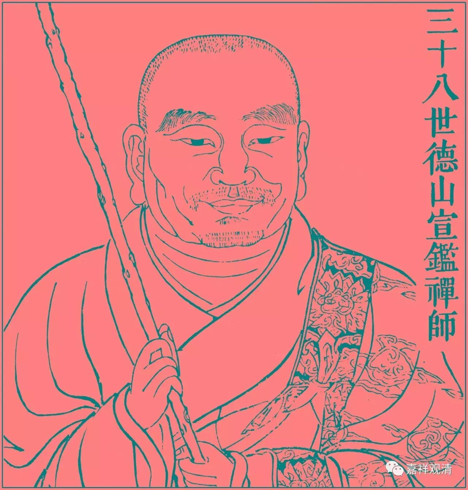

##  《金刚经》049（四） 

德山宣鉴 的开悟就是呆在龙潭崇信 禅师那里的时候，有一次 ， 天很晚了， 龙潭崇信 禅师 让德山宣鉴禅师回僚房，并递给他点着的蜡烛。宣鉴禅师正要接过来，龙潭崇信禅师，呼， 一口把蜡烛给吹灭了 —— 这 突然之间 就 开悟了 …… 第二天跑到法堂前面， 把《 青龙疏抄 》全给烧了。 （ 太可惜了！ ） 他把 自己对 《金刚经》的解释给烧了，说自己以前写了那么多文字，其实什么都没见到。 “ 穷诸玄辩，若一毫置于太虚 ； 竭世枢机，似一滴投于巨壑 ！ ”—— 想得再多，思辨再细，不过是一毛端之于宇宙、一滴水投于大海 ……

德山宣鉴禅师在禅宗里面是一位非常重要的人物，我们平时说的 “ 棒喝 ” —— “ 德山棒、 临济喝 ” 当中的 “ 德山棒 ” ，就是指他的 “ 棒法 ” 。估计他以前是不是也是练鞭杆的， 或者 也是练棒子的 （ 开个玩笑 ） 。那么这就是德山宣鉴禅师的故事。在后期，德山宣鉴禅师还有好几个故事，在他身上还有一个公案，令无数禅师跌倒呢。 

《金刚经》 “ 三心不可得 ” 的意思大家都明白了吗？佛的殊胜智 （ 五眼 ） 能够通达一切众生的世俗心 （ 三心 ） ，这个 “ 五眼 ” 是 向 佛的一切种智、一切智智。那么，**“过去心不可得，现在心不可得，未来心不可得”，**简单来讲，就是指 “ 心无自性 ” ，也就是前面讲的**“如来说诸心皆为非心，是名为心”**。而这个并不是如来以他的一切智智见一切众生心行的理由。这里**“何以故”**不是 问 理由的意思哦 ， 只是追加说心无自性而缘起有。 

这一段文字应该是很容易过的 。 那么多法师在那儿唠唠叨叨 地 解释呢，说实话他们自己也没搞懂。出现了一种说法以后，大家就跟风，都觉得这样就对了。其实这一段没那么复杂，至少不 像 他们所讲的那么复杂。这一段，就文字本身来说挺简单的 ——“ 佛见一切众生心 ”。 当然也有 一点 早期翻译的问题。我们现在一看到**“何以故”**就觉得是为什么的意思，其实不见得，有时候就是发起个问题，就跟《金刚经》前面讲的**“须菩提，如来说第一波罗蜜，即非第一波罗蜜，是名第一波罗蜜”**是一样的，只是发起一个问题，不是说 “ 因为这个 ……” 。当然，你一定要牵强地说是因为这个，也不是不可以，但绝不是像一般外面所讲的那样。 

好，今天《金刚经》先讲到这里，谢谢大家！ 

