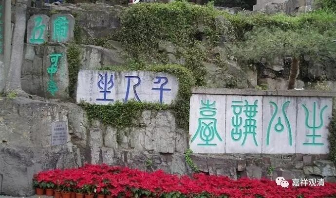

##  苏州虎丘·生公讲台 

##  略述生公善不受报义 

##  一、生公有《善不受报义》 

南北朝时期，东土之佛法译讲不绝，大师百出，一时灿烂无比，竺道生法师就是其中一位最富有人格魅力的大师！在佛教史上，他被尊称为 “涅槃圣”，其立意则每出时表，作有《善不受报论》、《佛无净土论》、《应有缘论》、《顿悟成佛义》、《二谛论》等，皆可谓惊世骇俗！《高僧传》卷七有《竺道生传》，文云： 

**“……自经典东流，译人 重阻，多守滞文，鲜见圆义。若忘筌取鱼，始 可与言道矣。（竺道生）于是校阅真俗，研思因果，迺 立 “善不受报”“顿悟成佛”，又著《二谛论》、《佛性 当有论》、《法身无色论》、《佛无净土论》、《应有缘论》等 ，笼罩旧说，妙有渊旨。而守文之徒多生嫌 嫉，与夺之声，纷然竞起 ……”**

说他作了很多名篇（可惜，以上诸篇全部散佚！），这些文章的立意都成为当时佛教义学讨论的中心，自然也成了诸方矛盾的焦点，甚至因为重要的义理之诤（道生法师在《涅槃经》全文翻译来以前先立 “阐提有性”说，就是“一切众生皆可成佛”的意思），而被摒出建康。 

竺道生法师一直是我很喜欢的大师，接下来，我聊聊道生法师的这些 “非常异议可怪之论”。 

先谈谈他的《善不受报论》。 

生公《善不受报论》，今全文佚失，被引用的文字、义理也很少见，还原甚难。先稍稍寻检一些早期的记述。 

吉藏大师离道生法师的时代比较近，也有比较接近的师授关系（道生法师是罗什法师弟子，而吉藏大师也是罗什法师六七传的弟子），其《法华义疏》卷四提到生公的《善不受报论》，文曰： 

**“昔竺道生 著《善不受报论》，明一毫之善并皆成佛、不受生 死之报，今见《璎珞经》亦有此意 ……”**

吉藏大师后文中是不全赞同 “善不受报义”的，对此义略做了折衷。在其《百论疏》卷一中，吉藏法师又提到了生公的“善不受报”： 

**“……竺道生云：善不受报一向锺佛 ……”**

所引述之义和《法华义疏》全同，都说 “善不受报”是指，为善之果乃至直趋佛果。 

清凉澄观法师在《华严经随疏演义钞》卷 四十一则说道生法师的 “善不受报义”有“十四科”，并举其一科（一段问答）： 

**“此亦 生公十四科 ‘善不受报义 ’。彼问云：善恶相倾 ，其犹明闇不并，云何言万善理同，恶异，各 有限域耶？答：明闇虽相倾，而理实天绝。明 能灭闇故，无闇而不灭。所以一爝之火，与 巨泽火同，闇不能灭明，以其理尽闇质 故也。思之可知。 ”**

这段在解释为什么善法感果的轨则与恶法不同。 

