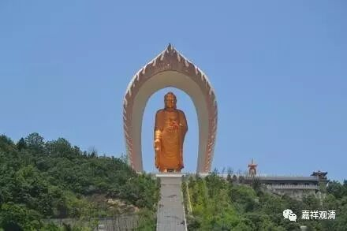

##  《金刚经》054（中） 

前面讲的是 “ 见 ” ，以中观的版本来谈的话，这是 “ 观 ” 。比如说，我们观一个佛相的时候，是不是以三十二相来观呢？大部分人都是这样认为的 —— 眼睛绀青色、耳朵大大的，脸、嘴、鼻子 ……各有样貌 。那佛在 《 金刚经 》 这里就说了，如果你观出三十二相、八十种好，那转轮圣王不也是三十二相、八十种好吗？那你观的 、 观想的 是如来呢，还是转轮圣王呢？ 

我们再举个其他的例子，比如印度、中国等各国的各个时代的佛像，都一样吗？哪个才是真正的佛相呢？以前《西游记》里面观音菩萨的扮演者左大玢，就被大家 公 认为是观音菩萨 “ 应该的 ” 样子。有一次她去普陀山 朝拜 ，从普陀山的大殿里出来的时候， 正 被一位居士看到了， 那居士赶紧 就跪下来 磕头 ，以为是 “ 观音菩萨显灵 ” 被 她 见到了。 形象就是佛菩萨吗？ 

**“可以三十二相观如来不？”**我们现在基本上就是这样的哦，以三十二相 这个样子 来观 想 ——这就是佛，观想成功或者没成功…… 可能我们连这个还做不到呢。 如果观想出来 有一个画像的样子，就觉得自己观出了佛相，还觉得挺美好的。那 问一下： 色身是如来 嘛 ？或者我们观出的这个相就是如来 吗 ？佛的五蕴当中，哪个重要呢？ 色蕴吗？佛就是物质、形色吗？ …… 当然了，佛的五蕴也不能谈哪个重要。那么智慧呢？ 

我弟弟就有这样一件事情。我那个时候还没出家，他在家里过来对我说： “啊呀！我看见佛了。”我当时也没当回事儿。过了几分钟，他又回来说了：“啊呀！刚才看错了。”我就问怎么回事，原来因为当时是晚上，家里的佛像映在玻璃上，我弟弟 正看窗外，在窗子上看到尊佛像， 就误以为看到的是窗外的佛的形像，把他激动的 呀 …… 。实际上，就是晚上家里的灯光比较亮，把佛像反射到窗户上而已。后来他很丧沮地说： “哦，不是的，是照到了。”我们平时很多所谓的观也好，甚至有些是臆想也好，都是真的吗？观察一下吧！ 有人说： “师父，我梦到你了！”你梦到的是我吗？ 

好，在这里佛就讲了，转轮圣王也是三十二相，即使你把三十二相观出来了，这个一定是如来的相吗？转轮圣王也是这个相啊！ 

**“须菩提白佛言：‘世尊，如我解佛所说义，不应以三十二相观如来。’”**这里须菩提又继续说了：世尊，我明白了，如果我知道佛的意思的话，不应以三十二相观如来。还要继续观什么呢？实际上是一定要观三十二相背后的性空等等，这样才可以。 色身如影像，法身是这背后的真实。 

