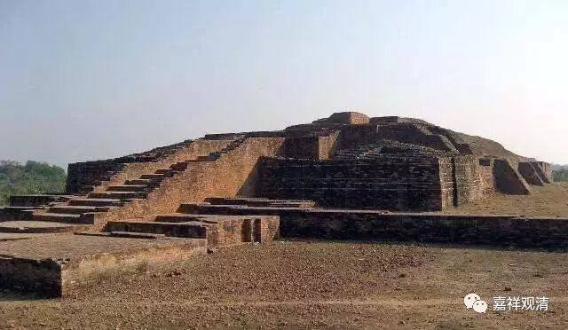

##  《金刚经》056（三） 

其实，其他宗派谈到这个极微的时候，他们也能够认识到，或者能够分析到所谓意识的极限，但是他们又确定这个极限是实有的。比如他们说 ， 大的东西可以被拆成小的，这是我眼睛看到的，当然可以承认。那我眼睛看不到的呢？可以用我们的智慧来继续拆分，然后就像我们把大的东西拆成小的东西一样，智慧也可以这样拆分，就会出现最小的单位。 

但这个说法是不能够成立的，对吧？所谓最小的东西其实上只是我们意识分割的界限，就像我们用眼睛或者用去手分割有界限一样，意识也有分隔的界限。所以，最小的、完全 “无方分”的、不可分割的、又是色法的这种极微，在大乘佛教里面认为。是不能够存在的，不能够成立的。 

所以这里就会先讲这样一个问题：**“若是微尘众实有者，佛则不说是微尘众。”**这个微尘也不是实有的。这里并不是说先承认有一个实有的微尘，然后再将三千大千世界碎为微尘 ——不是 这个意思 。微尘，或者极微，只是我们的一个概念，为了讲述的方便，然后再谈所谓的世界。 

**“世尊，如来所说三千大千世界，即非世界，是名世界。”**世界也不是实有的，为什么呢？**“若世界实有者，则是一合相。”**这个 “一合相”，我以前也问过我的老师，结果他也没给我回答，就举了一个比方——我也不知道是不是因为禅宗的背景。以我现在来想，他至少在当时并没有解决我的这个问题。这个“一合相”或者“一合执”呢，简单来说就是一个整体，而这个整体是没有部分的，就是实有的。但如果世界是一个整体而没有部分的话，它就不可能存在了。 

以中观自续派的观点来讲，不是一个整体的话，它一定是由部分所组成的。世界呢，它一定是由它的支分所组成的，比如说这些微尘，对吧？比如说青黄赤白、地水火风、眼根、耳根 ……是由 这些东西所组成的，所以它不可能是 “一合相 ” 。 

为什么说世界不是实有的呢？因为如果世界是实有的话，它应该是 “一合相”。是实有的话，它就不能够再被分析了，这里 ， “ 分析 ” 的意思就是分开、析破的意思。很显 然的 ，世界是可以被析破的，是可以被分开、破坏的，那么，显然 “ 世界 ” 不是 “一合相”， 那 显然世界不是实有的。 

