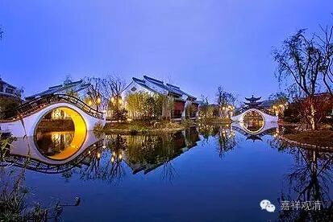

##  《金刚经》058（上） 

好，今天应该讲二十七问题中的最后一个 ， 是结束的部分了 。 

前面 第二十六个问题是 ： “如是，则彼法身当即是‘我’？！” 因为前面讲了应观导师的法性即导师的法身，那么就会有人认 为： 如来的法身是 “ 我 ”。而 这 里 的回答是 ： 如来的法身是他的无 自 性，最后所指向的是无我 ，而 不是指向我们所认为的 “ 我 ” 。 

佛的法性，就是空性 —— 一般我们会这么说哦， “ 在凡不减，在圣不增 ” ，它 是一个无为法。如果是这样的话， 那么 佛是常 住世间的喽 ，也没有涅槃不涅槃 的 说法了吧 ？ 这个 是 我们 一般 人会有的问题。所以 ， 这第二十七个问题就是 ： “佛 当常住世间，不当涅槃？ ！ ”

**“须菩提，若有人以满无量阿僧祇世界七宝，持用布施，若有善男子善女人，发菩提心者，持于此经，乃至四句偈等，受持读诵，为人演说，其福胜彼。**

**云何为人演说？不取于相，如如不动。何以故？**

**一切有为法，如梦幻泡影，**

**如露亦如电，应作如是观。”**

也有人把这四句当作《金刚经》中提到的四句偈 。 我们前面已经谈到了，其实不一定是指具体的哪四句，随便哪一 段 都可以。在义净法师的版本当中， 这 四句是这样翻译 ：**“一切有为法，如星翳灯幻，露泡梦电云，应作如是观。”**义净法师对于《金刚经》最末一颂专门写过一篇文章进行解释的，大家可以去看一下，或者明天我发一下。 

好，我们来解释一下 。**“须菩提，若有人以满无量阿僧祇世界七宝， ”**阿僧祇，也是无量的意思 ， 就是用那么多的七宝拿来布施 。 但是如果有发菩提心的人，**“持于此经，乃至四句偈等，”**以般若经乃至最下的其中一段文字，**“受持读诵，为人演说， ”**书写、受持等等，或者以今天的话来讲，印刷、讲经、礼拜、供养等等，**“其福胜彼。 ”**这个功德要超过之前那个人布施的功德。 

我们也讲过要有与空相应的智慧，是吧 ？ 这里就直接点出了 ：**“云何为人演说？”**要 怎么去 宣讲 呢？ 其实 不仅仅是怎么去宣讲，受持、读诵也是一样的，要怎么样做才会有这样大的功德呢？**“不取于相，如如不动。 ”“不取于相”**， 就是前面所说的**“不生法相”**或者**“不生法想”**—— 在一切法上不取法想，以与空相应的智慧，以证空的或者至少是通达空性的智慧来摄持。**“如如不动”**，如 ， 好 像； 如，真如 ； 不动，究竟的诸法的自性 ， 也就是空性，这个法是无为法 。**“如如不动。何以故？”**为什么呢？前面讲这是一个无为法，为什么呢？因为一切有为法，都是动的 ， 是吧 ？ 

**“一切有为法，如梦幻泡影，如露亦如电，应作如是观。”**我们应该这样去观察有为法 ：**“如梦幻泡影，如露亦如电。 ”**这 里 只讲了有为法，其实也就是从反面讲了无为法 。 无为法是什么呢？就是上面的**“如如不动”**。有为法，就是无常的 、 造作的 。 

