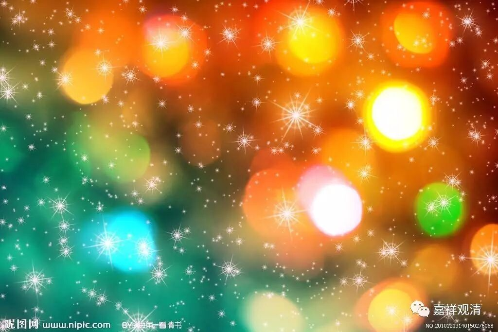

##  《金刚经》058（中） 

一切法 ， 可以分为有为法和无为法 。在 有为法当中 ， 又分色法、心法、心所有法、心不相应行法这四个 。 这个五分法是有部 习惯使用 的。 

这个偈颂在义净法师的版本当中是这样翻译的 ：**“一切有为法，如星翳灯幻，露泡梦电云，应作如是观。”**下面 我们就按照义净法师的这个版本来讲 。 

这 里 总共有九个比喻 ： 

首先是如星 。 星就是星星的那个星。星比喻什么呢？比喻见 。 星是夜有明 无， 就是晚上有，白天就没有了 。 我们的无明的妄执，就像夜空当中的星一样 ， 在凡夫的时候 有， 等到智慧都生起来以后，就没有了 。 

第二个呢，如翳 。 翳 ， 有点 像 白内障，或者说类似于眼里的病吧 。 这个眼中的病就会看见空中有花，或者有毛发等等 ， 这个就是翳。用翳来比喻，怎么说呢？对境上的这个东西本来是不存在的，但是基于我们眼睛上的 毛病 ， 会 看见空中有毛发乱舞等等 ， 这都是我们自己的原因，是我们妄执的原因 。 

第三个呢，如灯 。 灯 ， 是用来比喻我们的认识 。 在《缘起 心 要论颂》中也是这样来比喻的，灯 的 后焰 —— 后面的火焰 ， 是基于前面的火焰而生起，前面所烧的火焰，造成了或者说引发了后面所烧的火焰。识呢 ， 也是一样，就 像 灯这样生生不绝。这个灯，就是用来比喻我们的识 ，比喻我们的 心 。 

第四个， 如幻 。 幻 ， 就是幻相。其实按照以前的说法 ， 这个幻是跟魔术有点 像 哦 。 我们现在就把 幻 当作是在空中有一个幻相 ， 是吧 ？ 幻相是假而不真的，是由幻师的方便善巧而变出来的种种形象，就 像 魔术师变出来种种形象，或者 由 制作拍摄团队所制造出来的一部电影 。 那么 ， 这个幻的体 ， 也是非实的 ， 是没有真的，我们却以为它是实有的，看的时候很认真，还为它痛苦，还去研究这个应该怎么样，那个应该怎么样 。 其实都只是故事 ， 是吧 ？ 我们听评书 或者 看电视、看电影 ， 还常常为里面的人担忧 ， 是吧 ？ 这些都可以比喻为幻 。 幻 ， 就是它在空中，或者基于什么背景，让我们以为它是实有的 。 比如现在的电影 ， 看起来很像真的，实际上是编出来的一个东西 ， 但我们 仍然 会跟着它的情节走 ， 是吧 ？其实 它是幻 ， 不是 真的。 他比喻界，一切法如幻。 

第五个是如露 。 露是比喻什么呢？比喻我们的身体 。 露 ， 时间长了就没有了 ； 我们的身体也是这样，时间长了就没有了，有也是一时有 、 难得有。我们早上起来，看到草尖上有露水，就会拍个照片，很漂亮 ， 是吧 ？ 如果碰到风一吹，露就掉下来了，或者时间长了，就风干了，没有了 。 所以 ， 露就是比喻我们的身体 。 

第六个 ， 如泡 。 我们吹肥皂泡的时候，它一碰就灭了 。 这个泡用来比喻什么呢？比喻我们的受用 、 三受 。 现在我们受用的各种境，实际上也是和这个泡一样，是要有其他的因缘和合才产生的，然后呢，很容易破灭，是吧 ？ 

第七 项， 如梦 。 梦是什么呢？梦就是白天做事累了，晚上睡着以后就会产生 。 梦也是不实的，而且是因为回忆等等才会产生的 。 它的境有没有呢？它的境也是没有的，不是真的，是假的 。 所以说 ， 过去如梦，过去的事情就像梦一样 。 用梦来比喻过去 ， 我们以前做了什么事情，就像在梦当中一样，那么它也是不真实的。 

