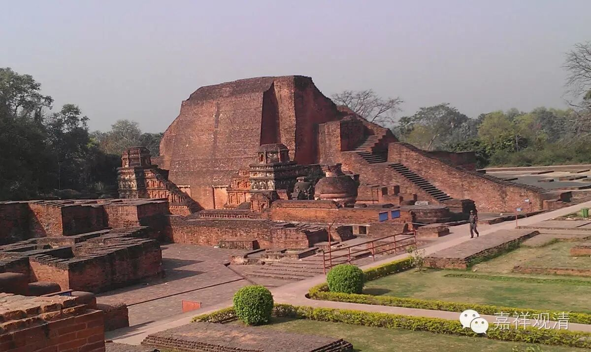

##  《金刚经》058（下）完结篇 

第八个呢 ， 是如电 。 电比喻什么呢？电比喻现在 。 现在 ， 刹那一闪就过去了 。 空中的闪电 ， 刹那刹那就过去了 ， 所以就用电来比喻现在。 

第九个是云 。用 云 来比喻 什么呢？用云来比喻未来 。 未来也是像云一样，看起来很美好 ， 是吧 ？ 但是它真的有吗？反正还没到呢 。 它的自体，可能有部会说它是有的，但我们认为未来也不是实有的 。 这个云呢 ， 也是要依赖于各种条件而存在，又是非常虚幻的 ， 所以用云来比喻。 

我们再来看鸠摩罗什法师的版本 ：**“一切有为法，如梦幻泡影，如露亦如电，应作如是观。”**在义净法师的版本中，多了一个星 、 一个翳 、 一个灯和一个幻 ， 还多了一个云，但是少了一个影。 大家有兴趣的话 ， 可以去再看一下义净法师的版本。我们上次也说了 ， 如果有机会的话，我们再印刷出一版鸠摩罗什法师和义净法师 两个翻译 版本的 对照 。 

这 整个一段在讲什么呢 ？ 就是我们前面讲的第二十七个问题 ： “佛 当常住世间，不当涅槃？ ！ ” 佛如果是无为法的话，那么也就没有什么涅槃不涅槃了 。 大乘佛法里面，包括 《现观庄严论》 里也讲了**“智不住生死，悲不住涅槃”**，是吧 ？我们在 前面也讲过**“应观佛法性，即导师法身 ”**。佛自己也讲了，只要有正法的地方，就是佛所在的地方。所以 ， 就像前面讲的 ， 我们如果认为**“如来若来、若去、若坐、若卧，是人不解我所说义。 ”**这个 好 像已经 讲了好多次了，真正佛的法性或者无为法，我们才在定义上称之为佛，是吧？ 

最后一段就是流通分 ：**“佛说是经已，长老须菩提及诸比丘、比丘尼、优婆塞、优婆夷**（这个就是四众）**，一切世间天、人、阿修罗，闻佛所说，皆大欢喜，信受奉行。 ”**， 这是最后流通分的部分。 

好，今天讲到这里，《金刚经》算是讲完了 。 我们这个《金刚经》的讲课呢，是采用微课堂的形式， 相对 轻松一点，主要是给大家增加一点知识 ， 应该说这个目的基本达到了 。 现在每天也有人在整理， 以 文字的方式推送出来，大家也可以看一看 ， 复习一下 。 

好，谢谢大家！《金刚经》的讲课也是缘起，因缘而起，没有大家也讲不了这个课 。 

随喜大家！ 

