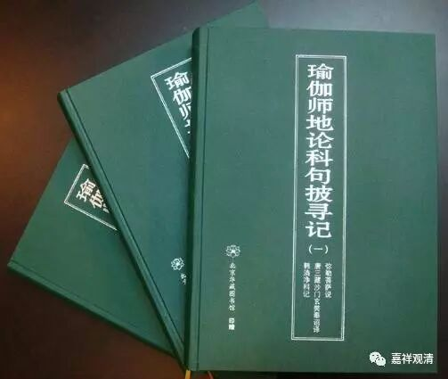

##  《六门教授习定论》讲记002（上） 

实际上，《六门教授习定论》的背景就是我们接下去很快会讲的《瑜伽师地论》中的《修所成地》，这二者几乎是可以 全部 对应起来的。 而手上 这部《六门教授习定论》的科判有所不同，但内容呢，只是开合的不同，或者说 仅有 详略的不同。 都属于弥勒学，内容差别不大。 

我们先来看这个表格。 

##  《瑜伽·修所成地》与《六门教授习定论》科判对照表 

##  四处 

| 

##  六门 

| 

##  七支   
  
---|---|---  
修处所  |  ① 意乐圆满（求脱者）  |  ① 生圆满   
修因缘  |  ② 依处圆满（积集）  ③ 本依圆满 （ 于住勤修习 ）  ④ 正依圆满 （ 得三圆满已 ）  |  ② 闻正法圆满  ③ 涅槃为上首  ④ 能熟解脱慧之成熟   
修瑜伽  |  ⑤ 修习圆满（有依）  |  ⑤ 修习对治   
修果  |  ⑥ 得果圆满 （修定人）  |  ⑥ 世间一切种清净  ⑦ 出世间一切种清净   
  
这里的 第一列 “四处”和 第三列 “七支”，都是出现《瑜伽师地论 ·修所成地 》里面的。大家可以看《瑜伽师地论》卷第二十，《本地分中修所成地第十二》。 

**“已说思所成地。云何修所成地？”《**思所成地 》 讲完了以后， 《 修所成地 》 是什么呢？**“谓略由四处，当知普摄修所成地。”《**修所成地 》 是按照四个方面来讲的， 四个大的科判， 也就是上面这个表格当中的第一列。**“一者，修处所；二者，修因缘；三者，修瑜伽；四者，修果。”**这个就是 “ 四处 ” 。 

**“如是四处，七支所摄。”**这四处 ——修处所、修因缘、修瑜伽、修果，如果把它广开，就是 “ 七支 ” 。**“何等为七？”**哪七个呢？**“一、生圆满；二、闻正法圆满；三、涅槃为上首；四、能熟解脱慧之成熟；”**能成熟解脱慧的成熟，简单来说就是解脱慧之成熟。**“五、修习对治；六、世间一切种清净；”**就是世间清净。**“七、出世间一切种清净。”**就是出世间清净。 

