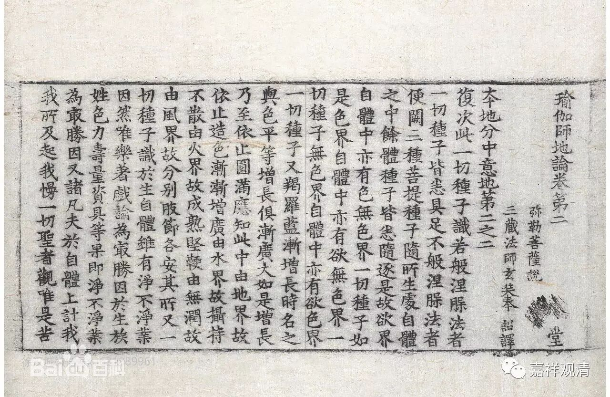

##  《广论》“十圆满”的出处 

《菩提道次第广论》之释 “十圆满”： 

“ 第二 、 圆满 。 分二： 

五 ‘ 自圆满 ’ 者，如云： “ 人 生 中 根 具 ，业未倒信处。 ”…… 此 五属于自身所摄，是修法缘，故名自满。 

五 ‘ 他圆满 ’ 者，如云： “ 佛降说正法，教住随教转， 有他具悲愍。 ”…… 此五属于 他身所有，是修法缘，故名他满。 ”

《广论》之十圆满分 “自他圆满”出自《瑜伽师地论》，而且在《瑜伽师地论》不同场合、不同名目多次出现，或谓“自他圆满”共十，或举“内外圆满”满十，如 《 瑜伽师地论》卷二十一《声闻地 》： 

“ 云何自圆满。谓善得 人身。生于圣处。诸根无缺。胜处净信。离诸 业障。 …… 唯由如是五种支分自体 圆满。是故说此名自圆满。 

云何他圆满。谓 诸佛出世。说正法教。法教久住。法住随转。 他所哀愍。 ”

及卷二十二： 

“……自他圆满……若 自圆满 、 若他圆满 ……”

又见 《 瑜伽师地论》卷二十《修所成地 》： 

“ 云何生圆满 ？ 当知略有十种 ， 谓依内有五 ， 依外有五 ， 总依内外合有十种。 

云何生圆 满中依内有五 ？ 谓众同分圆满 、 处所圆满 、 依止圆满 、 无业障圆满 、 无信解障圆满 ……

云何生圆 满中依外有五 ？ 谓大师圆满 、 世俗正法施设 圆满 、 胜义正法随转圆满 、 正行不灭圆满 、 随 顺资缘圆满。 ”

此《瑜伽师地论》之十圆满，若 “自他圆满”，若“内外圆满”，虽科别不同，文字稍异，而立意无别。文繁不录。 

